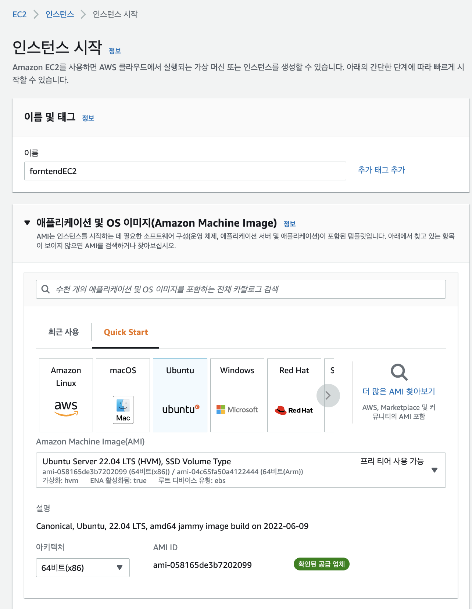
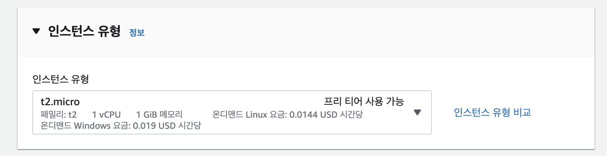
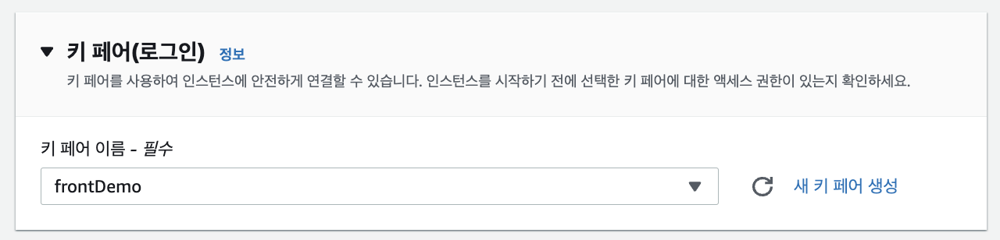
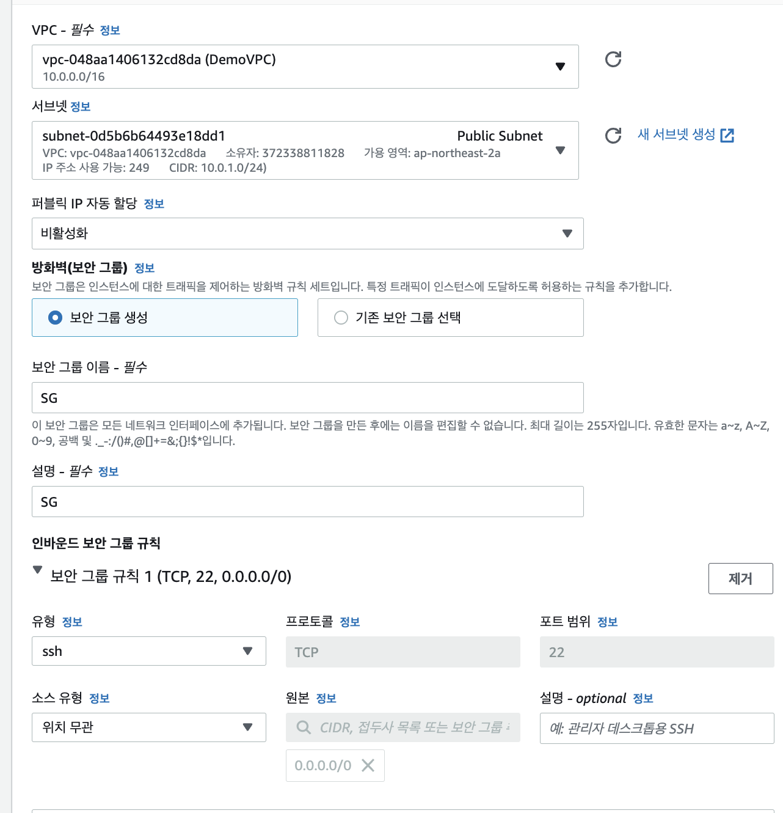
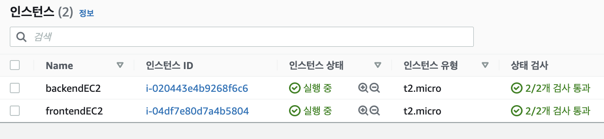
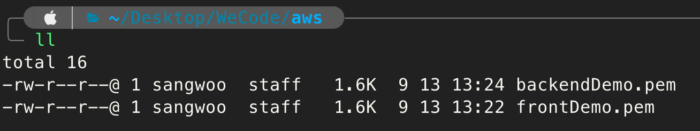
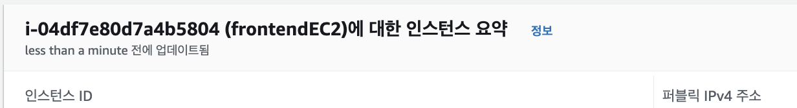
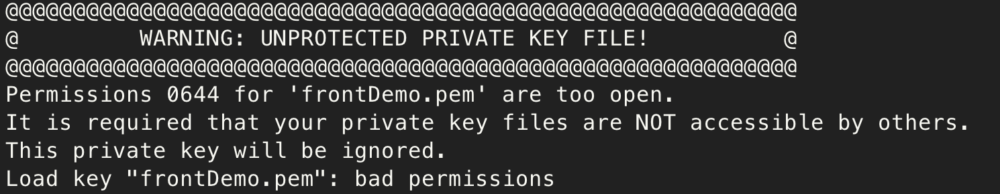
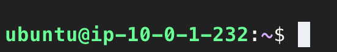

Frontend 코드를 담을 EC2를 생성한다.

EC2 인스턴스 생성에 들어가서 이름을 적고 Amazon Linux나 ubuntu 이미지를 선택한다. 나는 ubuntu를 선택한다. 버전은 프리티어가 가능한 버전으로 선택을 해준다.


인스턴스 유형은 프리티어 사용이 가능한 t2.micro를 선택해줬다.



키페어는 오른쪽에 새 키 페어 생성을 눌러서 생성해주면 다운로드가 되는데 접속할 때 필요해서 나는 따로 폴더를 만들어서 저장해두었다.



네트워크 설정 부분은 편집을 눌러서 앞전에 만들어둔 demoVPC를 선택하고 frontend EC2가 운용될 서브넷인 `Public Subnet`을 선택해준다. 퍼블릭 IP는 활성화로 해주었는데 사진에서는 왜 비활성화지.. 아무튼 활성화로 체크해주고 보안그룹은 새로 생성해서 이름과 설명은 SG로 해준 뒤 생성을 해주면 된다.



백엔드도 같은 방식으로 하며, 서브넷은 `Private Subnet`을 선택해주고 `퍼블릭 IP는 비활성화` 해주어야한다. 어차피 활성화 선택해도 생성은 안된다. 



생성된 EC2 접속 방법은 다음과 같다.

가장 먼저 아까 생성했던 키페어가 저장되어있는 디렉토리로 이동한다.



그런 뒤에 다음 코드를 치면 된다
```javascript
// 우분투유저
ssh -i 키페어이름.pem ubuntu@EC2-PublicIP
// 리눅스 유저
ssh -i 키페어이름.pem ec2-user@EC2-PublicIP
```

퍼블릭 아이피 주소는 내가 접속하고자 하는 인스턴스에 들어가면 퍼블릭주소가 나와있다.



접속하면 뭐 호스트 인증을 뭐 설정할 수 없다고 쏼랴쏼랴 영어 쭉 나오고 연결하겠느냐 물어보면 yes를 적어준다.


그러면 다음과 같은 에러가 나타나게 된다. 키페어에 권한이 너무 많이 부여되어있어서 나타나는 에러다.



다음 코드를 입력하여 권한을 제어해준다
```javascript
chmod 400 키페어.pem

```

이제 다시 실행을 해주면 정상적으로 작동되어 접속된 모습을 볼 수 있다.



