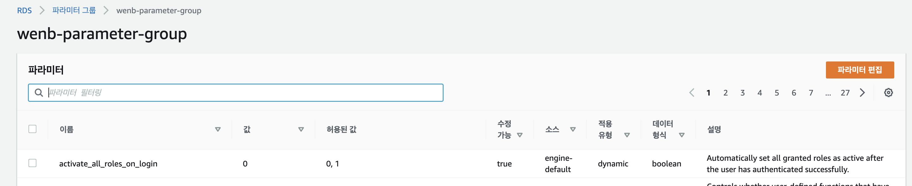

RDS를 생성하기 전에 먼저 파라미터 그룹을 생성해준다. 

파라미터 그룹은 RDS를 이용해 DB 인스턴스(mysql 서버)를 만들 때 해당 DB 인스턴스의 구성을 지정하는 방법으로 RDBMS 서버에서 사용하는 여러 설정값들이다. 메모리를 비롯해 데이터베이스에 할당할 리소스의 양을 지정하거나, 언어셋(charset)을 설정하는 등 다양한 서버 구성 값을 묶어 그룹으로 설정한 것이다.

파라미터 그룹 생성을 눌러서 database를 선택하고 이름과 디스커션을 작성하고 생성을 눌러준다.


다음으로 우리가 사용하기에 알맞게 설정해주어야한다. 방금 생성한 파라미터 그룹에 들어가서 편집을 눌러 다음 사진과 같이 값을 변경해주어야 한다. 



편집을 누르고 검색을 해서 값을 변경할 수 있다. 변경할 값은 다음 사진 밑의 표와 같다


|이름|값|
|---|---|
|character_set_client|utf8mb4|
|character_set_connection|utf8mb4|
|character_set_database|utf8mb4|
|character_set_results|utf8mb4|
|character_set_server|utf8mb4|
|collation_connection|utf8mb4_unicode_ci|
|collation_server|utf8mb4_unicode_ci|

여기서 utf8mb4는 글자당 최대 4bytes까지 할당하기 위한 것으로, 기존에는 utf8만으로도 전세계의 언어를 표현하는데 문제가 없었지만 이모티콘과 같은 다양한 문자가 탄생하면서 utf8mb4로 설정해주어야 한다.

collation은 보통 2가지 unicode_ci와 general_ci로 설정하는데, general의 경우 unicode보다 빠르지만 덜 섬세하다. 지금 시대에는 CPU의 성능이 워낙 좋다보니 좀 더 섬세한 unicode로 설정하는게 좋다.

이제 파라미터 그룹 생성이 끝났으니, 데이터베이스를 생성해야 한다.

데이터베이스 생성을 누른 뒤 표준생성으로 하고 MySQL을 골라준다. 버전은 프로젝트에 맞는 버전을 골라준다.


템플릿은 공부를 위한 것이므로 프리티어로 선택을 한 뒤 설정에서 인스턴스 이름과 마스터 이름 비밀번호를 설정한다.


인스턴스 구성은 공부를 위한 것이므로 가장 적은 db.t2.micro를 설정한다.


스토리지 용량 선택은 기본 20GiB로 설정되어있으며 자동 조정을 비활성화 해준다. 활성화를 DB의 용량이 할당해놓은 20GiB에 근접했을 때 자동으로 용량을 늘려주며, 아래쪽에 설정된 최대 용량까지 늘어난다. 나는 20GiB로 충분하기도 하고 요금이 두려워 설정을 해제해줬다.


다음 커넥션 설정이다. 연결하는 과정이 따로 있을까 싶어 공부를 위해 연결을 안하는 것으로 설정했고, VPC는 앞전에 생성한 DemoVPC를 선택했다. 서브넷 그룹은 따로 만들어둔 Private Subnet이 안떠서 우선 디폴트 값으로 설정했다.
Public Access는 Private 하게 관리하기 위해 아니요를 선택했다.


보안 그룹은 새로 생성하여 이름을 지정해주었다.


인증은 암호 인증을 했고 모니터링은 해제 하였다. 모니터링을 체크하면 DB 인스턴스가 실행되는 OS의 측정치를 실시간으로 제공해준다.


이제 추가 구성을 선택해서 초기 데이터베이스 이름을 설정하고(안해도 된다) 제일 중요한 파라미터 그룹을 앞에서 만들어 둔 파라미터 그룹으로 선택해준다. 백업은 DB의 스냅샷을 자동으로 생성하는데 용량 차지할거 같아서 해제해준다.


마지막으로 유지관리에서 마이너 버전 자동 업그레이드를 해제했다. 데이터베이스는 버전이 자동으로 업그레이드 되면 혹시 모를 버전간의 차이로 혼란이 있을 수 있어서 해제 한 뒤 데이터베이스를 생성 해준다.


이제 데이터베이스가 생성 되었으니 좀 전에 생성한 보안그룹의 인바운드 규칙을 설정해줘야 한다. 인바운드 규칙을 통해 접속할 수 있는 IP를 제한하거나 완전히 풀어놓을 수 있다.


나는 프라이빗하게 관리를 위해 백엔드 EC2에서만 접속할 수 있도록 사용자 지정 TCP로 변경한 뒤 소스에서 사용자 지정으로 바꿔주고 옆에는 프라이빗 IP주소를 적었다.


RDS에 접속하기 위해서는 생성한 데이터베이스에 적혀있는 엔드포인트 주소를 복사해서


다음과 같이 작성해서 접속한다.

```javascript

mysql -h 'DB Instance Endpoint 주소' -u 'user' -p
```

아..... 접속은 backend EC2에서 해야하는데.. 이거 프라이빗이라 접속하려면 또 뭔가 설정과 공부가 필요해서 다시 찾아보고 더 작성하겠다..ㅠㅠ
