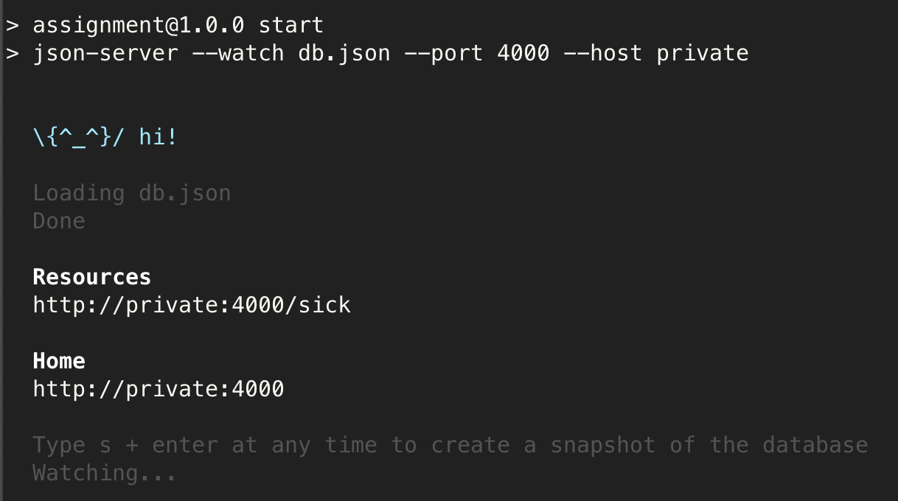

# 문제

라이브러리를 배포하기 위해 작업을 하던 중에 프론트엔드 동기분이 json server를 배포해보고 싶다고 하셔서 ec2를 알려드렸는데 json server가 정상적으로 작동을 하고 있지만 접근이 안돼서 처음에는 인바운드 규칙 때문에 접근이 안되는건가 하고 여러 방법을 시도하다가 json server에서 설정을 해줘야 하는것을 알게 되었다.

json server를 ec2에 설치하고 패키지를 설치한 뒤 npm start를 해주면 다음과 같이 나타났다.


ec2라는 서버의 localhost를 사용한다는 의미로 받아들여서 문제가 없다고 생각되었지만 문제는 저 localhost 였다..

# 해결

json server의 package.json으로 들어가서 scripts 부분을 수정해주어야한다.


다음과 같이
```
"start": "json-server --watch db.json --port 4000 --host 프라이빗 아이피"
```

`--host`를 추가해주고 `프라이빗 아이피`를 적어준다.
프라이빗 아이피는 EC2 인스턴스에 있다.

그리고 npm start로 실행한 뒤



`http://퍼블릭아이피:포트/END-POINT`로 접속을 해주면 

다음과 같이 데이터가 잘 나온다.


# Reference

[stack overflow questions 50508463](https://stackoverflow.com/questions/50508463/issue-with-running-json-server-on-aws-server-returning-404)