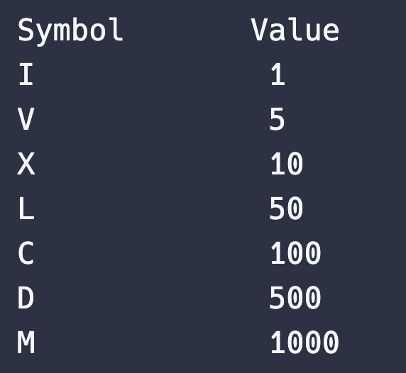

# 로마자에서 숫자로 바꾸기
> 1~3999 사이의 로마자 s를 인자로 주면 그에 해당하는 숫자를 반환해주세요.\
> 로마 숫자를 숫자로 표기하면 다음과 같습니다.



> 로마자를 숫자로 읽는 방법은 로마자를 왼쪽부터 차례대로 더하면 됩니다.\
> III = 3 XII = 12 XXVII = 27 입니다.\
> 그런데 4를 표현할 때는 IIII가 아니라 IV 입니다.\
>  뒤의 숫자에서 앞의 숫자를 빼주면 됩니다. 9는 IX입니다.\
> I는 V와 X앞에 와서 4, 9 X는 L, C앞에 와서 40, 90 C는 D, M앞에 와서 400, 900입니다.


----

# 풀이

```javascript
function romanToNum(s){
    let symbol = {
    I:1,
    V:5,
    X:10,
    L:50,
    C:100,
    D:500,
    M:1000
    }
    let result = 0;
    for(let i = 0; i < s.length; i++){
      let num1 = symbol[s[i]]
      let num2 = symbol[s[i+1]]

      if(num1 < num2){
        result -= num1
      } else {
        result += num1
      } 
    }
    return result
}
```
# 실행결과


# comment

로마숫자를 객체로 만든 뒤 for문과 초기값 `result`를 이용해서 인자`s`의 값을 앞뒤로 비교하여 풀이 하였다. 생소한 로마숫자이기에 처음 문제를 이해하는데 다소 시간이 소요되었지만 문제를 이해하고 흐름을 그려가니 약간의 막힘은 있었어도 풀이하는데 큰 어려움은 없었다.