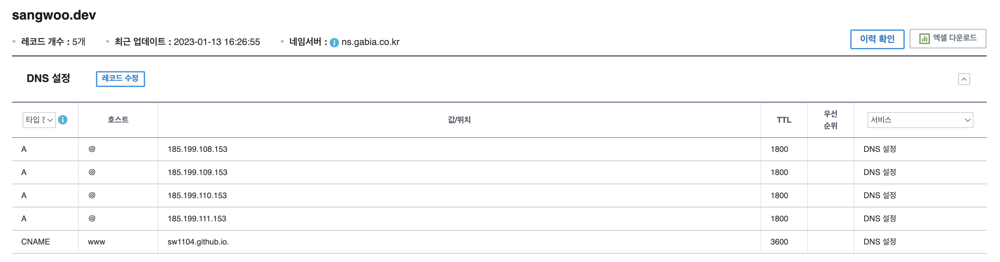
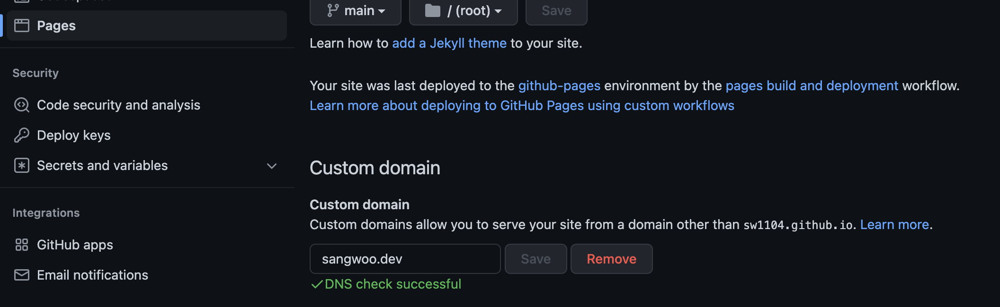
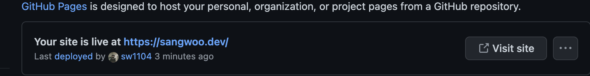
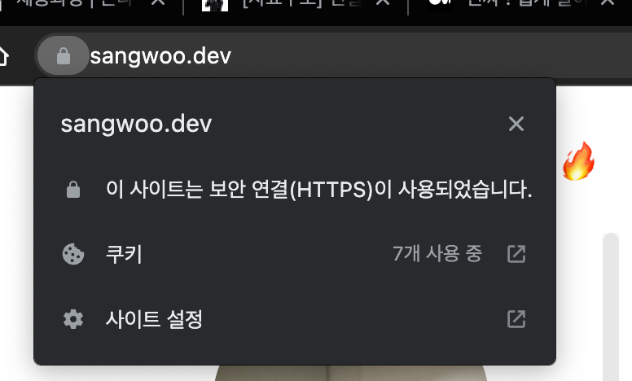
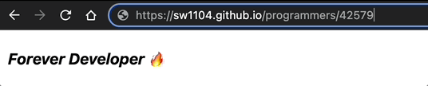

# 가비아 세팅

가비아에 접속해서 도메인 DNS 설정에 들어간 뒤 다음과 같이 추가해준다.

위와 같이 A 레코드와 CNAME을 설정한다. 

이렇게 설정을 해주면 github에서 `HTTPS`를 지원한다.

[깃허브 레코드 설정](https://docs.github.com/en/pages/configuring-a-custom-domain-for-your-github-pages-site/managing-a-custom-domain-for-your-github-pages-site#configuring-a-records-with-your-dns-provider)

# github 설정

블로그 레포에 들어간 뒤 setting에 들어가준다.

page 메뉴에서 `Custom Domain`에 적용할 도메인을 작성하고 Save해준다.

도메인이 정상적으로 바뀐걸 확인한다.

적용 후 최대 48시간 안에 적용된다고 하는데 나는 1분? 2분? 만에 적용이 되었다.

블로그에 접속해보면 `HTTPS`로 잘 적용된걸 확인할 수 있다.

리다이렉션도 자동으로 해주는거 같다.

