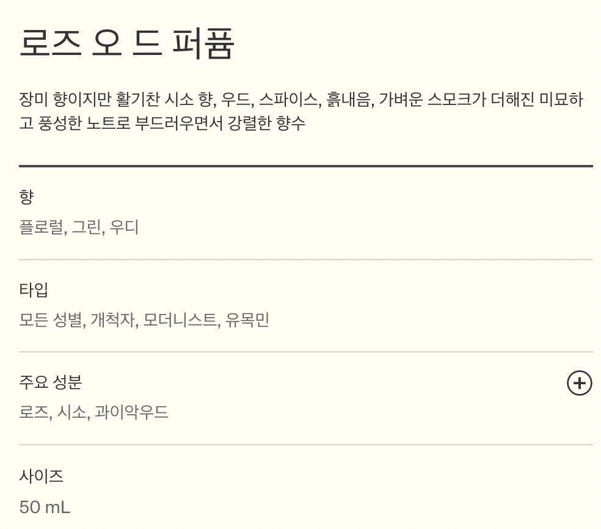
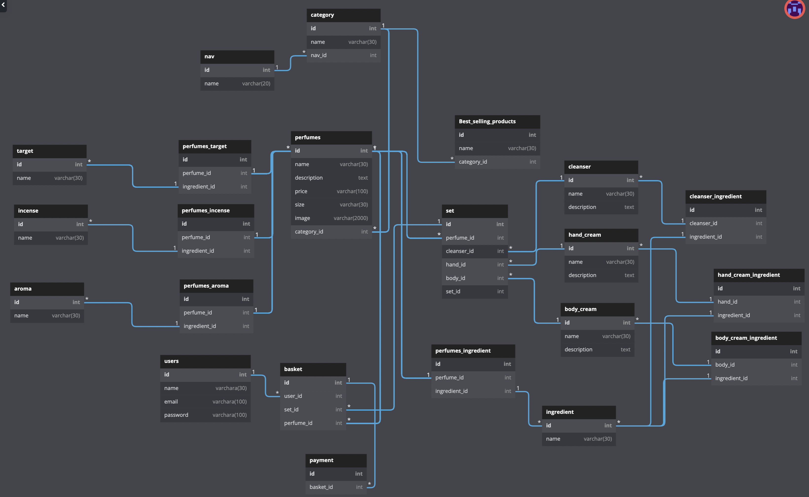
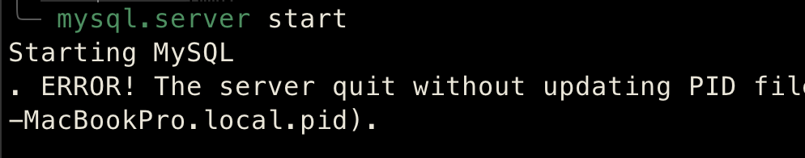
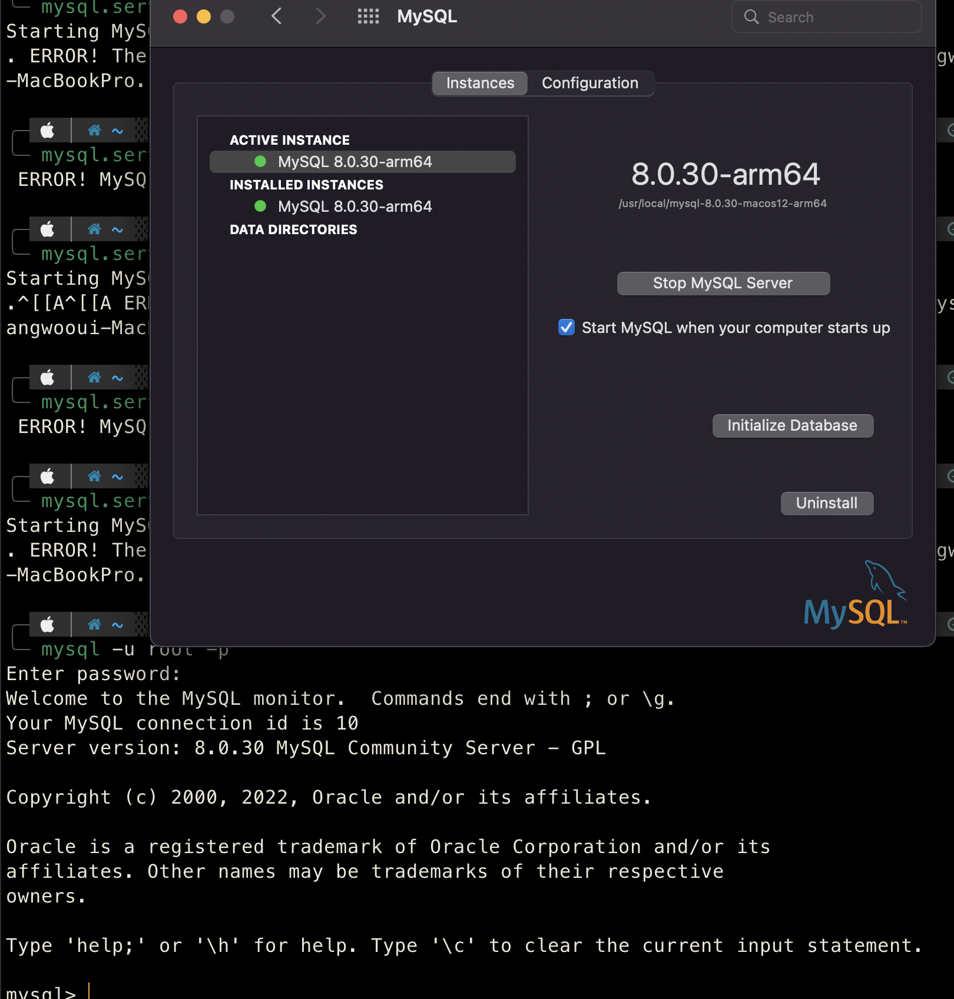

# Aesop 향수 카테고리 모델링

1차 프로젝트 Aesop의 향수 카테고리 모델링을 하였다. 향수 카테고리 안에 종류별로 다양한 카테고리가 있지만 제품이 많지 않아 모든 향수를 하나의 카테고리 안에 담아서 클론 하기로 했다.

향수 카테고리 안에 제품이 있는데 향수와 클렌져 + 바디크림 OR 핸드크림이 같이 있는 세트 상품이 있어서 클렌져와 바디크림, 핸드크림 테이블도 만들어서 set 테이블에 향수까지 참조를 했다.

그리고 제품 상세 페이지에는 제품 설명과 향 OR 아로마, 타입, 성분이 향수 뿐만 아니라 클렌져, 바디크림, 핸드크림까지 참조를 하면서 테이블이 많이 복잡해졌다...

사이즈와 가격표, 제품 설명, 이미지는 1:1이어서 향수 테이블 안에 넣기로 했다.

그리고 마지막으로 장바구니는 유저의 아이디와 세트상품 아이디 그리고 향수 제품 아이디를 참조했고 실제로 구현은 하지 않지만 결제 버튼을 누르면 장바구니가 비어질 수 있도록 결제 테이블도 추가를 했다.

그래서 완성된 모습은 다음과 같다.

참조관계가 너무 복잡하고 테이블이 많다보니 너무 세세하게 나눈게 아닌가 하는 생각도 들었지만 그래도 재밌었다.

# mysql........ PID?

재미있게 모델링을 하고 있던 와중에.... mysql이 안켜진다. PID가 정상적으로 업데이트가 되지 않고 종료가 되었다고 Mysql 서버를 start하면 에러가 나왔다...

이곳 저곳 찾아보고 brew를 이용해 설치를 해서 brew로 삭제도 해보고 했지만.. 안된다. 그래서 혹시 몰라서 공식홈페이지에서 mysql을 받아서 설치해서 시스템 환경설정에 있는 mysql로 서버를 열고 실행하니 실행이 되었다!

하지만 이것은 내가 느끼기엔 임시방편 같아보였다.. 터미널에서 시작을 하면 오류가 그대로 뜨기 때문이다ㅠ

이틀 전까지 잘 사용했고 서버도 mysql.server stop 명령어로 잘 닫았는데 갑자기 왜 이러는지 이해가 되지 않는다..

비록 데이터는 다 날아갔지만, 그래도 서버가 돌아가는거에 나는 만족한다..!

