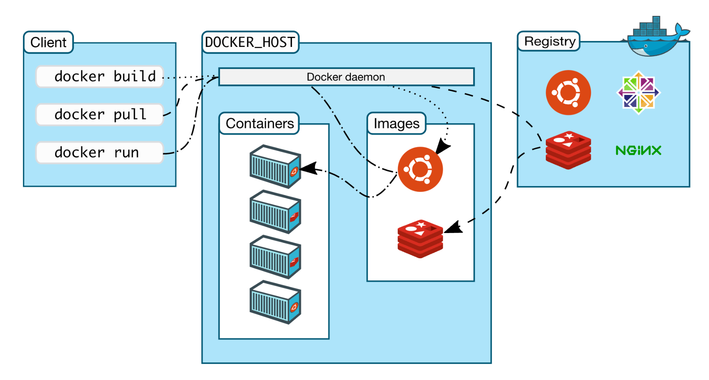

# 쿠버네티스 (Kubernetes)
쿠버네티스는 키잡이나 파일럿을 뜻하는 그리스어에서 유래되었다. 쿠버네티스는 리눅스 컨테이너 작업을 자동화 하는 오픈소스 플랫폼을 뜻한다.

컨테이너의 수가 많아지면 관리와 운영에 있어 어려움이 있다. 쿠버네티스는 컨테이너 오케스트레이션 툴로 다수의 컨테이너를 다룰 수 있는 시스템이다. 오케스트레이션이란 여러 서버에 걸친 컨테이너 및 사용하는 환경 설정을 관리하는 것으로, 컨테이너의 생성과 삭제, 시작 및 중단 시점을 제어, 스케줄링, 로드 밸런싱, 클러스터링 등 컨테이너로 어플리케이션을 구성하는 모든 과정을 관리할 수 있다.

## 쿠버네스트 특징
- 다수의 컨테이너를 관리
- 하드웨어를 최대한 활용해서 애플리케이션을 실행하는 데 필요한 리소스를 극대화
- 애플리케이션 배포 및 업데이트 자동화
- 스토리지를 장착 및 추가해서 stateful하게 애플리케이션 실행
- 컨테이너화 된 애플리케이션과 리소스를 즉시 확장
- 선언적으로 서비스를 관리해 배포된 애플리케이션이 항상 목적대로 실행되도록 함
- 자동 배치, 재시작, 복제, 확장을 사용해 애플리케이션 상태를 확인하고 복구를 수행

# 도커 (Docker)
도커는 컨테이너 가상화 기술을 기반으로 하는 오픈소스 플랫폼이다. 컨테이너 가상화 환경 위에 애플리케이션 배포 엔진을 더해서 사용자의 코드를 어디서든 빠르고 가볍게 실행시킬 수 있다. 또 요즘 널리 사용되는 MSA(Micro Service Architecture), CI/CD와 아주 잘 어울리기에 각광받는다. 실제로 도커는 한 컨테이너당 하나의 애플리케이션이나 프로세스를 실행하는 것을 권하고 있는데, 이는 MSA와 일맥상통한다.

# 도커의 구조
도커의 엔진은 클라이언트가 명령어를 서버에 전달하고 서버가 전달받은 명령어를 실행시키는 Client-Server Architecture를 사용하고 있다. 도커 오브젝트를 관리하는 주체가 서버리며, 오브젝트를 조작하기 위해 클라이어느가 명령어를 서버에 전달하면 서버의 dockerd(Docker daemon)라는 프로세스가 동작하여 해당 명령어를 실행한다. 
## 클라이언트 (Client)
클라이언트는 사용자가 도커 오브젝트를 관리하기 위해 사용하는 가장 근본적인 수단이며 CLI를 제공한다. 사용자가 명령어를 입력하면 해당 명령어를 수행하는 dockerd 프로세스에 전달한다.

## 호스트 (Host)
호스트는 도커 오브젝트를 관리하는 주체이다. dockerd라는 프로세스가 클라이언트로부터 전달받은 명령어를 실행하면 다양한 도커 오브젝트(이미지, 컨테이너, 볼륨 등)를 관리하게 된다. 

## 저장소 (Registry) - DockerHub
도커는 공식적으로 DockerHub라는 저장소를 지원한다. GitHub에 소스 코드를 저장하여 관리하는 것과 같이 이미지를 저장하여 관리할 수 있다.

다음은 도커의 구조이다.

# 도커 오브젝트
도커를 이용하면 다양한 도커 오브젝트를 활용하게 되는데 가장 핵심은 이미지와 컨테이너이다.
## 이미지
이미지는 컨테이너를 생성하기 위한 템플릿이다. 도커에서 공식적으로 제공하는 이미지가 있고, 다른 개발자들이 만들어 놓은 이미지가 있어서 이를 활용하여 자신만의 커스텀 이미지를 만들 수 있다.
## 컨테이너
컨테이너는 이미지의 실행 가능한 인스턴스로, 이미지를 실행시켜 컨테이너라는 가상화 공간에 만든다. 도커만 설치되어있다면 어디서든 저장소로부터 이미지를 가져와 컨테이너를 실행할 수 있다.

# 그 외 도커의 특징
- Logs : 로그는 현재 서비스의 상태를 파악할 수 있기에 어떠한 서비스를 운영하더라도 매우 중요하다. 컨테이너는 stdout, stderr, stdin을 통해서 생성되는 로그를 전부 수집하여 분석 혹은 trouble-shooting을 가능하게 해준다.
- Resource Isolation Grouping : 리눅스 커널의 Cgroups 기능을 통해 각각의 컨테이너마다 독립적인 리소스가 할당될 수 있다.
- 독립적 : 컨테이너는 독립된 파일 시스템으로, 컨테이너는 호스트와 완전히 분리되어 있는 프로세스 환경을 가지고 있으므로 독립적인 가상 네트워크 인터페이스와 IP 주소를 가진다.