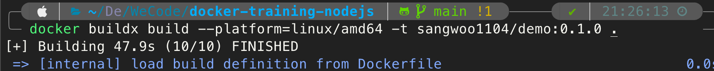
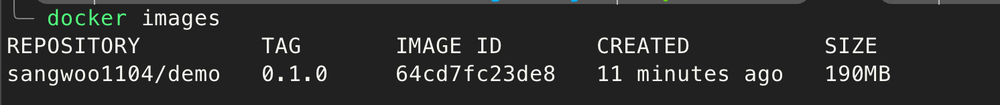
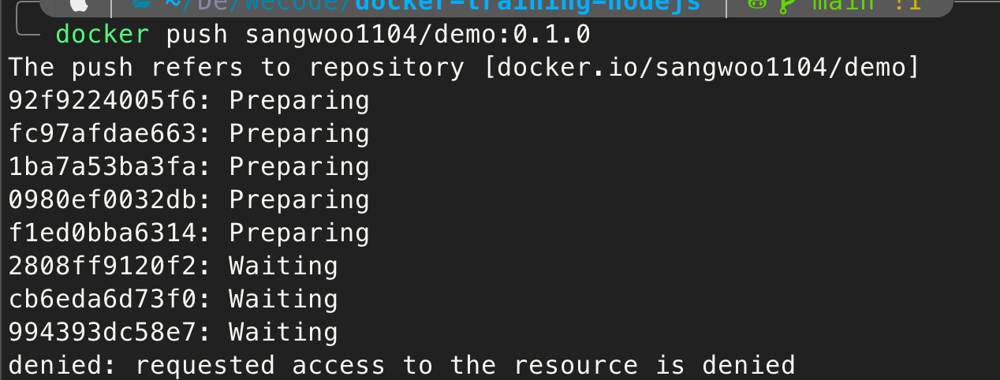
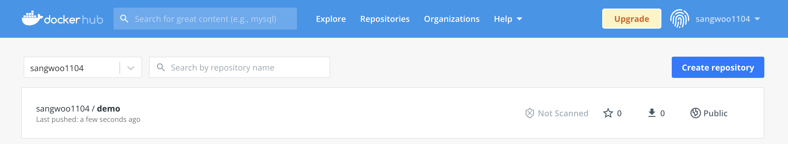

# DockerFile 작성
docker image를 생성하려면 먼저 프로젝트에 dockerfile이 필요하다.

나는 wecode에서 docker 실습을 위해 준비해준 프로젝트를 이용할거고, 다른 프로젝트를 하더라도 프로젝트에 맞게 작성해주면 된다.

```javascript
FROM node:16-alpine

WORKDIR /usr/src/app

COPY package*.json .

RUN npm install

COPY . .

EXPOSE 3000

CMD ["npm", "start"]
```

# Docker image 
Docker image를 build 하기 위해 다음 명령어를 사용해준다.
```javascript
docker build -t 'DockerHub username'/'image name(project name)':'version' 'Dockerfile path'
```
주의!!! 애플 실리콘칩은 ARM칩이기에 다음 명령어를 사용해야한다.
```javascript
docker buildx build --platform=linux/amd64 -t 'DockerHub username'/'image name(project name)':'version' 'Dockerfile path'
```
위의 명령어를 사용하면

다음과 같이 이미지가 잘 생성된 것을 볼 수 있다.

이제 다음 명령어를 통해 DockerHub에 올려야한다.

```javascript
docker push username/project name:version
```

그런데 이럴수가! 정상적으로 올라가지 않는다.. 



무엇이 문제인가 살펴보니 `docker login`이 되어있지 않아서 생긴 문제라고 한다.
다음 명령어를 이용해서 터미널상에서 로그인을 해준다.
```javascript
docker login
```

그리고 이제 올려보면 정상적으로 올라가고 DockerHub에 가서 보니 푸쉬가 잘 된것을 볼 수 있다.

