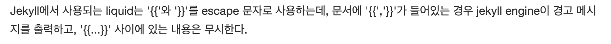
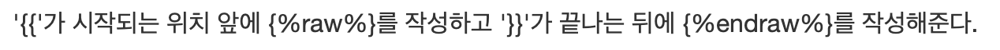

# 문제

기업 인턴십 프로젝트 페이지별로 코드에 대해 설명하는 글을 작성하고 푸쉬를 했는데 다음과 같은 에러가 나타났다.

# 원인

검색을 통해 찾아본 결과

# 해결

그렇다면 어떻게 써야하는가

다음과 같이 작성해주면 된다.

# 참고

[Jekyll에서 liquid warning 처리](http://jmjeong.com/escape-in-liquid-syntax/)
