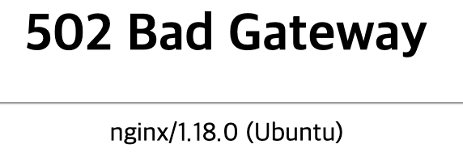

#### **문제**

앞 게시글의 CORS 에러를 해결하고 바로 502 Bad Gateway 날 찾아왔다.. 



nginx 502 Bad Gateway로 검색을 해보니 정말 많은 경우의 수가 나왔다.

가장 먼저 Nginx에서 요청을 받아 도메인을 처리하는 시간이 즉 버퍼가 부족해서였다. 

때문에 나는 location안에 buffer를 추가하는 코드를 작성하였다.

```
location / {
	
	...
    
	proxy_buffer_size          128k;
	proxy_buffers              4 256k;
	proxy_busy_buffers_size    256k;
	
	...
    
}
```

하지만 이것은 나에게는 해당되지 않았다.

다음으로는 디렉토리 경로가 잘못된경우가 있었는데 경로를 수정하고 수정하고 해봤지만 나에게는 해당되지 않았다...

#### **해결**

이 때까지만 해도 나는 에러로그는 복잡하고 보기 어렵다는 생각과 구글에는 다 나와있을 것이라는 생각을 가지고 있어서 구글링으로 해결을 하려는 멍청한 생각을 가지고 있었다. 자신의 문제조차 모르고 해결을 하려하다니...ㅠㅠ

nginx의 에러로그를 보니 떡하니 나의 문제가 나와있었다.. 그것은 바로

```
/run/gunicorn.sock failed (13: Permission denied)
```

권한 문제였다. gunicorn 서비스 등록을 위해서 유저와 그룹에 대해 권한을 부여해줘야 한다.

```
sudo chown ubuntu:www-data 디렉토리 // 권한 부여

ll //권한 변경 확인
```

권한을 부여하고 확인을 해보면 정상적으로 변경됨을 확인할 수 있다.


다음으로 gunicorn.sock 파일 권한을 변경해주기 위해 파일이 있는 디렉토리로 옮겨가서 다음 명령어를 실행해주었다.

```
sudo chmod 666 gunicorn.sock
```

각 숫자는 순서대로 사용자, 그룹, 다른사용자 순서이고 읽기는4 쓰기는2 실행은1로 각각을 더해서 설정할 수 있다. 나는 666으로 설정을 해주었다. 

여기까지 실행해주고 다시 통신을 했지만 502 Bad Gateway가 떳다...

다시 에러로그를 보니 권한 문제이다.... 더 해주어야 하는것이 무엇인지 더 이상은 검색을 해도 나오지 않아서 다시 초심으로 돌아가서 각각의 설정 파일들을 하나하나 뜯어보았다. 그러고 발견을 했다.

nginx.conf 파일의 1번 줄이 다음과 같이 되어있었다. 

```
user www-data
```

나는 이것이 확실하다고 생각을 했고 바로 내가 권한을 부여해 준 사용자인 ubuntu로 변경을 해주었다.

```
user ubuntu
```

벌렁벌렁이는 심장을 부여잡으며 다시 통신을 해보았고 드디어 제대로 통신이 되었다!! 만세!!