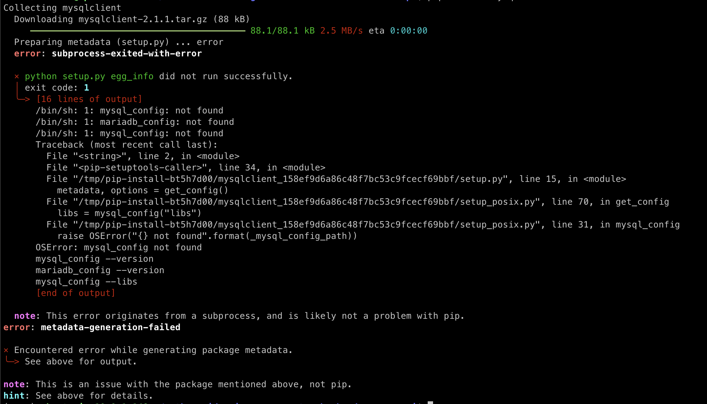

#### **문제**

AWS-EC2 ubuntu 22.04 버전으로 생성 후 파이썬 프로젝트의 패키지를 설치 하던 중 다음과 같은 에러를 마주하였다.



#### **해결**

검색을 통해 libmysqlclient-dev를 설치하여 해결해주었다.

```
sudo apt-get install libmysqlclient-dev
```

패키지를 설치할 때 아래에 해당하는 에러가 날 경우에는 pip를 업그레이드 해주거나 setuptools를 업그레이드 해주면 해결된다고 한다.

```
Command "python setup.py egg_info" failed with error code 1 in /tmp/pip-build-on0urr/pip/
```

```
python -m pip install --upgrade pip

pip install --upgrade setuptools
```

#### **참고**

[stackoverflow](https://stackoverflow.com/questions/35991403/pip-install-unroll-python-setup-py-egg-info-failed-with-error-code-1)