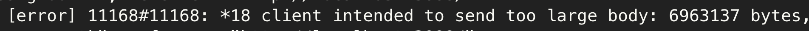

## **Nginx 파일 용량 초과 에러**

#### **문제**

Todo List server를 배포하고 회원가입 통신에서 에러를 마주하였다.



원인을 찾아보니 nginx에서 받아올 수 있는 파일의 최대 용량을 설정하는 client\_max\_body\_size의 기본 값이 1m이고 클라이언트의 content-length 헤더 값이 더 클 경우 nginx는 413 에러(Request Entity Too Large)를 응답한다고 한다.

#### **해결**

따라서, nginx의 설정에서 client\_max\_body\_size의 값을 지정해주고 nginx를 재시작 하면 된다.

```
server{
	...
	location / {
    	...
    	client_max_body_size 100m;
    	...
    }
	...
}
```

만약 용량을 제한하지 않고 다 받아오겠다면 client\_max\_body\_size 0; 으로 설정해주면 된다.