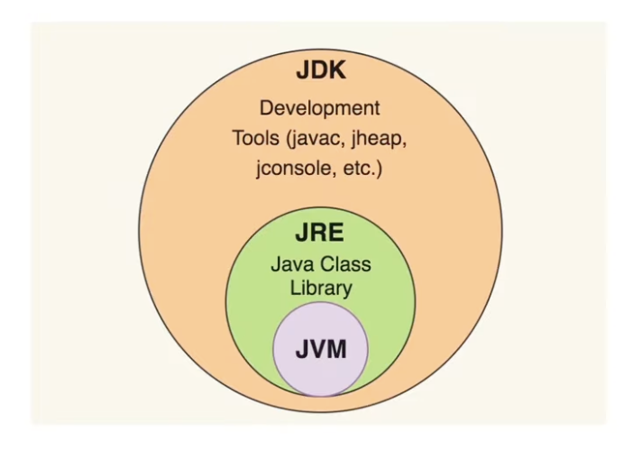

# JVM (Java Virtual Machine)

운영체제마다 다른 `컴파일러`가 필요하다. 이는 운영체제마다 `0`과 `1`을 조합하는 방식이 다르기 때문이다. C언어의 경우에는 각각의 운영체제에 맞는 컴파일 방식을 사용해야하지만 JAVA는 그렇지 않고 JVM이 운영체제에 맞게 알아서 번역한다.

즉, JVM은 컴파일된 `0`과 `1`의 조합을 해당 컴퓨터의 운영체제가 알아들을 수 있게 다시 한번 번역해주는 작업을 하는 것이다.

자바뿐만 아니라 그루비, 스칼라, 코틀린 등에서도 사용된다.

# JRE (Java Runtime Environment)

JVM + 자바 프로그램 실행에 필요한 라이브러리 파일들을 포함한다. JVM의 실행 환경을 구현한다.

# JDK (Java Development Kit)

JRE + 개발을 위한 컴파일러, 디버그 등의 도구들을 포함한다.

# 결론

JDK > JRE > JVM 

JDK를 설치하면 JRE와 JVM도 함께 설치된다. 따라서 JAVA의 버전은 JDK의 버전이 된다.

# 참고

[공부하는 개발자](https://youtu.be/f0cAmTYo4tQ)
