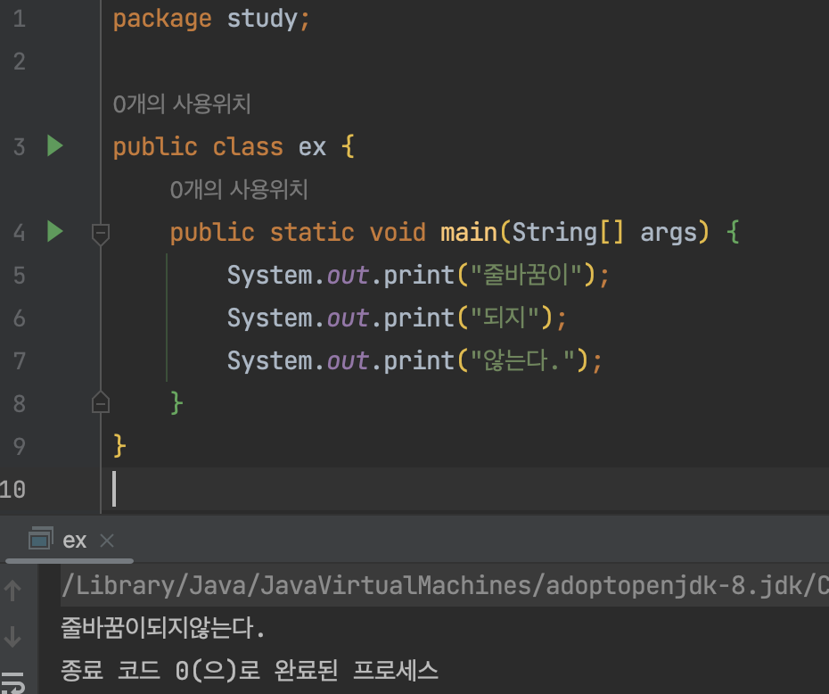
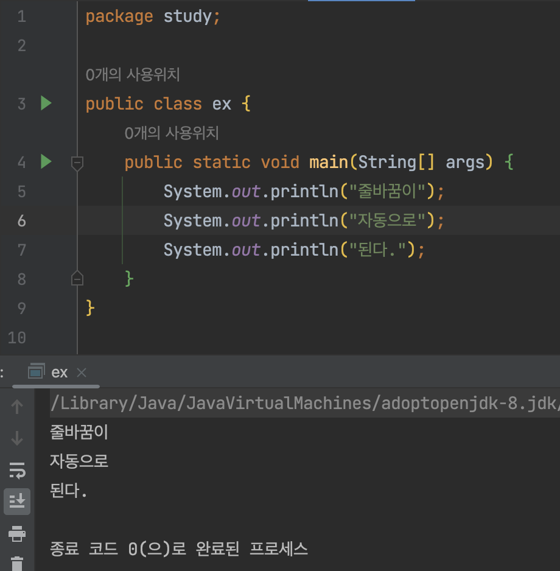

## System.out.print

형식(int, float, double 등)에 구애받지 않는 문자를 그대로 출력하고 싶을 때 사용한다.

엔터 입력시 버퍼(buffer)에 \n(개행문자)는 포함 안됨.(엔터 누르는 순간 엔터는 입력 안됨)

그래서 줄바꿈 필요 없을 때 println말고 print 사용하면 된다.

 

## System.out.println

`print`와 동일하게 형식(int, float, double 등)에 구애받지 않는 문자를 그대로 출력하고 싶을 때 사용한다.

차이점은 엔터 입력시 버퍼(buffer)에 \n(개행문자)가 같이 들어간다. (엔터 누르는 순간 엔터도 입력된걸로 간주)

## System.out.printf

`print`, `println`과 달리 형식을 신경써야할 때 사용(int, long, float, double 등)
엔터 입력시 버퍼(buffer)에 \n(개행문자)는 포함 안됨.

