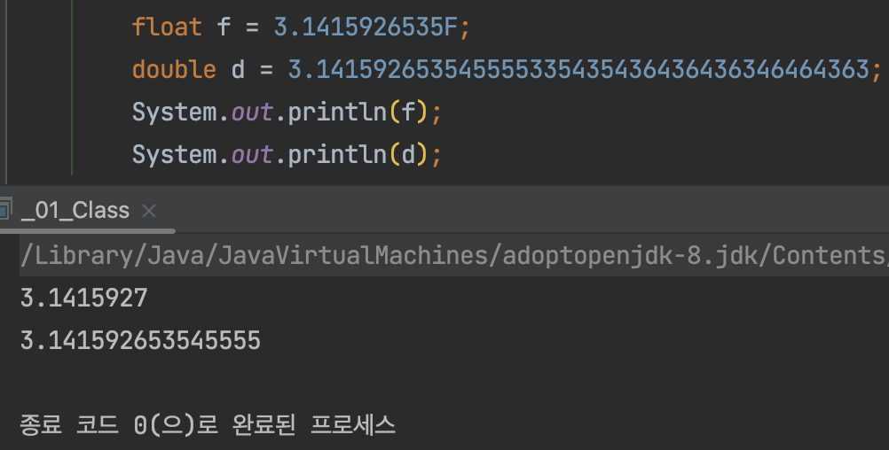

# Float과 Double

float과 double은 둘 다 실수를 표현하기 위해 사용되는 자료형이다. 

내가 알고 있는 float과 double의 차이는 두가지다.
 1. 자바는 기본적으로 실수형의 타입을 double로 인식하여 float을 사용하기 위해서는 실수 뒤에 f나 F를 붙여서 float임을 명시해야 하기 때문에 `3.14F`로 작성하지만 double은 `3.14`로 작성한다.
 2. float은 6번째 자리까지 정확히 표현되며 7번째 자리까지 출력되고 8번째 자리에서 올림 되며, double은 14번째 자리까지 정확하게 표현되며 15번째 자리까지 출력되고 16번째 자리에서 반올림된다. 
 
 

그러면, 작성하기에도 편하고 더 정확한 double을 쓰면 되는거 아닌가 싶은데.. float은 왜 쓰이는건지 궁금한데 찾아보면 둘의 특징에 대해서만 나올 뿐 왜 float도 쓰이는지에 대해서는 나오지 않는다. 좀 더 찾아보고 추가해야겠다.

