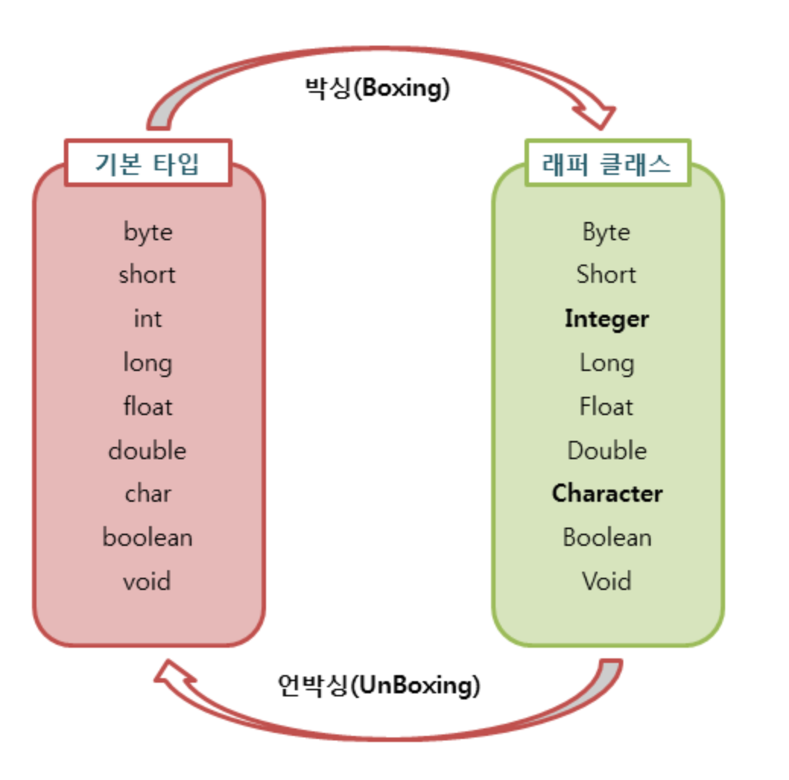

# 래퍼 클래스(wrapper class)

기본 타립의 데이터를 객체로 취급해야 하는 경우 기본 타입 8가지를 객체로 포장해주는 클래스를 래퍼 클래스라고 한다. 래퍼 클래스는 각각의 타입에 해당하는 데이터를 인수로 전달받아, 해당 값을 가지는 객체로 만들어 주는데, 자바에서는 java.lang 패키지에 포함되어 있다.

## 기본 타입에 맞춰 제공하는 래퍼 클래스

|기본 타입|래퍼 클래스|
|---|---|
|byte|Byte|
|short|Short|
|int|Integer|
|long|Long|
|float|Float|
|double|Double|
|char|Character|
|boolean|Boolean|

## 박싱과 언박싱

래퍼 클래스는 산술 연산을 위해 정의된 클래스가 아니라서 인스턴스에 저장된 값을 변경할 수 없고 값을 참조하기 위해 새로운 인스턴스를 생성해서 해당 값만을 참조할 수 있다.
따라서, 기본 타입의 데이터를 래퍼 클래스의 인스턴스로 변환하는 과정을 박싱이라 하고 래퍼 클래스의 인스턴스에 저장된 값을 다시 기본 타입의 데이터로 꺼내는 과정을 언박싱이라 한다.

JDK 1.5 부터 박싱과 언박싱이 필요한 상황에서 자바의 컴파일러가 이를 자동으로 처리하는데 이는 오토 박싱, 오토 언박싱 이라 한다.



### 예시

```java
Integer num = new Integer(1);   // 박싱
int n = num.intValue();         // 언박싱

Character ch = 'A';             // Character ch = new Character('A'); 오토 박싱
char c = ch;                    // char c = ch.charValue(); 오토 언박싱
```

# 래퍼 클래스의 비교 연산

래퍼 클래스는 객체이므로 `==` 를 사용하게 되면, 두 인스턴스의 값을 비교하는게 아니라 두 인스턴스의 주소값을 비교한다. 따라서 서로 다른 두 인스턴스는 `==` 연산자를 사용하면 `false`를 반환하기 때문에 인스턴스에 저장된 값의 동등 여부를 판단하기 위해서는 equals() 메소드를 이용해야 한다.


# 참고

[TCP SCHOOL](http://www.tcpschool.com/java/java_api_wrapper)


