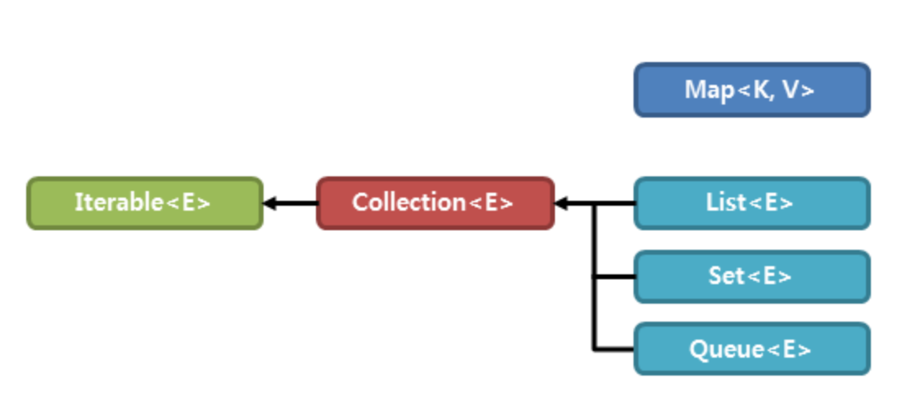

# 컬렉션 프레임워크(collection framework)

컬렉션 프레임워크는 다수의 데이터를 처리하기 위한 표준화된 방법을 제공하는 클래스 집합으로, 데이터를 저장하는 자료 구조와 데이터를 처리하는 알고리즘을 클래스로 구현한 것으로 인터페이스를 사용하여 구현한다.

# 컬렉션 프레임워크 주요 인터페이스

컬렉션 프레이워크에서는 데이터를 저장하는 자료 구조에 따라 3가지 인터페이스로 정의한다.
 1. List
 2. Set
 3. Map

List와 Set은 Collection interface를 상속 받지만 Map은 구조상의 차이로 별도로 정의된다.

# 인터페이스 간의 상속 관계

컬렉션 프레임워크를 구성하고 있는 인터페이스 간의 상속 관계는 다음과 같아.



`<E>`나 `<K, V>`는 제네릭이다.

# 특징

|인터페이스|특징|구현 클래스|
|---|---|---|
|List|순서가 있는 데이터의 집합으로 데이터의 중복을 허용한다.|Vector, ArrayList, LinkedList, Stack, Queue|
|Set|순서가 없는 데이터의 집합으로 데이터의 중복을 허용하지 않는다.|HashSet, TreeSet|
|Map|키와 값의 한 쌍으로 이루어진 데이터의 집합으로 순서가 없다. <br> 키는 중복을 허용하지 않지만, 값은 중복될 수 있다.|HashMap, TreeMap, Hashtable, Properties|

# 컬렉션 클래스

컬렉션 프레임워크에 속하는 인터페이스를 구현한 클래스로 모든 컬렉션 클래스는 List와 Set, Map 중 하나로 구현되었으며, 클래스 이름에도 구현한 인터페이스의 이름이 포함되어있다.

기존에 만들어졌던 클래스는 기존 코드의 호환성을 위해 남아있지만 새로 추가된 ArrayList나 HashMap 클래스를 사용하는것이 성능 면에서 득이된다.

## ArrayList 예제

```java
import java.util.*;

public class CollectionEx{
  public static void main(String[] args) {
    // 리스트 생성
    ArrayList<String> arr = new ArrayList<String>();

    // 리스트에 요소 저장
    arr.add("가");
    arr.add("나");
    arr.add("다");

    // 리스트 요소 출력
    for(int i = 0; i < arr.length(); i++) {
      System.out.println(arr.get());
    }
  }
}

//  출력
가
나
다
```

# Collection Interface

List와 Set은 Collection Interface를 상속받기 때문에 많은 공통 부분을 여기서 정의한다. 

## Collection Interface에서 제공하는 주요 메소드

|메소드|설명|
|---|---|
|boolean add(E e)|해당 컬렉션에 전달된 요소를 추가(선택적 기능)|
|void clear()|해당 컬렉션의 모든 요소 제거(선택적 기능)|
|boolean contains(Object o)|해당 컬렉션이 전달된 객체를 포함하는지 확인|
|boolean equals(Object o)|해당 컬렉션과 전달된 객체가 같은지|
|boolean isEmpty()|해당 컬렉션이 비어있는지|
|Iterator<E> iterator()|해당 컬렉션의 반복자를 반환|
|boolean remove(Object o)|해당 컬렉션에서 전달된 객체를 제거(선택적 기능)|
|int size()|해당 컬렉션의 요소의 총 개수 반환|
|Object[] toArray()|해당 컬렉션의 모든 요소를 Object 타입의 배열로 반환|

# 참고

[TCP SCHOOL](http://www.tcpschool.com/java/java_collectionFramework_concept)
