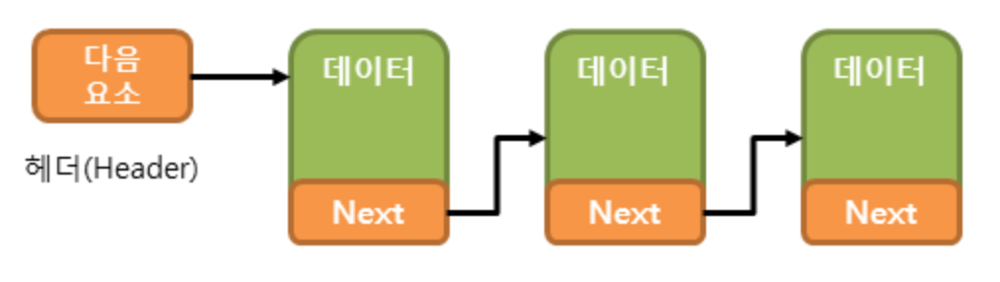
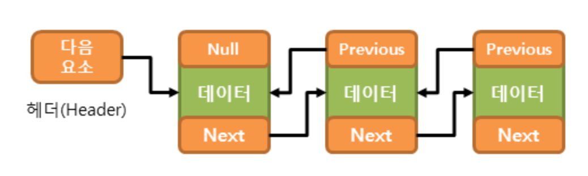

# List collection class

List 컬렉션 클래스에 속하는 클래스는 다음과 같다.
 1. ArrayList<E>
 2. LinkedList<E>
 3. Vector<E>
 4. Stack<E>

특징으로는 
 1. 요소의 저장 순서 유지
 2. 중복 저장 가능

## ArrayList

ArrayList는 가장 많이 사용되는 컬렉션 클래스 중 하나로 내부적으로 배열을 이용해 요소를 저장한다. 배열을 이용하기 때문에 인덱스를 이용해서 배열 요소에 빠르게 접근할 수 있다. 하지만 배열은 크기를 변경할 수 없는 인스턴스이기 때문에 크기를 늘리기 위해서는 새로운 배열을 생성하고 기존의 요소들을 옮겨해서 요소의 추가 삭제 작업에 걸리는 시간이 매우 길어지는 단점을 가진다.

### 예제

```java
ArrayList<Integer> arr = new ArrayList<Integer>();

// 요소 저장 : arr() 메소드 이용
arr.add(4);
arr.add(3);
arr.add(2);
arr.add(1);

// 요소 출력 : for 문과 get() 메소드 이용
for (int i = 0; i < arr.length; i++) {
        System.out.print(arr.get(i)+" "); // 4 3 2 1
}

// 요소 제거 : remove() 메소드 이용
arr.remove(1); // 인덱스를 이용해서 제거한다. 4 2 1

// 요소 출력 2 : Enhanced for 문과 get() 메소드 이용
for (int e : arr) {
    System.out.print(e + " "); // 4 2 1
}

// 요소 정렬 : Collections.sort() 메소드를 이용
Collections.sort(arr); // 1 2 4

// 요소 출력 3 : iterator()와 get() 메소드 이용
Iterator<Integer> num = arr.iterator();
while (num.hasNext()) {
    System.out.print(num.next() + " "); // 1 2 4
}

// 요소 변경 : set() 메소드 이용
arr.set(2, 3); // (인덱스, 값) 1 2 3

// 요소 개수 : size() 메소드 이용
arr.size(); // 3
```

# LinkedList

LinkedList 클래스는 ArrayList 클래스의 단점을 극복하기 위해 고안되었다. LinkedList 클래스는 연결리스느를 이용하여 요소를 저장한다. 배열은 요소가 순차적으로 저장되지만 연결 리스트는 비순차적으로 분포하여 이를 링크로 연결하여 구성한다.

## 단일 연결 리스트(singly linked list)

다음 요소를 가리키는 참조만을 가지는 연결리스트로 요소의 저장과 삭제 작업이 다음 요소를 가리키는 참조만 변경하면 되기 때문에 빠르지만 이전 요소로 접근하기는 어렵다.



## 이중 연결 리스트(doubly linked list)

이전 요소를 가리키는 참조를 가지므로 좀 더 만히 사용된다. LinkedList도 이중 연결 리스트를 내부적으로 구현한 것이다. 



## 예제

ArrayList처럼 LinkedList 역시 List 인터페이스를 구현하기 때문에 메소드는 거의 같다.

```java
LinkedList<String> lnk = new LinkedList<String>();

// 요소 저장 : add() 메소드 이용
lnk.add("라");
lnk.add("다");
lnk.add("나");
lnk.add("가");

// 요소 출력 : for 문과 get() 메소드 이용
for (int i = 0; i < lnk.length(); i++) {
        System.out.print(lnk.get(i)+" "); // 라 다 나 가
}

// 요소 제거 : remove() 메소드 이용
lnk.remove(1); // 인덱스를 이용해서 제거한다. 라 나 가

// 요소 출력 2 : Enhanced for 문과 get() 메소드 이용
for (int e : lnk) {
    System.out.print(e + " "); // 라 나 가
}

// 요소 변경 : set() 메소드 이용
lnk.set(0, "다"); // (인덱스, 값) 다 나 가
lnk.set(2, "카"); // (인덱스, 값) 다 나 카

// 요소 개수 : size() 메소드 이용
lnk.size(); // 3
```

# Vector

현재는 기존 코드와의 호환성을 위해서 남아있고 ArrayLint를 사용하는 것이 권장된다.

# 메소드

List 인터페이스 주요 메소드는 다음과 같다.

|메소드|설명|
|---|---|
|boolean add(E e)|요소를 추가|
|void add(int index, E e)|특정 위치에 요소 추가|
|void clear()|모든 요소 제거|
|boolean contains(Object o)|전달된 객체를 포함하는지 확인|
|boolean equals(Object o)|전달된 객체와 같은지 확인|
|E get(int index)|특정 위치에 존재하는 요소 반환|
|boolean inEmpty()|비어있는지 확인|
|Iterator<E> iterator()|반복자를 반환|
|boolean remove(Object o)|전달된 객체를 제거|
|boolean remove(int index)|특정 위치의 요소 제거|
|E set(int index, E e)|특정 위치의 요소를 객체로 대체|
|int size()|요소의 총 개수|
|Object[] toArray()|모든 요소를 Object 타입의 배열로 반환|

# 참고

[TCP SCHOOL](http://www.tcpschool.com/java/java_collectionFramework_list)

