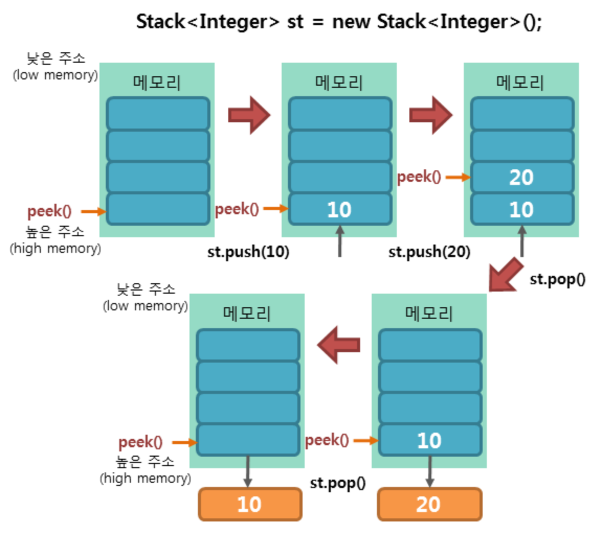
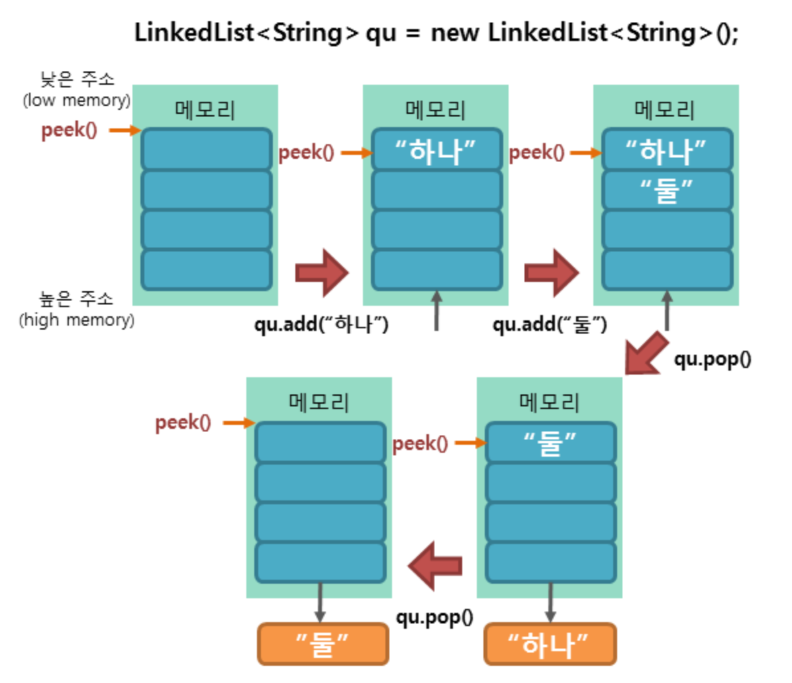

# Stack

Stack 클래스는 List 컬렉션 클래스의 Vector 클래스를 상속받아, 전형적인 스택 메모리 구조의 클래스를 제공한다. 스택 메모리 구조는 선형 메모리 공간에 데이터를 저장하면서 후입선출(LIFO : Last In First Out)의 시멘틱을 따르는 자료구조이다.



Stack 클래스는 스택 메모리 구조를 표현하기 위해, Vector 클래스의 메소드 5개를 상속받아 사용한다.

|메소드|설명|
|---|---|
|boolean empty|스택이 비어있으면 true 아니면 false 반환|
|E peek()|스택의 제일 상단에 있는 요소 반환|
|E pop()|스택의 제일 상단에 있는 요소를 반환하고 스택에서 제거함|
|E push(E item)|스택의 제일 상단에 요소를 삽입|
|int search(Object o)|스택에서 전달된 객체가 존재하는 위치의 인덱스 반환. <br> 인덱스는 제일 상단에 있는 요소부터 0이 아닌 1로 시작|

> 더욱 복잡하고 빠른 스택을 구현하고 싶다면
> Deque 인터페이스를 구현한 ArrayDeque 클래스를 사용한다.
> 단, ArrayDeque는 search() 메소드는 지원하지 않는다.
> Deque<Integer> st = new ArrayDeque<Integer>();

# 예제

```java
Stack<Integer> st = new Stack<Integer>();

// 요소 저장
st.push(4);
st.push(3);
st.push(2);
st.push(1);

// 요소 반환
System.out.println(st.peek());  // 1
System.out.println(st);         // [4, 3, 2, 1]

// 요소 반환 및 제거
System.out.println(st.pop());   // 1
System.out.println(st);         // [4, 3, 2]

// 요소 위치 검색
System.out.println(st.search(2));   // 2
```

# Queue

큐 메모리 구조는 별도의 인터페이스 형태로 제공이 된다. Queue 인터페이스를 상속받는 하위 인터페이스는 다음과 같다.
 1. Deque<E>
 2. BlockingDeque<E>
 3. BlockingQueue<E>
 4. TransferQueue<E>

Queue 인터페이스를 직간접적으로 구현한 클래스는 많은데, Deque 인터페이스를 구현한 LinkedList 클래스가 큐 메모리 구조를 구현하는 데 가장 많이 사용된다.

큐 메모리 구조는 선형 메모리 공간에 데이터를 저장하면서 선입선출(FIFO)의 시멘틱을 따르는 자료 구조이다.



Queue 인터페이스는 큐 메모리 구조를 표현하기 위해 다음 표와 같은 컬렉션 인터페이스 메소드만을 상속받아 사용한다

|메소드|설명|
|---|---|
|boolean add(E e)|큐의 맨 뒤에 요소 삽입. <br> 성공하면 true를 반환하고 큐에 공간이 없어서 실패하면  IllegalStateException가 일어남|
|E element()|큐의 맨 앞에 있는 요소를 반환|
|boolean offer(E e)|큐의 맨 뒤에 요소를 삽입|
|E peek()|큐의 맨 앞에 있는 요소를 반환하고 큐가 비어있으면 null을 반환함|
|E poll()|큐의 맨 앞에 있는 요소를 반환하고 해당 요소를 큐에서 제거하며, 큐가 비어있으면 null을 반환함|
|E remove()|큐의 맨 앞에 있는 요소를 제거|

> 큐에서도 마찬가지로 더 빠른 큐를 구현하고 싶으며s ArrayDeque 클래스를 사용하면 된다.

# 예제

LinkedList 메소드를 이용하여 큐 메모리 구조 구현

```java
LinkedList<String> qu = new LinkedList<String>();

// 요소 저장
qu.add("하나");
qu.add("둘");
qu.add("셋");
qu.add("넷");

// 요소 반환
System.out.println(qu.peek());  // "하나"
System.out.println(qu);         // ["하나", "둘", "셋", "넷"]

// 요소 반환 및 제거
System.out.println(qu.poll());  // "하나"
System.out.println(qu);         // ["둘", "셋", "넷"]

// 요소 제거
qu.remove("넷");
System.out.println(qu);         // ["둘", "셋"]
```

> 결론적으로, Java SE 6부터 지원된 ArrayDeque 클래스는 스택과 큐 메모리 구조를 모두 구현하는데 가장 적합한 클래스이다.

# 참고

[TCP SCHOOL](http://www.tcpschool.com/java/java_collectionFramework_stackQueue)