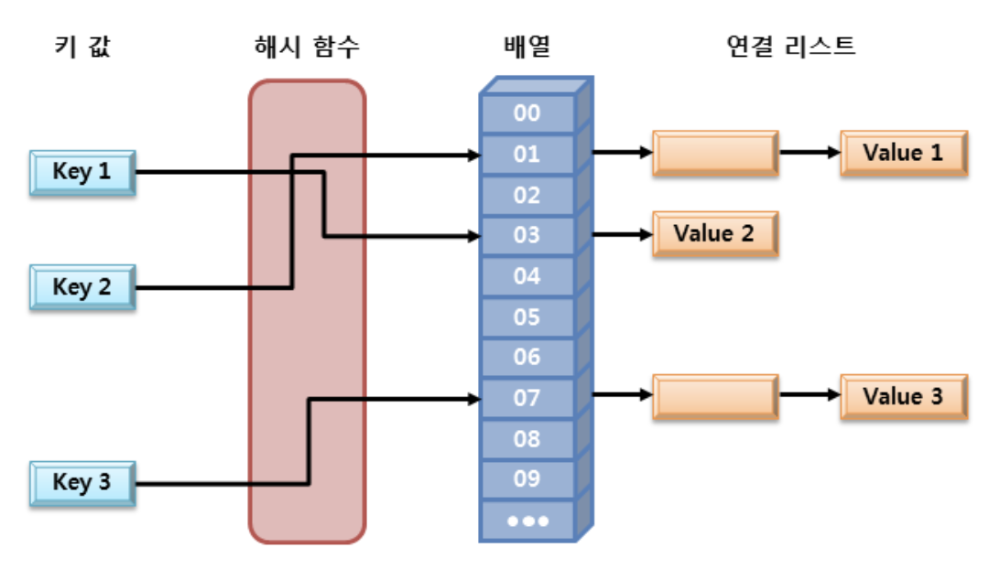

# Set

Set의 특징으로는 
 1. 요소의 저장 순서를 유지하지 않는다.
 2. 같은 요소의 중복 저장이 불가능하다.

대표적으로 `HashSet<E>`와 `TreeSet<E>`가 있다.

# HashSet

HashSet은 Set에서 가장 많이 사용되는 클래스 중 하나이다. 해시 알고리즘을 사용하여 검색속도가 매우 빠르며, 내부적으로 HashMap 인스턴스를 이용하여 요소를 저자한다. HashSet은 Set의 특징을 가지고 있기 때문에 만약 요소의 저장 순서를 유지해야 한다면 `LinkedHashSet`을 사용한다.

## 예제

```java
HashSet<String> hs = new HashSet<String>();

// 요소 저장
hs.add("이순신");
hs.add("홍길동");
System.out.println(hs01.add("임꺽정"));
System.out.println(hs01.add("임꺽정")); // 중복된 요소의 저장

// 요소 출력 1
for(String e: hs) {
    System.out.print(e + " "); // 이순신 홍길동 임꺽정
}

// 요소 출력 2
Iterator<String> iter = hs.iterator();
while(iter.hasNext()) {
    System.out.print(iter.next() + " "); // 이순신 홍길동 임꺽정
}

// 요소 총 개수
System.out.println(hs.size()); // 3
```

이미 존재하는 요소를 추가하려고 할 때 HashSet에서는 요소를 가지고 있는지 먼저 파악을 하는데 다음의 과정을 거친다.
 1. hashCode() 메소드를 호출하여 반환된 해시값으로 검색할 범위를 결정
 2. 범위 내의 요소들을 equals() 메소드로 비교

따라서, HashSet에서 add() 메소드를 사용하여 중복 없이 새로운 요소를 추가하기 위해서는 hashCode()와 equals() 메소드를 상황에 맞게 오버라이딩 해야한다.

## 오버라이딩 예제

```java
class Animal {
    String species;
    String habitat;

    Animal(String species, String habitat) {
        this.species = species;
        this.habitat = habitat;
    }

    public int hashCode() {
        return (species + habitat).hashCode();
    }
    public boolean equals(Object o) {
        if(obj instanceof Animal) {
            Animal temp = (Animal)obj;
            return species.equals(temp.species) && habitat.equals(temp.habitat);
        } else {
            return false;
        }
    }
}

public class Set02 {
    public static void main(String[] args) {
        HashSet<Animal> hs = new HashSet<Animal>();

        hs.add(new Animal("고양이", "육지"));
        hs.add(new Animal("고양이", "육지"));
        hs.add(new Animal("고양이", "육지"));
        
        System.out.println(hs.size());      // 1
    }
}
```

add() 메소드를 통해 같은 값을 가지는 Animal 인스턴스를 여러 번 저장했지만, HashSet 요소의 개수는 1개만 저장된걸 확인할 수 있다.

## 해시 알고리즘(hash algorithm)

해시 알고리즘이란 해시 함수를 사용하여 데이터를 해시 테이블에 저장하고, 다시 그것을 검색하는 알고리즘이다.



자바에서 해시 알고리즘을 이용한 자료 구조는 배열과 연결리스트로 구현한다. 저장할 데이터의 키값을 해시 함수에 넣어 반환되는 값으로 배열의 인덱스를 구하고 해당 인덱스에 저장된 연결 리스트에 데이터를 저장하게 된다.

# TreeSet

TreeSet은 데이터가 정렬된 상태로 저장되는 이진 검색 트리(binary search tree)의 형태로 요소를 저장한다. 이진 검색 트리는 데이터를 추가하거나 삭제하는 등의 기본 동작 시간이 매우 빠르다. 

## 예제

```java
TreeSet<Integer> ts = new TreeSet<Integer>();

// 요소 저장
ts.add(30);
ts.add(40);
ts.add(20);
ts.add(10);

// 요소 출력 1
for (int e : ts) {
    System.out.print(e + " ");  // 10 20 30 40 -> 정렬되어 저장
}

// 요소 제거
ts.remove(40);

// 요소 출력 2
Iterator<Integer> iter = ts.iterator();
while(iter.hashNext()) {
    System.out.print(iter.next() + " ");    // 10 20 30
}

// 요소 총 개수
ts.size(); // 3

// 부분 집합의 출력
System.out.println(ts.subSet(10, 20)); // [10] -> 첫 번째 매개변수로 전달된 값에 해당하는 요소부터 시작하여 두 번째 매개변수로 전달된 값에 해당하는 요소의 바로 직전 요소까지를 반환
System.out.println(ts.subSet(10, true, 20, true)); // [10, 20] -> 두 번째와 네 번째 매개변수로 각각 첫 번째와 세 번째 매개변수로 전달된 값에 해당하는 요소를 포함할 것인지 아닌지를 명시
```

# Set 인터페이스 메소드

Set은 컬렉션 인터페이스를 상속받으므로 컬렉션에서 정의한 메소드 모두 사용할 수 있다.

|메소드|설명|
|---|---|
|boolean add(E e)|요소 추가|
|void clear()|모든 요소 제거|
|boolean contains(Object o)|전달된 객체를 포함하고 있는지 확인|
|boolean equals(Object o)|전달된 객체와 같은지 확인|
|boolean isEmpty()|비어있는지 확인|
|Iterator<E> iterator()|반복자를 반환|
|boolean remove(Object o)|전달된 객체 제거|
|int size()|요소의 총 개수 반환|
|Object[] toArray()|모든 요소를 Object 타입의 배열로 반환|

# 참고

[TCP SCHOOL](http://www.tcpschool.com/java/java_collectionFramework_set)