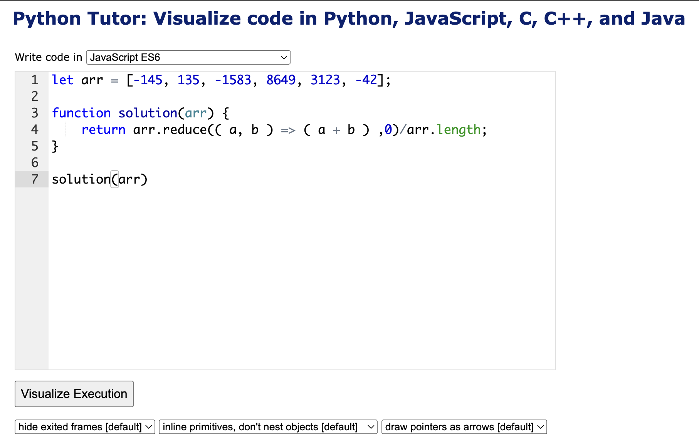
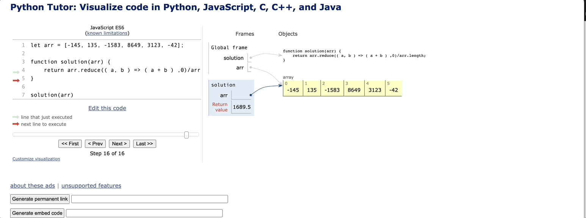

# 문제 풀이

```javascript
let arr = [1,2,3,4];
function solution(arr) {
    return arr.reduce(( a, b ) => ( a + b ) ,0)/arr.length;
}
```

`reduce`에 익숙해지기 위해 `reduce`로 풀어봤다.

위의 함수를 풀이해보면 다음과 같다.

```javascript
[1,2,3,4].reduce((accumulator, currentValue) => accumulator + currentValue , 0)/4
```

||accumulator|	currentValue|	currentIndex|	array| 반환값|
|---|---|---|---|---|---|
|호출1|0|1|1|[1,2,3,4]|1|
|호출2|1|2|2|[1,2,3,4]|3|
|호출3|3|3|3|[1,2,3,4]|6|
|호출4|6|4|4|[1,2,3,4]|10|

`reduce`는 10을 반환하고 `arr.length`로 나눠서 `10/4 =2.5`가 나오게 되었다.

배열을 좀 복잡하게 해서 풀어보자.

`[-145, 135, -1583, 8649, 3123, -42]`라는 배열이었다면,
||accumulator|	currentValue|	currentIndex|	array| 반환값|
|---|---|---|---|---|---|
|호출1|0|-145|-145|[-145, 135, -1583, 8649, 3123, -42]|-145|
|호출2|-145|135|135|[-145, 135, -1583, 8649, 3123, -42]|-10|
|호출3|-10|-1583|-1583|[-145, 135, -1583, 8649, 3123, -42]|-1593|
|호출4|-1593|8649|8649|[-145, 135, -1583, 8649, 3123, -42]|7056|
|호출5|7056|3123|3123|[-145, 135, -1583, 8649, 3123, -42]|10179|
|호출6|10179|-42|-42|[-145, 135, -1583, 8649, 3123, -42]|10137|

`reduce`는 10137을 반환하고 최종적으로 평균값 1689.5가 나오게 된다.

좀 더 직관적으로 보기 위한 사이트를 소개하자면,

https://pythontutor.com/ 에서 확인할 수 있는데, 

다음과 같이 작성을 하고 밑에 `Visualize Execution`을 누르면 된다.



그러면 이렇게 직관적으로 볼 수 있다!!! 

