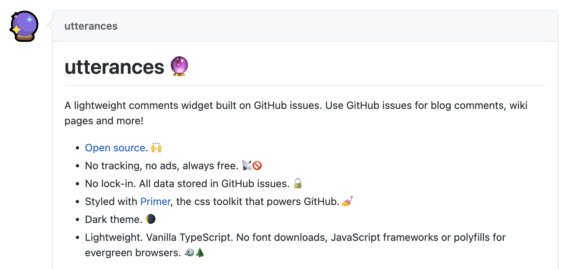
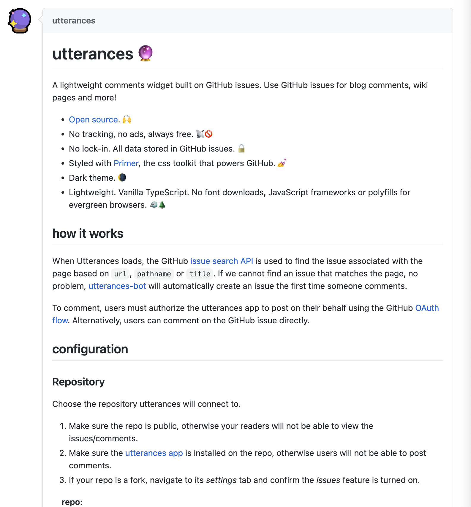

그동안 미루고 미루어왔던 댓글 기능을 추가했다.

댓글 기능은 Github의 issue를 이용하는 오픈소스 `utterances`를 이용할것이다.



[Github issue search API](https://docs.github.com/en/rest/search#search-issues)를 이용하여 url, pathname, title을 기반으로 issue를 찾아 Github issue로 관리한다. 오픈 소스라서 광고가 없다보니 요즘 많이 쓰는듯 하다.

# 댓글 기능 추가

순서는 다음과 같다. 적용방법은 내 블로그에 맞게 되어있다보니 다른 블로그에 적용하려면 수정이 필요하다.

- 본인 GitHub에 utterances용 repository 생성
- [https://github.com/apps/utterances](https://github.com/apps/utterances)에 접속하여 생성한 repo 선택 후 install
- `_config.yml` 파일 수정

```yml
comments:
  provider: "utterances"
  utterances:
    theme: "github-light" # "github-dark"
    issue_term: "pathname" # pathname은 post의 markdown 파일 이름으로 연결된다.
```

- `_includes/comments-providers/utterances.html` 파일 작성 

```yml
# 자신의 깃허브 아이디와 생성한 레파지토리 입력
script.setAttribute('repo', 'github-account/repository-name');
# 선택한 깃허브 테마 입력
script.setAttribute('theme', '{{ site.comments.utterances.theme | default: "github-light" }}');
```

# 다른 블로그는
utterances를 repo에 install 하면 다음 사이트로 이동하는데, 여기서 따라 작성하면 마지막에 script가 내가 작성한 양식에 맞춰서 나타난다. 그럼 그걸 이용해서 적용해주면 된다.

