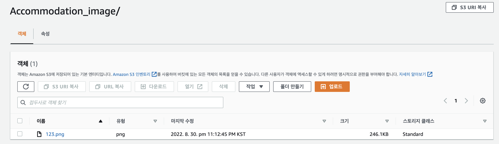

# Node.js에서 s3를 설정

## aws-sdk

Node.js에서 s3를 설정하기 위해서는 aws를 위한 npm 패키지를 하나 받아야한다.

```
npm install --save aws-sdk
```

패키지 설치가 끝나면 코드 작성을 위한 파일을 하나 만들고 코드를 작성한다.

```javascript
aws.config.update({
    region: 'aws region',
    accessKeyId: 'your accessKeyId',
    secretAccessKey: 'your secretAccessKey',
});
```

여기서 region은 AWS S3 버킷을 만들었던 region을 작성하고 accessKeyId와 secretAccessKey는 IAM 설정에서 받은 값을 넣어준다.

보안을 위해 환경변수 파일(env)에 넣고 process.env,{값}으로 작성을 해도 되고 단순 테스트 목적이면 string 값으로 넣으면 된다.

## multer

multer은 파일 업로드를 위해 사용하는 multipart/form-data를 다루기 위한 패키지로 image file이 multer을 거쳐 req.file(s)로 내용을 넘겨준다.

윗 단계를 통해 S3에 접근을 할 수 있게 되었으니 image file을 받아올 수 있도록 multer 패키지를 설치해주며 추가로 multer-s3패키지도 같이 추가해준다.

```
npm install multer multer-s3 --save
```

그 뒤 위에서 작성한 코드에 추가로 작성을 해준다.

먼저 추가한 패키지들을 불러오기 위해 다음 코드로 require해준다.
```javascript
const aws = require('aws-sdk')
const multer = require('multer')
const multers3 = require('multer-s3')
const path = require('path')
```

그리고 다음 코드를 제일 처음 작성했던 코드 밑에 추가한다.

```javascript
const s3 = new aws.S3();

const fileFormat = ['.png', '.jpg', '.jpeg', '.bmp'];

const imageUploader = multer({
    storage: multers3({
        s3: s3,
        bucket: 'your-bucket-name',
        key: (req, file, cb) => {
            const directory = req.query.directory ?? ''
            const format = path.extname(file.originalname)
            if(!fileFormat.includes(format)){
                return cb(new Error('WRONG_FORMAT'))
            }
            cb(null, `${directory}/${file.originalname}`
        )},
        acl: 'public-read-write'
    }),
})

module.exports = {
    imageUploader
}
```

이 전에 생성했던 S3 버킷 이름을 작성해주면 끝이다. 위 코드에서 cb는 콜백을 의미하며 두번 째 인자는 디렉토리/파일명이다. acl은 권한 관련 설정이다. format은 원하지 않는 확장자를 받지 않기 위해 추가한 것으로 기본 패키지인 path를 이용하여 extname으로 확장자를 추출한 다음 허용치 않는 확장자이면 에러를 반환하도록 하였다.

최종적인 코드는 다음과 같은 형태이다.

```javascript
const aws = require('aws-sdk')
const multer = require('multer')
const multers3 = require('multer-s3')
const path = require('path')

aws.config.update({
    region: 'aws region',
    accessKeyId: 'your accessKeyId',
    secretAccessKey: 'your secretAccessKey',
});
const s3 = new aws.S3();

const fileFormat = ['.png', '.jpg', '.jpeg', '.bmp'];

const imageUploader = multer({
    storage: multers3({
        s3: s3,
        bucket: 'your-bucket-name',
        key: (req, file, cb) => {
            const directory = req.query.directory ?? ''
            const format = path.extname(file.originalname)
            if(!fileFormat.includes(format)){
                return cb(new Error('WRONG_FORMAT'))
            }
            cb(null, `${directory}/${file.originalname}`
        )},
        acl: 'public-read-write'
    }),
})

module.exports = {
    imageUploader
}
```

## api url

위에서 작성한 파일을 이제 미들웨어로서 작동하도록 하고 기능 확인을 위해 router에 test api url을 만들어서 요청을 보내보자. router에는 다음과 같은 코드로 이루어져있다.

```javascript
const express = require("express");
const router = express.Router();
const { imageUploader } = require("../utils/imageUploader");

router.post('/test', imageUploader.single('image'), (req, res) => {
    res.send('good!')
})

module.exports = router;
```

위에서 `imageUploader.single`의 의미는 하나의 이미지를 받을 때 사용하는 것으로, 만약 다량의 이미지를 받고자 한다면 `imageUploader.array`로 작성하면 된다. 

## test!

`postman`을 이용하여 테스트를 해보자.

url은 http://localhost:portNum/test?directory=folderName과 같은 형식으로 작성한다.

req.body는 form-data형식으로 요청한다.

나는 localhost의 6000번 포트를 사용했으며, s3의 directory는 Accommodation_image이고 key는 위에서 설정한대로 image이며, value는 내 파일 중 하나인 123.png를 업로드 해보겠다. 

혹 파일 선택이 안된다면 key값 입력하는 창에 오른 쪽 끝에 file인지 text인지 확인하자.


위와 같이 입력을 해서 요청을 보낸뒤 응답을 보면


우리가 router에서 설정한 응답 메시지 good!이 잘 찍혔다. 이제 AWS S3로 가서 확인을 해보자



Accommodation_image 폴더에 123.png파일이 잘 들어와있는 모습을 볼 수 있다.

#### 만약 요청을 보냈을 때 다음과 같은 에러가 나타난다면 


```
POST /test?directory=Accommodation_image 500 17.039 ms - 979
TypeError: this.client.send is not a function
  ...
```

`aws-sdk`와 `multer-s3`의 버전이 맞지 않아서 이다.

package.json을 살펴보면 
```
 "aws-sdk": "^2.1205.0",
 "multer-s3": "^2.10.0" 
```
두 패키지 다 2. 버전으로 맞춰져있는것을 볼 수 있다.
만약, multer-s3가 3. 버전이면 삭제해주고 다음과 같이 설치해준다.
```
npm i multer-s3@^2 --save
```
