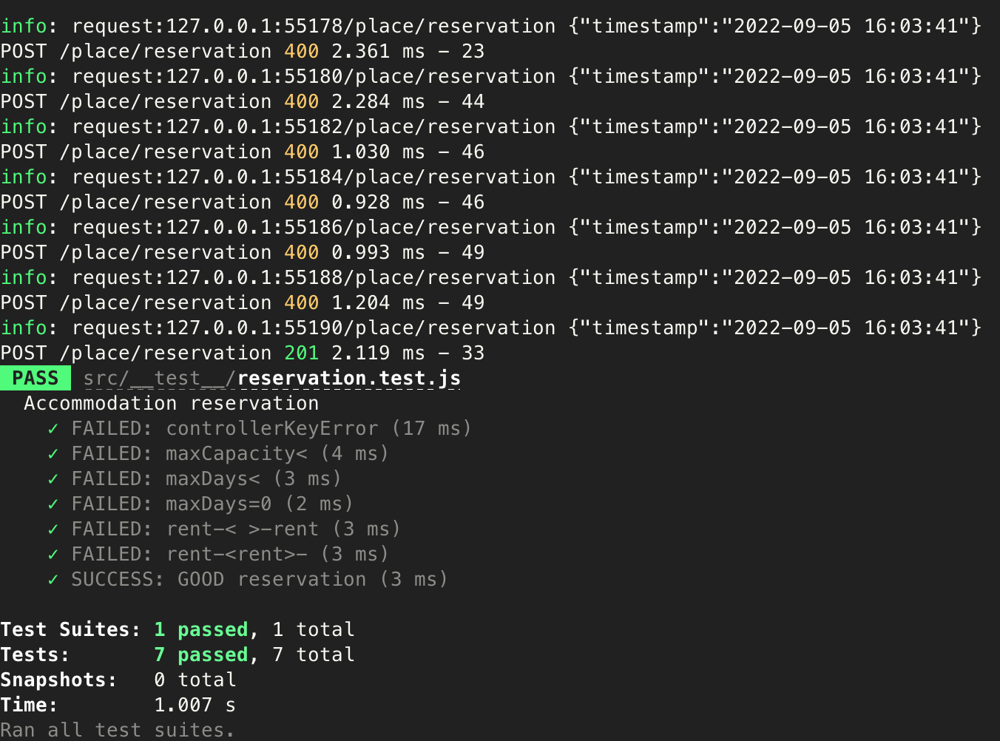

숙소 예약기능을 JEST를 이용하여 TEST를 돌렸다.

제대로된 테스트를 구현 한 것은 처음이었는데 실패할 상황을 예측하고 그것을 구현하느라 조금 애를 먹긴 했다.

테스트를 진행하면서 기능을 구현 할 때 예측했던 조건과 상황이 조금 씩 달라져서 기능 구현한 코드도 손을 봤다.

확실히 1차 때는 기능 구현을 하고 통신만 되면 끝이라고 생각했는데, 테스트를 진행해보니 생각하지 못했던 조건들이 나오고 그것을 코드에 추가하니

기능이 좀 더 완벽해졌다는 느낌이 들었다.

# 테스트 코드

```javascript
const request = require("supertest")

const { createApp } = require("../../app")
const { appDataSource } = require("../models/datasource")

describe("Accommodation reservation", () => {
    let app;

    beforeAll(async()=>{
        app = createApp();
        await appDataSource.initialize();
    })

    afterAll(async()=>{
        await appDataSource.destroy();
    })

    test("FAILED: controllerKeyError", async() =>{
        await request(app)
        .post("/place/reservation")
        .send({ })
        .expect(400)
        .expect({ message: "KEY_ERROR" });
    })

    test("FAILED: maxCapacity<", async() =>{
        await request(app)
        .post("/place/reservation")
        .send({ userId:"4", placeId:"17", guestNumber:"3", availableFrom:"2022-08-30", availableUntil:"2022-08-31"})
        .expect(400)
        .expect({ message: "EXCEEDING_THE_NUMBER_OF_PEOPLE" });
    })


    test("FAILED: maxDays<", async() =>{
        await request(app)
        .post("/place/reservation")
        .send({ userId:"4", placeId:"17", guestNumber:"2", availableFrom:"2022-08-22", availableUntil:"2022-08-31"})
        .expect(400)
        .expect({ message: "RESERVATION_DAYS_ARE_NOT_CORRECT" });
    })

    test("FAILED: maxDays=0", async() =>{
        await request(app)
        .post("/place/reservation")
        .send({ userId:"4", placeId:"17", guestNumber:"2", availableFrom:"2022-08-30", availableUntil:"2022-08-30"})
        .expect(400)
        .expect({ message: "RESERVATION_DAYS_ARE_NOT_CORRECT" });
    })

    test("FAILED: rentStart< >", async() =>{
        await request(app)
        .post("/place/reservation")
        .send({ userId:"4", placeId:"17", guestNumber:"2", availableFrom:"2022-08-25", availableUntil:"2022-08-27"})
        .expect(400)
        .expect({ message: "RESERVATION_SCHEDULE_DOES_NOT_MATCH" });
    })

    test("FAILED: < >restEnd", async() =>{
        await request(app)
        .post("/place/reservation")
        .send({ userId:"4", placeId:"17", guestNumber:"2", availableFrom:"2022-09-08", availableUntil:"2022-09-11"})
        .expect(400)
        .expect({ message: "RESERVATION_SCHEDULE_DOES_NOT_MATCH" });
    })

    test("SUCCESS: GOOD reservation", async() =>{
        await request(app)
        .post("/place/reservation")
        .send({ userId:"4", placeId:"17", guestNumber:"2", availableFrom:"2022-09-05", availableUntil:"2022-09-07"})
        .expect(201)
        .expect({ message: "SUCCESS_RESERVATION" });
    })
})
```

# 테스트 결과
