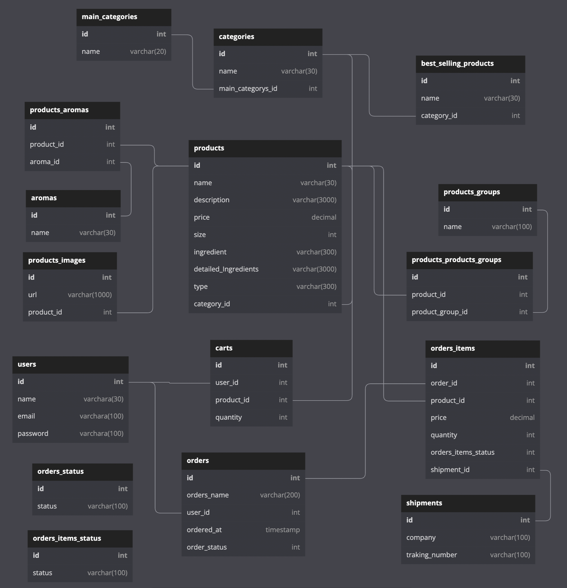
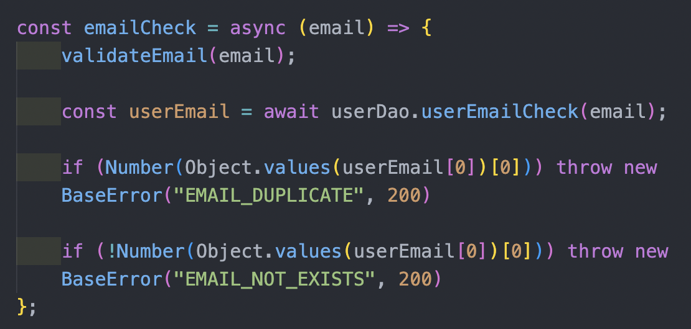
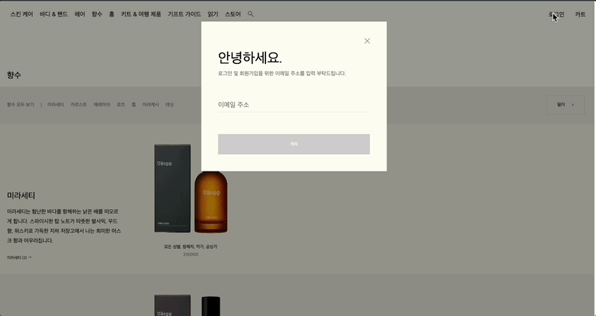
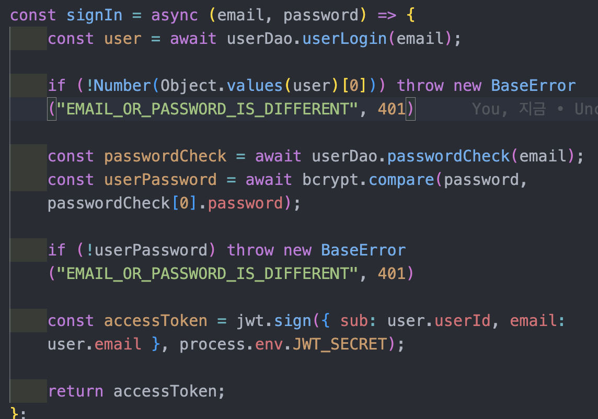
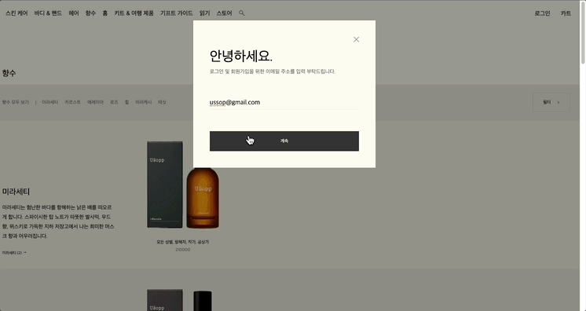
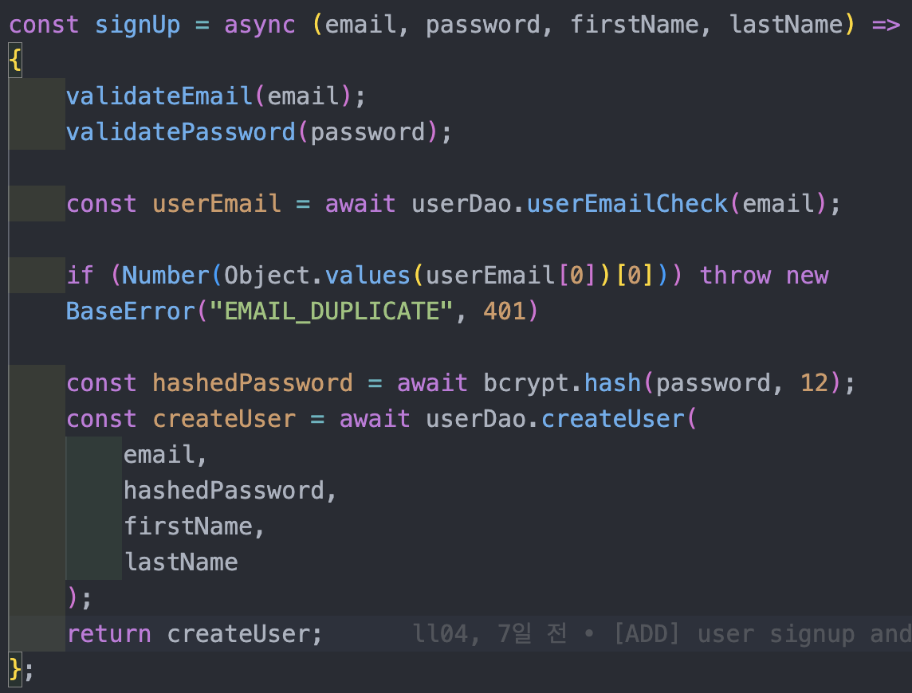
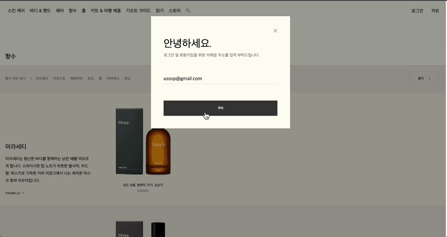
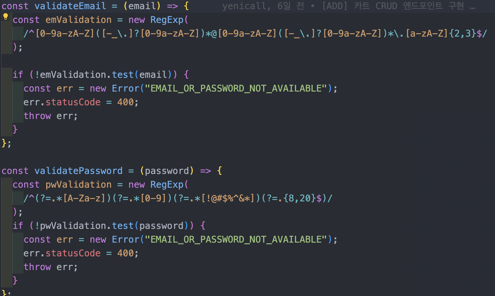
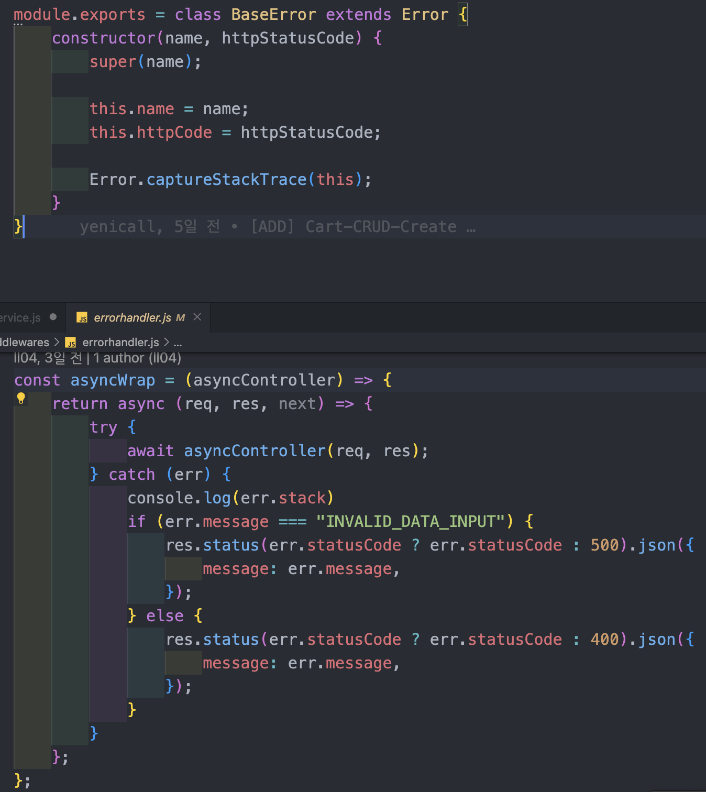
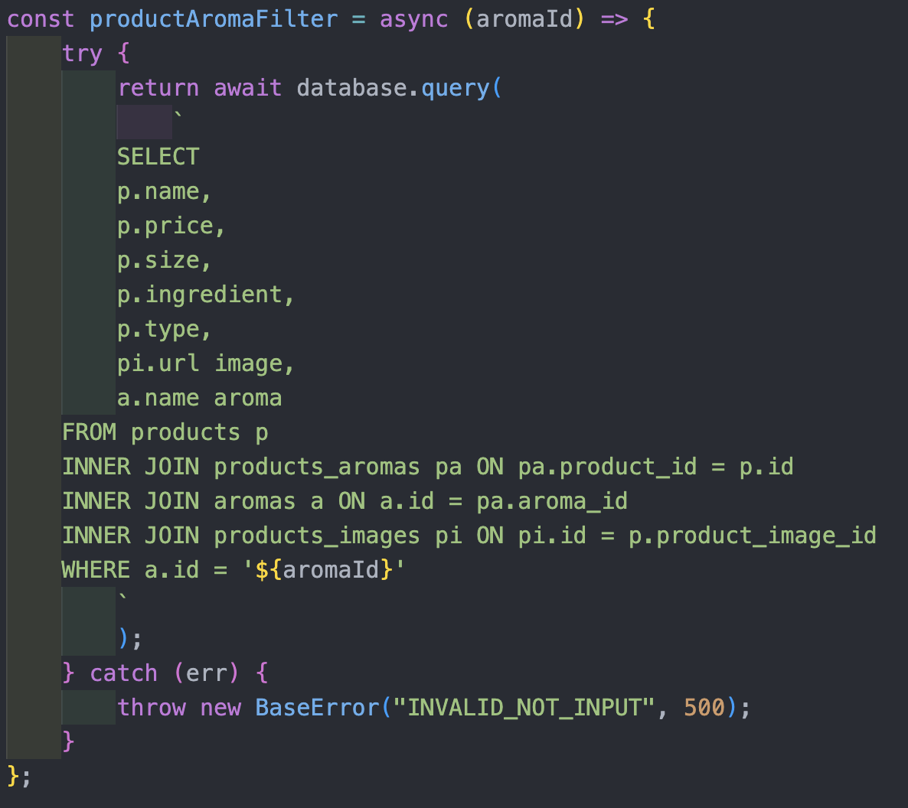

# 1차 프로젝트

기간 : 2022-08-16 ~ 2022-08-26 (11일)

사이트 : [이솝](https://www.aesop.com/kr/)

팀명 : 우솝

[FRONTEND GITHUB](https://github.com/wecode-bootcamp-korea/36-1st-Usopp-frontend)

[BACKEND GITHUB](https://github.com/wecode-bootcamp-korea/36-1st-Usopp-backend)

[프로젝트 시연 영상](https://www.youtube.com/watch?v=n2kL24FnHsE)

<iframe width="600" height="390" src="https://www.youtube.com/embed/n2kL24FnHsE" title="이솝 홈페이지 클론 코딩" frameborder="0" allow="accelerometer; autoplay; clipboard-write; encrypted-media; gyroscope; picture-in-picture" allowfullscreen></iframe>

---

# Facts

## 프로젝트 팀 구성

-   FRONT END 3명
-   BACK END 3명

## 기술 스택

-   FRONT END

`HTML`, `CSS`, `SASS`, `Javascript`, `React`

-   BACK END

`Javascript`, `Node.js`, `express`, `MySQL`, `bcrypt`, `jwt`

-   community tool

`slack`, `Trello`, `Zoom`, `Gather`, `ngrok`

## 내가 맡은 부분

-   DB 모델링
-   이메일 중복 체크
-   로그인
-   회원가입
-   에러핸들링
-   아로마의 종류에 따른 제품 출력

## 구현 사항

### DB 모델링

-   DB 모델링은 동료들과 같이 정리하고 구조를 짜서 작성하였고 최종적으로 멘토님의 피드백이 반영되어 다음과 같은 구조를 갖게 되었다.

### 이메일 중복 체크

클라이언트에서 요청으로 email이 담겨오면 DB에 email이 존재하는지 여부를 판단해서 1이면 중복이라는 메시지, 0이면 존재하지 않는다는 메시지를 반환하도록 구현 하였다.

### 로그인

유저가 로그인을 할 때 이메일이나 패스워드 둘 중 하나가 다르면 보안상 하나가 다르다고 알려주면 안된다고 해서 에러메시지를 둘 중 하나가 다르다라고 응답했다.
그리고 나중에 사용 할 유저의 아이디와 이메일을 토큰에 담아서 발급할 수 있도록 페이로드에 담아서 토큰을 발행하는 로직을 구현했다.

### 회원가입

이메일이 중복일 경우 중복메시지를 반환하고, 패스워드를 저장할 때 bcrypt를 이용해서 암호화해서 저장할 수 있도록 구현 했으며, 이메일과 패스워드는 우리 사이트에 맞게 정규표현식을 사용하여 검증하는 단계를 두었다.

#### 이메일 패스워드 정규 표현식

### 에러핸들링

controller, service, dao에서 나타나는 에러를 모아서 처리해 줄 수 있는 에러핸들링을 middleware에 구현 하였다.

### 아로마 타입에 따른 제품 출력

원래 계획은 사이트에 아로마가 쭉 나열되어 있고 중복 선택을 통해 그에 맞는 제품이 나타나도록 구현하려고 했지만, 프론트와의 통신과 멘토님 코드리뷰에 따른 수정사항을 처리하다보니 제 역할을 수행할 수 있는 필터를 구현하는데 실패하였다. 해당 부분은 좀 더 고민하고 공부해서 2차 프로젝트에 필터기능이 모든 사이트에 있어서 구현하도록 해봐야겠다.

---

[프로젝트 회고록 바로가기](https://sangwoo.dev/memoir/6)