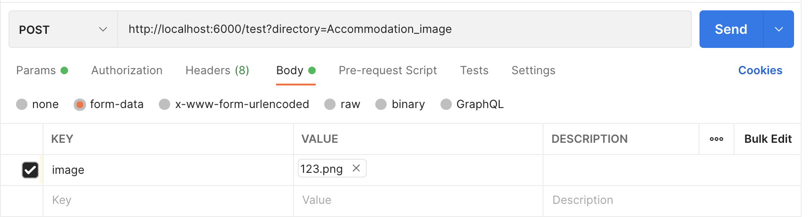
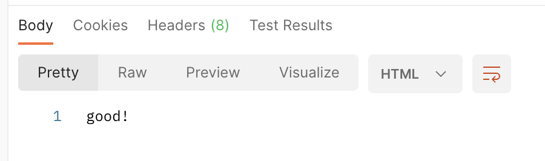
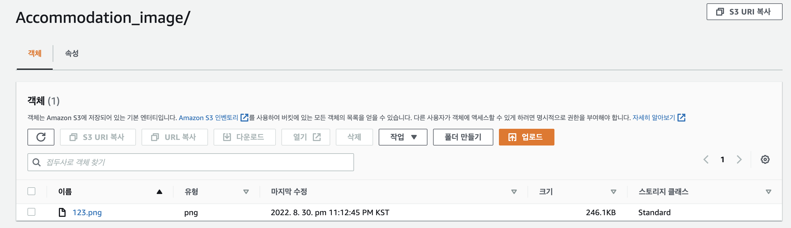
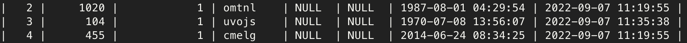
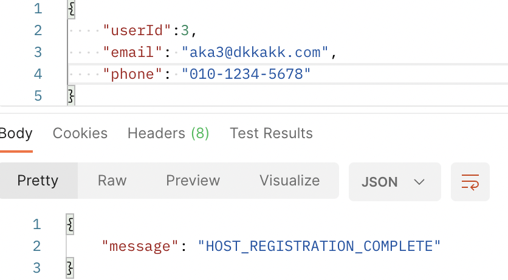
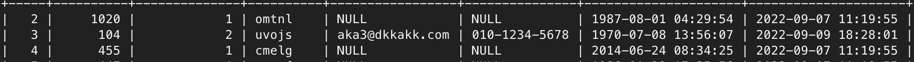
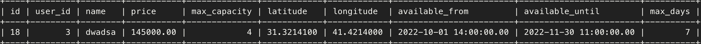
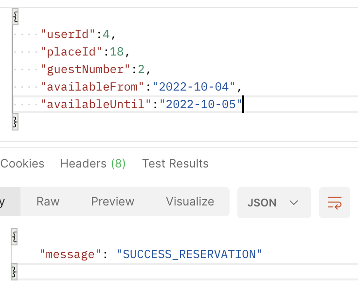
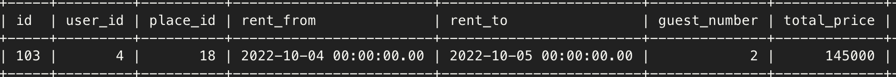

# 2차 프로젝트

기간 : 2022-08-29 ~ 2022-09-08 (11일)

사이트 : [AIRBNB](https://www.airbnb.com/)

팀명 : WeNB

[FRONTEND GITHUB](https://github.com/wecode-bootcamp-korea/36-2nd-WeNB-frontend)

[BACKEND GITHUB](https://github.com/wecode-bootcamp-korea/36-2nd-WeNB-backend)

[프로젝트 시연 영상](https://www.youtube.com/watch?v=4i2Bv78AlmY)

<iframe width="600" height="390" src="https://www.youtube.com/embed/4i2Bv78AlmY" title="WeNB 시연 영상" frameborder="0" allow="accelerometer; autoplay; clipboard-write; encrypted-media; gyroscope; picture-in-picture" allowfullscreen></iframe>

---

## 프로젝트 팀 구성

-   FRONT END 4명
-   BACK END 3명

---

### 기술스택

-   프론트엔드 : 
    
    
    
    
    
    
    

-   백엔드 : 
    
    
    
    
    
    
    
    
    
    
    
    

-   협업 툴 :   

# Facts

## 내가 맡은 부분

-   AWS S3를 이용한 이미지 업로더
-   카카오로그인을 통해 가입된 게스트 유저 호스트 등록 API
-   숙소 예약 시스템

### AWS S3를 이용한 이미지 업로더

클라이언트에서 이미지파일을 요청의 바디에 담아서 보내면 S3에 업로드 하는 로직을 미들웨어로 구현

위와 같이 입력을 해서 요청을 보낸뒤 응답을 보면

good!이 잘 찍혔다. 이제 AWS S3로 가서 확인을 해보자

### 유저의 호스트 등록 API

카카오 소셜 로그인을 통해 가입된 유저(게스트)가 호스트로 등록을 하면 유저의 타입이 1(게스트)에서 2(호스트)로 바뀌게 되며 email과 phone을 등록을 하고 email과 phone의 중복체크와 DB에 있는지 검증을 거쳐서 등록되게 된다.

먼저 데이터베이스에서 유저를 조회한 후 3번 유저가 호스트 등록을 한다고 가정하자.

클라이언트는 게스트의 토큰과 email, phone를 보내주면 미들웨어에서 토큰을 분해해서 userId를 빼서 바디에 같이 담아준다.
이메일과 폰번호가 정상적으로 들어오게 되면 호스트 등록이 완료된다.

이제 DB에 저장된 값을 찾아보면 3번 유저의 타입은 2로 바뀌었고 이메일과 패스워드가 잘 들어온 것을 볼 수 있다.

### 숙소 예약 API

게스트or호스트가 숙소를 예약하기 위해 숙소를 선정한 후 날짜를 선택하고 예약 인원을 설정하면 숙소에 등록되어 있는 정보들을 가져와서 비교한 후 예약이 성공 OR 실패된다.

먼저 숙소의 정보를 보고

4번 유저가 해당 숙소를 보고 인원수랑 렌트 기간을 설정하고 렌트를 하면 성공적으로 예약된다.

이제 예약DB를 보면 다음과 같이 성공적으로 예약이 들어온것을 볼 수 있다.

