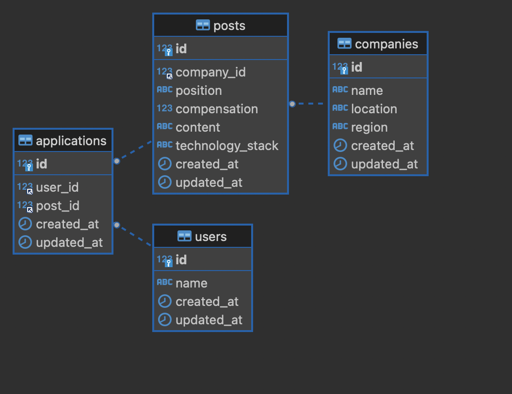
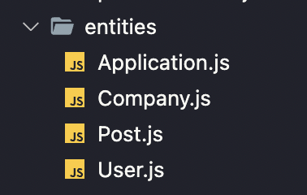
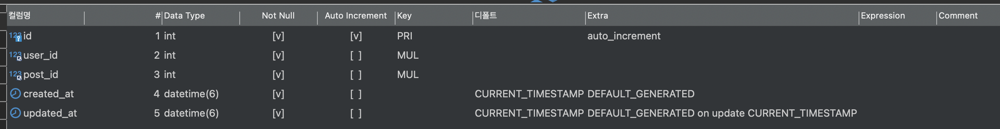
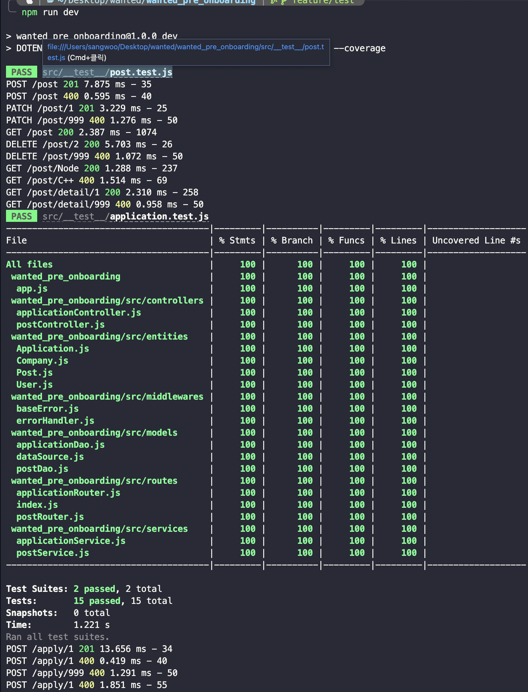
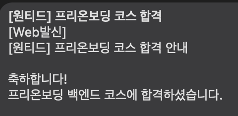

# 원티드 프리온보딩 백엔드 코스 사전과제

사전과제 내용: 기업에서 채용공고를 `등록`하고 `수정`하고 `삭제`할 수 있으며, 사용자는 `모든 채용공고를 조회`할 수 있고, `채용공고 상세페이지를 조회`할 수 있으며 상세페이지에는 해당 기업에서 등록한 `다른 채용공고도 같이 표시`된다. 그리고 사용자는 `채용공고를 검색어를 이용해서 조회`할 수 있으며, 해당 기업의 `채용공고에 지원`할 수 있다.`(유저는 해당 채용공고에 1번만 지원 가능)` 마지막으로 `Unit test`를 진행한다.

기간 : 2022-10-11 ~ 2022-10-12 (2일)

[GITHUB](https://github.com/sw1104/wanted_pre_onboarding)

## 프로젝트 팀 구성

-   BACKEND 1명

## 기술 스택

       

## ERD



## 구현 내용

-   ENTITY를 이용하여 데이터 베이스 생성

    

    ```javascript
    // entities/Application.js
    const EntitySchema = require("typeorm").EntitySchema;
    module.exports = new EntitySchema({
        name: "Application",
        tableName: "applications",
        columns: {
            id: {
                primary: true,
                type: "int",
                generated: true
            },
            user_id: {
                type: "int"
            },
            post_id: {
                type: "int"
            },
            created_at: {
                createDate: "true"
            },
            updated_at: {
                updateDate: "true"
            }
        },
        relations: {
            User: {
                target: "users",
                type: "many-to-one",
                joinColumn: {
                    name: "user_id"
                },
                onDelete: "CASCADE"
            },
            Post: {
                target: "posts",
                type: "many-to-one",
                joinColumn: {
                    name: "post_id"
                },
                onDelete: "CASCADE"
            }
        },
        uniques: [
            {
                name: "ApplicationUniques",
                columns: ["user_id", "post_id"]
            }
        ]
    });
    ```

    ```javascript
    // models/dataSource.js
    const { DataSource } = require("typeorm");
    const Application = require("../entities/Application");
    const Company = require("../entities/Company");
    const Post = require("../entities/Post");
    const User = require("../entities/User");

    const AppDataSource = new DataSource({
        type: process.env.TYPEORM_CONNECTION,
        host: process.env.TYPEORM_HOST,
        port: process.env.TYPEORM_PORT,
        username: process.env.TYPEORM_USERNAME,
        password: process.env.TYPEORM_PASSWORD,
        database: process.env.TYPEORM_DATABASE,
        entities: [User, Company, Post, Application],
        synchronize: false,
        logging: false
    });

    module.exports = {
        AppDataSource
    };
    ```

    -   생성된 데이터베이스 application table

    

---

-   채용공고 등록

    ```javascript
    const createPost = async (
        companyId,
        position,
        compensation,
        content,
        technologyStack
    ) => {
        return await AppDataSource.createQueryBuilder()
            .insert()
            .into(Post)
            .values({
                company_id: companyId,
                position: position,
                compensation: compensation,
                content: content,
                technology_stack: technologyStack
            })
            .execute();
    };
    ```

---

-   채용공고 수정

    ```javascript
    const editPost = async (
        postId,
        position,
        compensation,
        content,
        technologyStack
    ) => {
        return await AppDataSource.createQueryBuilder()
            .update(Post)
            .set({
                position: position,
                compensation: compensation,
                content: content,
                technology_stack: technologyStack
            })
            .where({
                id: postId
            })
            .execute();
    };
    ```

---

-   채용공고 삭제

    ```javascript
    const deletePost = async (postId) => {
        return await AppDataSource.createQueryBuilder()
            .delete()
            .from(Post)
            .where({
                id: postId
            })
            .execute();
    };
    ```

---

-   채용공고 전체 리스트

    ```javascript
    const getPostList = async () => {
        return await AppDataSource.createQueryBuilder()
            .select([
                "p.id AS postId",
                "p.position AS position",
                "p.compensation AS compensation",
                "p.technology_stack AS technologyStack",
                "c.name AS companyName",
                "c.location AS companyLocation",
                "c.region AS companyRegion"
            ])
            .from(Post, "p")
            .innerJoin(Company, "c", "p.company_id = c.id")
            .execute();
    };
    ```

---

-   검색어를 이용하여 해당하는 채용공고 조회하기

    ```javascript
    const getSearchPost = async (search) => {
        return await AppDataSource.createQueryBuilder()
            .select([
                "p.id AS postId",
                "p.position AS position",
                "p.compensation AS compensation",
                "p.technology_stack AS technologyStack",
                "c.name AS companyName",
                "c.location AS companyLocation",
                "c.region AS companyRegion"
            ])
            .from(Post, "p")
            .innerJoin(Company, "c", "p.company_id = c.id")
            .where("p.position LIKE :word", { word: `%${search}%` })
            .orWhere("p.compensation LIKE :word", { word: `%${search}%` })
            .orWhere("p.technology_stack LIKE :word", { word: `%${search}%` })
            .orWhere("c.name LIKE :word", { word: `%${search}%` })
            .orWhere("c.location LIKE :word", { word: `%${search}%` })
            .orWhere("c.region LIKE :word", { word: `%${search}%` })
            .execute();
    };
    ```

---

-   채용공고 상세페이지(해당 기업의 다른 채용공고\_id 같이 출력)

    ```javascript
    const getPostDetails = async (postId) => {
        const [result] = await AppDataSource.query(
            `
            SELECT
                p.id,
                p.position,
                p.technology_stack,
                p.content,
                p.compensation,
                c.name,
                c.location,
                c.region,
                (SELECT JSON_ARRAYAGG(
                    p.id
                ) FROM posts p
                WHERE p.id != ${postId} AND p.company_id = c.id
                ) AS anotherPost
            FROM posts p
            INNER JOIN companies c ON p.company_id = c.id
            WHERE p.id = ${postId};
            `
        );
        return result;
    };
    ```

---

-   채용공고 지원하기
    ```javascript
    const applyJob = async (postId, userId) => {
        return await AppDataSource.createQueryBuilder()
            .insert()
            .into(Application)
            .values({
                user_id: userId,
                post_id: postId
            })
            .execute();
    };
    ```

---

-   jest를 이용하여 unit test 하기

    ```javascript
    // post test
    const request = require("supertest");

    const { createApp } = require("../../app");
    const { AppDataSource } = require("../models/dataSource");

    describe("post unit test", () => {
        let app;

        beforeAll(async () => {
            app = createApp();
            await AppDataSource.initialize();
            await AppDataSource.query(
                `
                INSERT INTO posts(
                    company_id,
                    position,
                    compensation,
                    content,
                    technology_stack
                ) VALUES 
                    (1, "백엔드 주니어 개발자", 1000000, "백엔드 신입 개발자 대규모 채용", "Python"),
                    (1, "백엔드 시니어 개발자", 1500000, "백엔드 7년차 이상 경력직 채용", "Node.js, MySQL"),
                    (2, "프론트엔드 주니어 개발자", 500000, "프론트엔드 신입 개발자 채용", "React"),
                    (3, "프론트엔드 시니어 개발자", 1350000, "프론트엔드 시니어 개발자 채용", "React, MySQL");
                `
            );
        });

        afterAll(async () => {
            await AppDataSource.query(`SET FOREIGN_KEY_CHECKS = 0`);
            await AppDataSource.query(`TRUNCATE applications`);
            await AppDataSource.query(`TRUNCATE posts`);
            await AppDataSource.query(`SET FOREIGN_KEY_CHECKS = 1`);
            await AppDataSource.destroy();
        });

        test("SUCCESS: 채용공고 등록", async () => {
            await request(app)
                .post("/post")
                .send({
                    companyId: 3,
                    position: "풀스택 개발자 모집",
                    compensation: 3000000,
                    content: "세계 최고의 기업에서 풀스택 개발자를 모집합니다.",
                    technologyStack:
                        "Javascript, Node.js, React, MySQL, GO, Python, Django"
                })
                .expect(201)
                .expect({ message: "JOB POSTING COMPLETED" });
        });

        test("FAILED: 채용공고 등록 값 누락", async () => {
            await request(app)
                .post("/post")
                .send({
                    companyId: 3,
                    position: "풀스택 개발자 모집",
                    compensation: 3000000,
                    content: "세계 최고의 기업에서 풀스택 개발자를 모집합니다."
                })
                .expect(400)
                .expect({ message: "KEY ERROR", statusCode: 400 });
        });

        test("SUCCESS: 채용공고 수정", async () => {
            await request(app)
                .patch("/post/1")
                .send({
                    position: "백엔드 시니어 개발자"
                })
                .expect(201)
                .expect({ message: "POST EDITED" });
        });

        test("FAILED: 채용공고 수정", async () => {
            await request(app)
                .patch("/post/999")
                .send({
                    position: "백엔드 시니어 개발자"
                })
                .expect(400)
                .expect({ message: "POST DOES NOT EXIST", statusCode: 400 });
        });

        test("SUCCESS: 모든 채용공고 가져오기", async () => {
            await request(app).get("/post").expect(200);
        });

        test("SUCCESS: 채용공고 삭제", async () => {
            await request(app)
                .delete("/post/2")
                .expect(200)
                .expect({ message: "POST DELETED" });
        });

        test("FAILED: 채용공고 삭제", async () => {
            await request(app)
                .delete("/post/999")
                .expect(400)
                .expect({ message: "POST DOES NOT EXIST", statusCode: 400 });
        });

        test("SUCCESS: 검색된 결과 가져오기", async () => {
            await request(app).get("/post/Node").expect(200);
        });

        test("FAILED: 검색된 결과가 없는 경우", async () => {
            await request(app).get("/post/C++").expect(400).expect({
                message: "NO RESULTS WERE FOUND FOR YOUR SEARCH.",
                statusCode: 400
            });
        });

        test("SUCCESS: 채용공고 상세 페이지", async () => {
            await request(app).get("/post/detail/1").expect(200);
        });

        test("FAILED: 채용공고 상세페이지를 보려고 하지만 글이 없는 경우", async () => {
            await request(app)
                .get("/post/detail/999")
                .expect(400)
                .expect({ message: "POST DOES NOT EXIST", statusCode: 400 });
        });
    });
    ```

    ```javascript
    // application test
    const request = require("supertest");

    const { createApp } = require("../../app");
    const { AppDataSource } = require("../models/dataSource");

    describe("post unit test", () => {
        let app;

        beforeAll(async () => {
            app = createApp();
            await AppDataSource.initialize();
            await AppDataSource.query(
                `
                INSERT INTO posts(
                    company_id,
                    position,
                    compensation,
                    content,
                    technology_stack
                ) VALUES 
                    (1, "백엔드 주니어 개발자", 1000000, "백엔드 신입 개발자 대규모 채용", "Python"),
                    (1, "백엔드 시니어 개발자", 1500000, "백엔드 7년차 이상 경력직 채용", "Node.js, MySQL"),
                    (2, "프론트엔드 주니어 개발자", 500000, "프론트엔드 신입 개발자 채용", "React"),
                    (3, "프론트엔드 시니어 개발자", 1350000, "프론트엔드 시니어 개발자 채용", "React, MySQL");
                `
            );
        });

        afterAll(async () => {
            await AppDataSource.query(`SET FOREIGN_KEY_CHECKS = 0`);
            await AppDataSource.query(`TRUNCATE applications`);
            await AppDataSource.query(`TRUNCATE posts`);
            await AppDataSource.query(`SET FOREIGN_KEY_CHECKS = 1`);
            await AppDataSource.destroy();
        });

        test("SUCCESS: 채용공고에 지원하기", async () => {
            await request(app)
                .post("/apply/1")
                .send({
                    userId: 1
                })
                .expect(201)
                .expect({ message: "APPLICATION COMPLETE" });
        });

        test("FAILED: 채용공고에 지원하려고 하나 사용자가 없는 경우", async () => {
            await request(app)
                .post("/apply/1")
                .expect(400)
                .expect({ message: "KEY ERROR", statusCode: 400 });
        });

        test("FAILED: 채용공고에 지원하려고 하나 공고가 없는 경우", async () => {
            await request(app)
                .post("/apply/999")
                .send({
                    userId: 1
                })
                .expect(400)
                .expect({ message: "POST DOES NOT EXIST", statusCode: 400 });
        });

        test("FAILED: 채용공고에 이미 지원한 경우", async () => {
            await request(app)
                .post("/apply/1")
                .send({
                    userId: 1
                })
                .expect(400)
                .expect({
                    message: "YOU HAVE ALREADY APPLIED",
                    statusCode: 400
                });
        });
    });
    ```

-   unit test 결과

    

---

# 느낌점 및 배운점

위코드 기업 인턴십 기간과 원티드 프리온보딩 백엔드 코스 신청기간이 겹쳐있어서 많이 바쁘게 개발을 진행했다. 원래 신청기간은 10월 19일까지라 기업 인턴십이 13일에 끝나서 그 이후에 진행을 해도 됐지만, 12일까지 신청해야 가산점을 줘서 너무나도 하고싶어서 조금 무리를 해서라도 진행을 했다.

지금까지 프로젝트에서는 dbmate와 raw query를 이용해서 개발을 진행을 했었는데, 이번 사전 과제에서 entity와 Query Builder를 이용해 개발을 진행하려고 하니 처음에는 이해가 잘 가지 않아서 조금 헤메긴 했지만 한번 성공하고나니 큰 막힘 없이 진행을 할 수 있었다.

그리고 가산점 기준에 git commit 메시지 관련해서도 있었는데, 지금까지 그래도 잘 작성하고 있다고 생각하고 있어서 미처 검색을 해볼 생각을 못했는데 혹시나 싶어서 검색을 해보니 많은 사람들이 사용하는 컨벤션이 있고 정말 꼼꼼하게 작성해야 하는것을 알 수 있었다!

이틀동안 인턴십을 진행하는 회사에 출근 전에 퇴근 후에 정말 열심히 했고 그 결과로 합격문자를 딱 받았다! 커리큘럼을 보니 조금 주5일 09시~18시까지 진행을 하는데 새로운 사람들과 함께 다양한 경험을 할 수 있을거 같아 설레인다.


