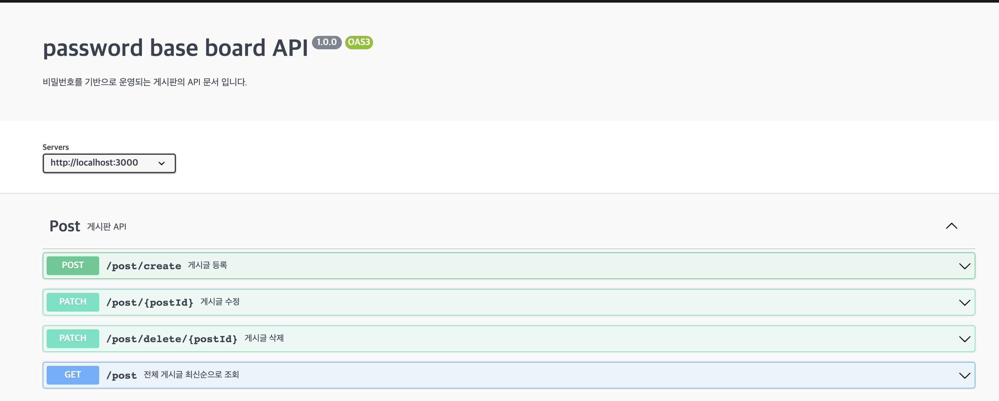

# password-base-board-api

## 프로젝트 개요

비밀번호를 기반으로 운영되는 게시판의 서버 api 구현 프로젝트이다. 사용자는 회원가입 및 로그인 없이 게시글을 작성할 수 있으며, 게시글 작성시 해당 게시글에 비밀번호를 설정한다. 비밀번호가 맞으면 작성자가 아닌 제3자도 게시글을 수정 및 삭제할 수 있는 비밀번호 기반의 게시판 서비스이다.

[프로젝트 github](https://github.com/sw1104/password-base-board-api)

### 개발 인원
- Backend 1명

### 개발 기간
2022-11-03~2022-11-04 (2일)

### 기술 스택
- Framework: express
- ORM : typeorm
- DB : mysql

## ERD

# 구현 사항

사용자는 게시글을 작성
- 게시글은 제목과 본문으로 구성
- 제목은 최대 20자, 본문은 200자로 서버에서 제한
- 제목과 본문 모두 이모지가 포함

게시글 작성 시 비밀번호를 설정
- 회원가입, 로그인 없이 비밀번호만 일치하면 수정, 삭제
- 비밀번호 암호화 저장
- 비밀번호는 6자 이상, 숫자 1개 이상 반드시 포함

게시글 최신 글 순서로 확인

게시글에 날씨 추가
- [https://www.weatherapi.com](https://www.weatherapi.com/)에서 Real-time Weather API 사용
- API_Key .env저장
- 게시글 작성시 자동으로 데이터베이스에 날씨 저장

swagger를 이용하여 API문서 작성

