## 프로젝트 개요
todo list 프로젝트로 유저는 회원가입과 로그인을 하고 todo를 생성, 체크, 수정, 삭제한다. 회원가입시 프로필 사진을 등록하며, 사진은 백엔드에서 form-data로 받아 S3에 저장 후 데이터베이스에 URL을 저장한다.

기간 : 2022-11-19 ~ 2022-11-21 (3일)

<!-- [FRONTEND GITHUB]() -->

[BACKEND GITHUB](https://github.com/sw1104/todo-server-api.git)

---

## 프로젝트 팀 구성

-   FRONT END 1명
-   BACK END 1명

---

## 기술스택

-   프론트엔드 :
    </a>  </a> </a> </a>

-   백엔드 : 
    </a> </a> </a> </a> </a>

## ERD
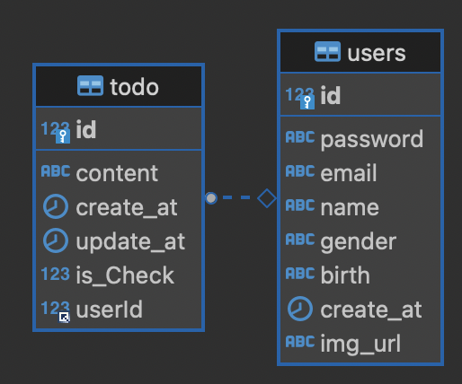

## API DOCUMENT
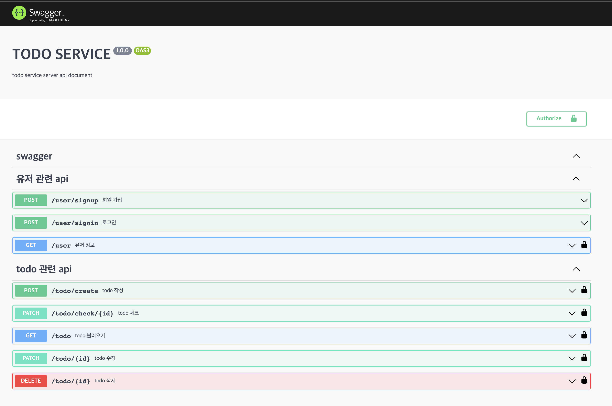

# 구현 사항
## 유저 등록
유저를 등록한다. 유저는 등록시 프로필 사진을 등록해야한다. 프로필 사진은 S3에 저장되며, DB에는 S3에 저장된 파일의 URL을 가져와서 저장한다. 비밀번호는 bcrypt를 이용하여 암호화해서 저장한다.

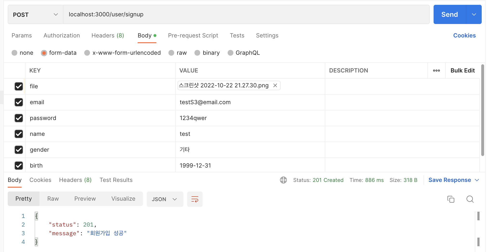

## 유저 로그인
유저는 이메일과 패스워드를 통해 로그인을 진행한다. 로그인이 정상적으로 완료되면 JWT TOKEN을 발급해서 응답한다. TOKEN에는 user의 id와 email이 담겨있다.
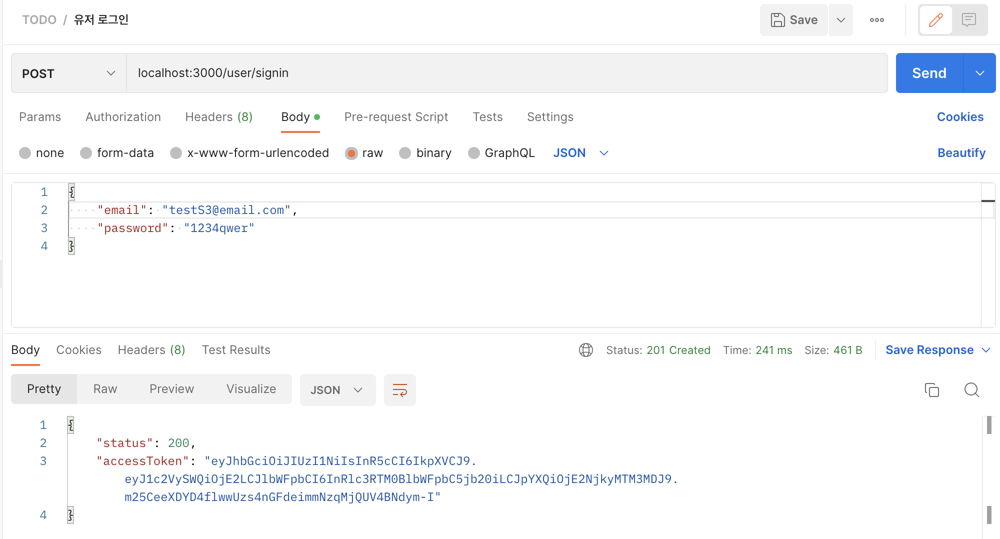

## todo 생성
todo를 생성한다. 생성시 먼저 토큰을 클라이언트로부터 받아와서 user의 id를 검증하고 생성을 진행한다.
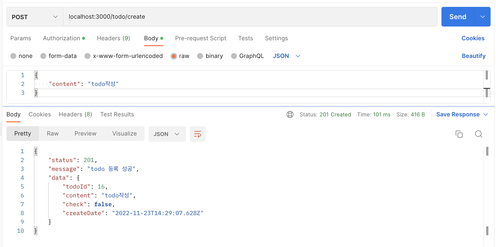

## todo 체크
todo 항목에 대해서 체크를 진행한다. 하나의 api로 체크 상태를 확인해서 체크와 언체크한다. 
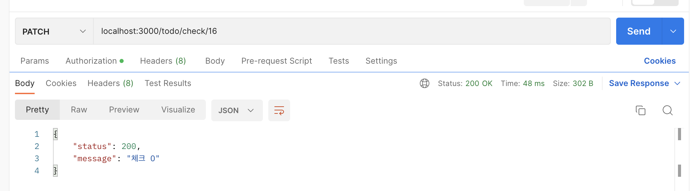
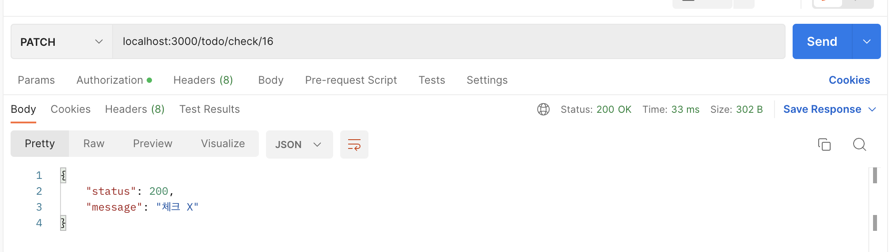

## todo를 수정
todo 항목을 수정한다. 수정은 체크가 되어있지 않은 상태에서만 할 수 있으며 해당 항목이 체크된 경우 수정은 불가능하다.
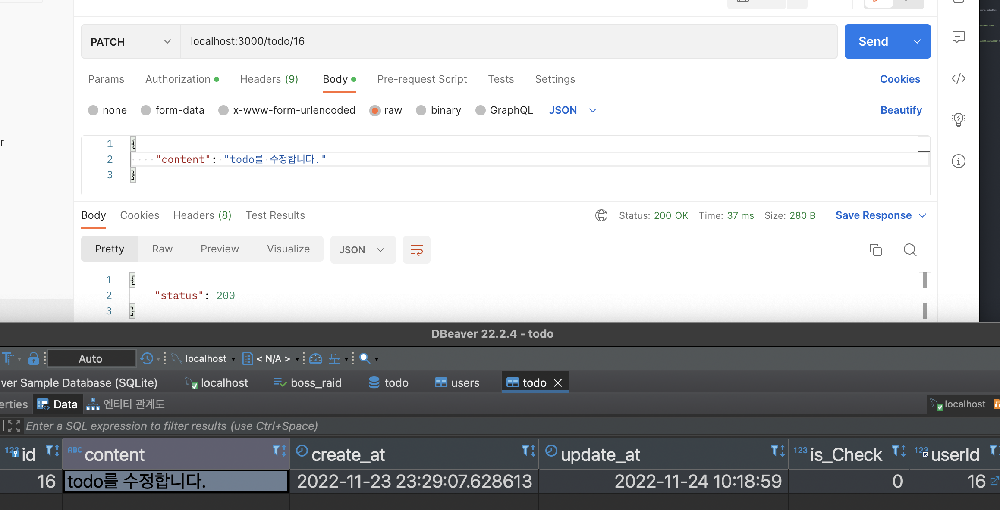

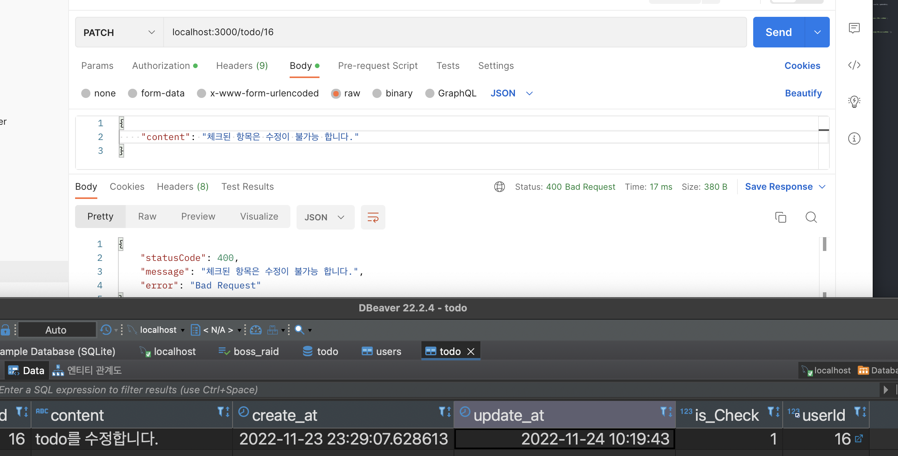

## 유저 정보
유저의 정보를 확인한다. `age`는 가입시 설정한 `birth`를 통해 계산해서 응답하고, `together`는 가입일로부터 며칠이 경과했는지 계산해서 응답한다.
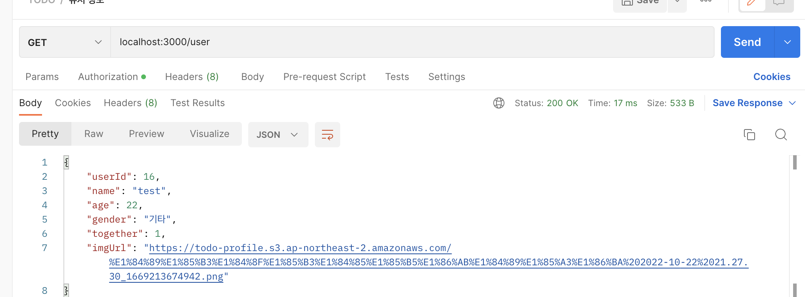

## 유저의 todo 정보
유저가 작성한 todo의 정보를 응답한다.
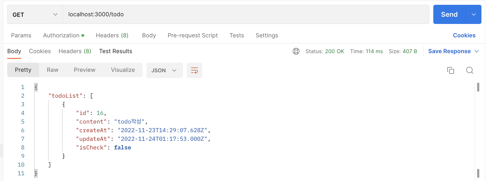

## todo 삭제
todo 항목을 삭제한다. 
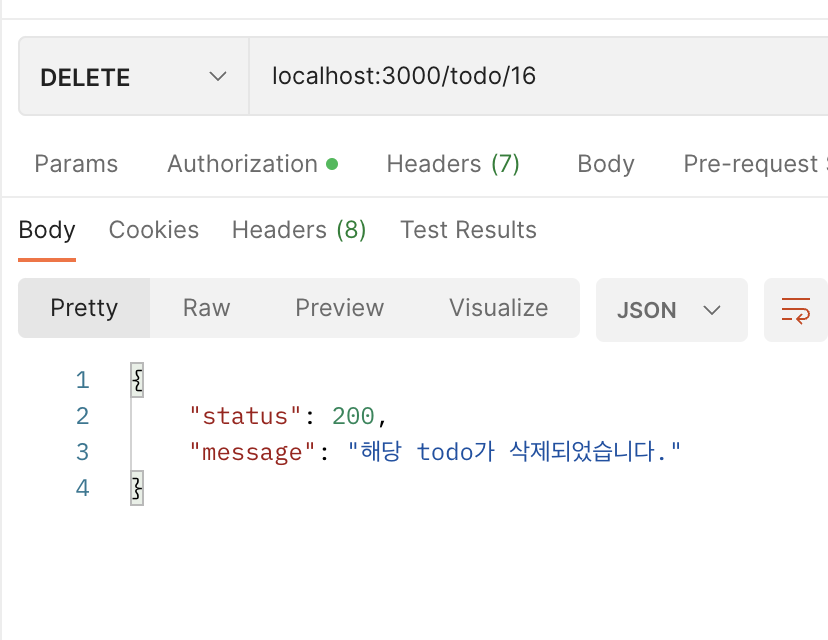

# 회고록
원티드 프리온보딩을 통해 습득한 `typescript`와 `nest`를 이용하여 프로젝트를 프론트엔드 개발자 한 분과 진행하였다. 프리온보딩을 진행할 때는 촉박한 시간에 새로운 기술을 이용하여 프로젝트를 진행해야 해서 내가 정말 이 기술을 알고 사용하는 것인가 의문이 많이 들어서 해당 프로젝트를 기획하게 되었다. 처음 해당 프로젝트를 기획했을 때는 지금보다 크기가 많이 적었지만 동료분이 캘린더와 드롭다운을 사용해보고 싶다고 하셔서 생일과 성별을 추가 하였고, 이미지 미리보기 기능과 전송도 해보고 싶다고 하셔서 처음에는 로컬에서 이미지를 저장하였다. 그러다가 `express`에서 S3를 이용했을 때와 `nest`에서 이용할 때 어떤 차이점이 있을지 궁금하여 S3를 이용하는 방식으로 변경을 하였다. 아직 `express`만큼 손에 익지는 않았지만 계속해서 학습하고 사이드 프로젝트를 진행하면서 `nest`의 진면목을 알아가고싶다. 위코드에서 진행했던 프로젝트 이후로 항상 백엔드 개발자 분들과 프로젝트를 진행하다가 오랜만에 프론트엔드 개발자분과 프로젝트를 진행하였는데, 협업을 하면서 서로 배려하고 존중하는 마음으로 임하여 커뮤니케이션도 잘 되고 즐겁게 프로젝트를 진행할 수 있었다. 특히 그동안 몇몇 프로젝트에서 `swagger`를 이용하여 api문서를 만들어는 보았지만 실제로 프론트엔드 동료에게 전달해준 적은 없었는데, 이번에 너무 만족해 하시는 모습을 보면서 잘 정리된 문서의 중요성도 다시한번 깨닫게 되었다.