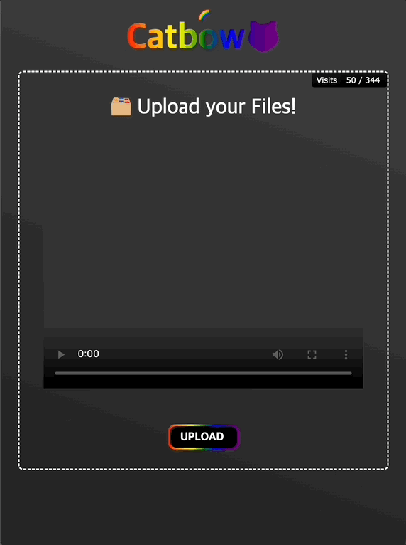

 
 
---

## **🌈🤗 Check these sites and try them out**

[Video Converter Site](https://catbow.github.io/catbow-photo-converter/)  
[CatBow Doc](https://catbow.github.io/catbow-docs/)  
[CatBow ScrollView Tutorial](https://catbow.github.io/catbow-docs/scrollview)  
[NPM Library Site](https://www.npmjs.com/package/react-catbow-scrollview)  
[YARN Library Site](https://yarnpkg.com/package/react-catbow-scrollview)

---

 
 
## **Catbow-photo-converter**

👉 배포 링크 [Video Converter Site](https://catbow.github.io/catbow-photo-converter/)

 
 
## **🌈😺Catbow**

총 4명으로 구성된 🌈😺Catbow ( FE : 3, BE : 1 ) Project

CatBow Library는 프레임 단위로 추출한 이미지 파일들을 이용해 화면 스크롤시 동영상 재생 효과를 주는 인터랙티브 UI 라이브러리입니다.

 
 
### **공식 문서**

[CatBow Docs](https://catbow.github.io/catbow-docs/)

 
 
### **깃허브**

[GitHub](https://github.com/catbow)

 
 
### **프로젝트 설명**

위코드 36기 수료생으로 이루어진 팀을 구성해 구현한 CatBow Library는 프레임 단위로 추출한 이미지 파일들을 이용해 화면 스크롤시 동영상 재생 효과를 주는 인터랙티브 UI 라이브러리입니다. observer API 를 사용해 해당 기능을 구현하였고 이에 필요한 동영상을 프레임 단위로 잘라주는 사이트도 함께 개발했습니다.

CatBow Library는 배포 후 홍보 없이 npm, yarn package 누적 다운로드 수 2000건을 달성했고 계속 유지 보수를 이어갈 예정입니다. 

 
 
### **🌈**😺**Catbow**

 
 
#### **팀원**

 
 
🌈 라이브러리 팀

-   FRONTEND : 김준호(PM), 최슬기

 
 
🎥 동영상-이미지 변환 사이트 팀

-   FRONTEND : 조은지
-   BACKEND : 이상우

 
 
#### **개발 기간**

-   2022-11-21 ~ 2022-12-12 (22일)

 
 
#### **기술 스택**

-   **FrontEnd**
    -   Javascript, React, styled-components, contextAPI, AWS-S3, CI/CD
-   **BackEnd**
    -   Python, Django, Nginx, Gunicorn, MySQL, Certbot(SSL), Freenom(domain), AWS-EC2, AWS-RDS, AWS-VPC

 
 
#### **구현 사항**

**🌈**😺**Catbow 에서 동영상 업로드 후 zip파일로 변환해 자동 다운로드하는 convert 사이트의 서버를 개발했습니다.** 

-   클라이언트에서 S3 업로드 후 요청으로 키값을 보내주면 이를 이용하여 이미지 파일이 담길 폴더 생성 및 S3 동영상 주소로 재구성
-   S3의 동영상 주소를 이용하여 해당 동영상을 프레임 단위의 이미지로 변환
-   이미지 파일을 압축 및 S3에 업로드
-   생성된 폴더와 이미지파일 및 압축파일 자동 삭제
-   S3에 업로드 된 압축파일 주소를 클라이언트에게 응답
-   AWS EC2와 RDS 및 VPC를 이용하여 배포 환경 세팅
-   SSL 인증서와 도메인 활용하여 HTTPS 적용
-   무료 SSL 인증서 기간 자동 갱신
-   Nginx에서 악성 IP 차단

 
 
### **프로젝트 회고록**

동영상을 이미지로 변환하기 위해 자바스크립트와 노드를 이용해서 구현을 하고자 방법을 찾아봤지만 자료가 부족하였고 파이썬을 이용하는 방법이 대다수여서 파이썬으로 프로젝트를 진행해야 하나 고민을 많이 했다. 일반적인 사이드 프로젝트였다면 부담을 느끼지 않았을 텐데 이건 실제 사용자들을 위해서 만드는 프로젝트라 지금까지 배워왔던 자바스크립트와 노드로도 해보지 못했던 실 사용자를 위한 배포를 과연 파이썬을 이용해서 해낼 수 있을지 확신이 없어서였다. 하지만 너무 길게 고민을 할 수는 없었고 같이 사이트 구현을 맡은 프론트엔드 동료의 응원 덕분에 파이썬으로 진행을 하기로 하였다.  

첫 시작은 순조롭지만은 못했다. 파이썬 문법은 백준에서 코딩 테스트를 파이썬으로 하면서 어느 정도 이해는 했으나 MVC 패턴이 감이 잡히지 않았다. 그래서 파이썬 장고 CRUD 프로젝트들을 유튜브와 검색을 통해 찾아보면서 조금씩 구현을 해 나갔다. 그렇게 동영상을 이미지로 변환하는 로직을 완성하고 나서 프론트와 첫 통신을 시작했다. 프론트에서 S3에 동영상을 업로드하고 키를 body에 담아 요청을 하면 키를 가지고 조합해서 해당 URL을 만들어 사용하는 방식이었고 이 부분은 순조롭게 진행이 되어 첫 통신이 생각보다 빠르게 성공할 수 있었다. 

다음으로 내 발목을 잡은 것은 압축이었다. 압축파일을 만들고 그 압축파일에 변환된 이미지를 넣어야 하는데 경로가 자꾸 이상하게 설정이 되어 압축파일에 들어가지 않았다. 그래서 print()로 계속해서 경로를 찾아가면서 성공할 수 있었다. 이제 다음으로 압축파일을 S3에 올리고 URL을 프론트에 응답한 뒤 마지막에 만들어졌던 이미지와 압축 폴더를 삭제하는 것이었는데 이건 아주아주 순조롭게 진행이 되었다. 하지만 문제가 하나 발생했다. 분명 생성된 압축파일은 압축 해제가 잘 되었는데, S3에 업로드해서 받아온 압축파일은 해제가 안되었다. 이것에 대한 문제는 결국 찾지 못하였고 기능을 하나하나 돌려보면서 압축하고 S3에 올렸을 때 문제가 생겼다는 것을 알게 되었다. 그래서 API를 두 개로 나눠서 해결을 하였다. 동영상을 이미지로 변환하고 압축하는 API와 압축파일을 S3에 업로드하고 생성된 폴더 및 파일을 삭제하는 API로 나누어 진행을 하니 작동이 잘 되는 것을 확인하였다.

로컬에서 잘 돌아가는 것을 확인한 후 배포를 시작했다. 나는 이때까지만 해도 EC2에 백엔드 로직을 올리고 RDS로 디비를 연결하기만 하면 되는 건 줄 알았는데 그게 아니었다. HTTPS를 적용하기 위해서 SSL 인증서를 등록해야 하고 인증서를 등록하기 위해서는 도메인이 필요했다. 그리고 동시 요청을 원활하게 수행하기 위해 Nginx를 이용해야 하고 Nginx로부터 서버사이드 요청을 받으면 WSGI를 통해 Django로 전달해 주기 위한 Gunicorn을 이용해야 했다. 갑작스럽게 늘어난 배포 과정에 적잖이 당황을 하긴 했지만 항상 들어만 봤던 HTTPS 적용이나 Nginx를 이번 기회에 사용할 수 있다는 생각에 재미있게 진행을 했다.

프로젝트에 HTTPS 적용도 하고 Nginx와 Gunicorn 적용까지 마치고 나서 프론트와 통신을 했고 그 이후로 CORS 에러와 502 Bad Gateway 그리고 timeout 에러를 마주했다.

> 에러 해결은 아래 포스트에  

[[Error] CORS error](https://sangwoo.dev/error/4)

[[Error] nginx 502 Bad Gateway](https://sangwoo.dev/error/5)

[[Error] upstream prematurely closed connection while reading response header from upstream](https://sangwoo.dev/error/3)

에러를 다 해결한 뒤 드디어 통신이 정상적으로 완료되었을 때 진짜 말로 표현 못 할 만큼의 행복을 느꼈다. 그때의 기분은 며칠이 지난 지금 이 글을 적으면서도 갑자기 웃음이 나올 정도로 아직까지 잊히지가 않는다. 사실 에러를 해결하는 데 30시간 가까이를 소모하면서 '내가 정말 할 수 있을까?'라는 부정적인 생각이 자꾸 들었는데 그때마다 계속해서 옆에서 할 수 있다고 응원을 해준 프론트엔드 동료에게도 너무나 감사하다.

나의  첫 배포가 **2022년 12월 11일 20시 16분**에 이루어졌다.

이 프로젝트를 진행하면서 배포라는 큰 경험을 할 수 있었고  앞으로 개발자의 인생을 살아가면서 많은 배포를 하게 되겠지만 이 첫 배포의 기억은 잊지 못할 거 같다.

> 포기하지 않고 끝까지 도전한다면 실패는 과정일 뿐 그 끝은 결국 성공이 될 것이다.