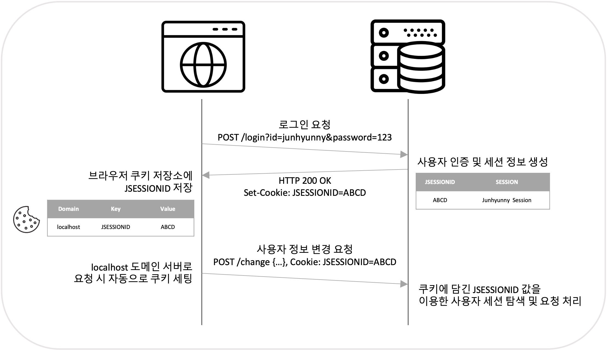

# CSRF란?
CSRF(Cross Site Request Forgery)는 사이트 간 요청 위조라는 뜻으로, 웹 사이트 취약점 공격의 하나이다. 서버가 실제 서비스 페이지를 통한 정상 요청인지 확인하지 않고서 처리하는 경우 악의적인 스크립트를 이용하여 다른 사용자의 권한을 사용하는것으로, 사용자가 자신의 의지와는 무관하게 공격자가 의도한 행위(등록, 수정, 삭제 및 중요기능 등)를 특정 웹 사이트에 요청하게 하는 공격이다. 특정 웹 사이트가 사용자의 웹 브라우저를 신용하는 상태를 노린 공격 방식으로 사용자가 웹 사이트에 로그인 한 상태에서 사이트간 요청 위조 공격 코드가 삽입된 페이지를 열게되면 공격 대상이 되는 웹 사이트는 위조된 공격 명령을 인증된 사용자로부터 발송된 것이라 판단하여 공격에 노출된다.

# 공격 

먼저 CSRF 공격을 시도하기 위해서는 다음과 같은 조건이 필요하다.
- 사용자가 보안이 취약한 서버로부터 이미 인증을 받은 상태
- 쿠키 기반으로 서버 세션 정보를 획득할 수 있어야 함
- 서버를 공격하기 위한 요청 방법에 대해 미리 파악

조건이 만족되면 다음의 과정을 통해 CSRF 공격이 수행된다.
1. 사용자는 보안이 취약한 서버에 로그인
2. 로그인 이후 서버에 저장된 세션 정보를 사용할 수 있는 세션ID가 사용자의 브라우저 쿠키에 저장
3. 공격자는 인증된 사용자가 악성 스크립트 페이지를 누르도록 유도
    - 유도하는 방법은 다양한데 대표적으로 악성 스크립트 링크를 메일로 전달하거나 게시글로 작성하여 유도한다.
4. 사용자가 악성 스크립트에 접근하면 쿠키에 저장된 세션ID는 브라우저에 의해 자동적으로 함께 서버로 요청
5. 서버는 쿠키에 담긴 세션ID를 통해 해당 요청이 인증된 사용자로부터 온 것이라고 판단하여 처리

# 방어

이를 방어하기 위해서는 몇 가지 방법이 존재하는데, 다음과 같다.

1. Referrer 검증
- 서버에서 request의 referrer를 확인하여 도메인이 일치하는 지 검증하는 방법이다. 같은 도메인 내에 XSS 취약점이 있을 경우 CSRF 공격에 취약할 수 있다. 도메인 검증에서 더 세밀하게 페이지 단위까지 일치하는지 검증을 하면 방어할 수 있다.

2. Security Token(CSRF Token)
- 사용자의 세션에 임의의 난수 값을 저장하고 사용자가 요청을 보낼 때 해당 난수 값을 전송하여 서버에서 검증하는 방법이지만 이 방식 또한 XSS 취약점이 있다면 CSRF 공격에 취약하다.

3. Double Submit Cookie 검증
- Security Token 검증 방식의 한 종류로 세션을 사용할 수 없는 환경에서 사용하는데, 웹 브라우저의 `Same Origin(어떤 출처에서 불러온 문서나 스크립트가 다른 출처에서 가져온 리소스와 상호작용하는 것을 제한하는 보안 방식)` 정책으로 인해 자바스크립트에서 타 도메인의 쿠키 값을 확인/수정 하지 못하는 것을 이용하는 방법이다. 스크립트 단에서 요청 시 난수 값을 생성하여 쿠키에 저장 한 뒤 동일한 난수 값을 헤더나 파라미터에 저장하여 서버로 전송한다. 서버에선 쿠키의 토큰 값과 파라미터의 토큰 값이 일치하는지 검사한다.

# Reference
[https://ko.wikipedia.org/wiki/%EC%82%AC%EC%9D%B4%ED%8A%B8_%EA%B0%84_%EC%9A%94%EC%B2%AD_%EC%9C%84%EC%A1%B0](https://ko.wikipedia.org/wiki/%EC%82%AC%EC%9D%B4%ED%8A%B8_%EA%B0%84_%EC%9A%94%EC%B2%AD_%EC%9C%84%EC%A1%B0)\
[https://itstory.tk/entry/CSRF-%EA%B3%B5%EA%B2%A9%EC%9D%B4%EB%9E%80-%EA%B7%B8%EB%A6%AC%EA%B3%A0-CSRF-%EB%B0%A9%EC%96%B4-%EB%B0%A9%EB%B2%95](https://itstory.tk/entry/CSRF-%EA%B3%B5%EA%B2%A9%EC%9D%B4%EB%9E%80-%EA%B7%B8%EB%A6%AC%EA%B3%A0-CSRF-%EB%B0%A9%EC%96%B4-%EB%B0%A9%EB%B2%95)\
[https://scshim.tistory.com/527](https://scshim.tistory.com/527)