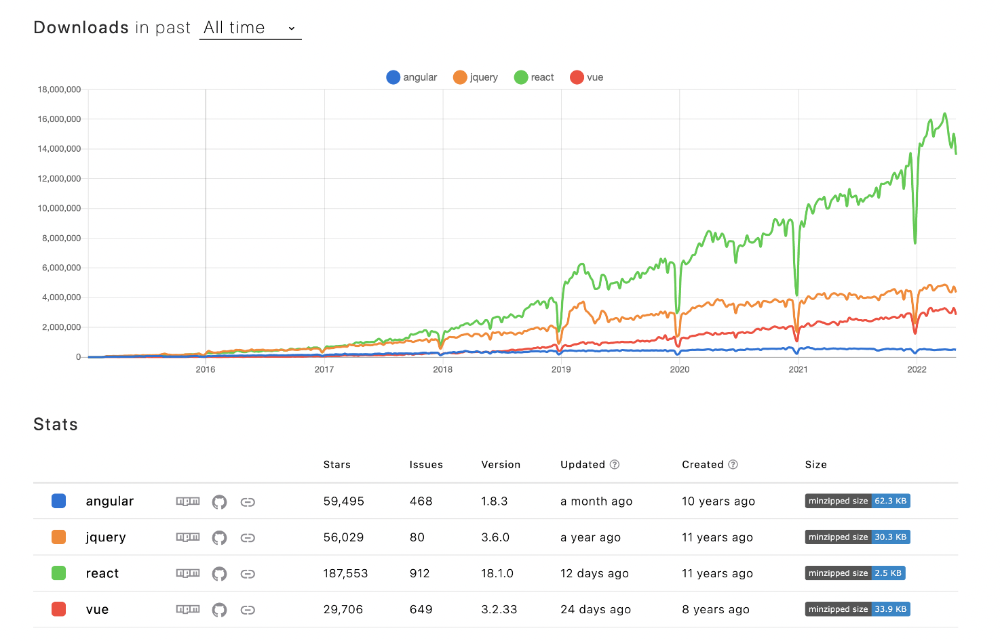

# 갑자기 React를 하게 된 배경

나는 위코드에서 backend를 배웠고 마지막 달에 기업 인턴십을 나온 상태이다. 그런데 여기 회사에서는 프론트와 백을 원했지만 백엔드만 오게 되었고 결과적으로 리액트를 배워야 하는 상황이 되었다..

과연 내가 잘 할 수 있을것인가 걱정이 많이 된다. 그래도 어차피 해야되는거 걱정 할 시간에 빨리 배워보자는 생각으로 일단 회사 사수님이 알려주신 [벨로퍼트와 모던 리액트](https://react.vlpt.us/)와 wecode의 프론트엔드 학습자료를 보면서 공부를 한다.

# Web Application

새로운 기술을 학습하기 위해서는 항상 이 기술이 어떤 목적을 위해서 만들어지게 되었는지를 알아야한다고 생각한다. 그렇기에 `React가` 등장하게 된 배경인 `Web Application`의 발전에 대해서 알아보자.

과거의 웹 페이지는 UI가 단순하며, 상호작용이 적었던 것에 비해 지금의 웹 페이지는 동적이며, 다양한 UI를 가지게 되고 많은 카테고리와 이벤트 등 유저와의 상호작용이 많아졌다. 이러한 이유로 현대의 많은 웹 서비스는 웹 페이지라는 단어보다는 웹 어플리케이션이라는 단어를 많이 사용한다.

이처럼 웹 애플리케이션의 규모가 커지고 다양한 UI, UX를 구현하기 위해서는 과거에 DOM으로 직접 접근해서 조작하는 방식으로는 개발과 유지보수가 어려워졌다. 이를 보안하기 위해서 JQuery라는 라이브러리가 등장하였지만 JQuery도 결국 DOM에 접근해서 조작하는 메서드 모음이기 때문에 현대의 무수한 DOM 요소에 접근해서 조작, 관리하기란 쉽지가 않다.

그래서 규모가 커지고 복잡한 로직을 관리하고 개발하기 위해 다양한 프론트엔드 프레임워크와 라이브러리가 등장하게 되었다.

## Framework & Library

프레임워크와 라이브러리는 복잡한 개발을 효율적으로, 편리하게 하기 위해 다른 개발자들이 만들어 둔 코드라는 공통점이 있지만 이 둘의 차이점은 다음과 같다.

### Framework

프레임워크는 다른 사람이 만들어둔 코드를 정해진 틀에서 수동적으로 작업을 해야한다.

### Library

라이브러리는 개발자가 작업을 진행할 때 필요한 기능을 찾고 능동적으로 가져와서 사용한다.

정리하자면, 프레임워크는 전체적인 흐름을 자체적으로 가지고 있어서 개발자가 그 흐름을 따라서 코드를 작성해야하고, 라이브러리는 개발자가 흐름을 가지고 원하는 라이브러리를 가져다 사용한다.

프론트엔드에서 가장 많이 쓰이는 프레임워크는 앵귤러(Angular)와 뷰(Vue)가 있고 리액트(React)는 프레임워크적인 특징을 일부 가지고 있지만 라이브러리이다.

# Why React?

다 갖추어진 프레임워크를 쓰면 일정한 흐름속에서 개발을 착착착 진행할 수 있을텐데 왜 나에게 필요한 기능을 가져다가 써야하는 리액트를 써야하는걸까? 에 대한 가장 큰 이유는 뷰와 앵귤러는 자신만의 문법을 가지고 있지만, 리액트는 자바스크립트 문법을 그대로 활용하기 때문에 자연스레 자바스크립트에 대한 이해도와 활용도를 높일 수 있고 거대 기업인 페이스북(현 메타)에서 만든 라이브러리이기 때문에 지속적인 관리와 생태계가 잘 활성되어있고 이는 곧 개발자의 생산성을 향상시키는 결과를 가져온다. 그리고 리액트 기반의 React Native라는 기술을 이용하면 모바일 앱도 개발할 수 있다.

다음은 연도별 Angular, Jquery, React, Vue 다운로드 횟수이다.

