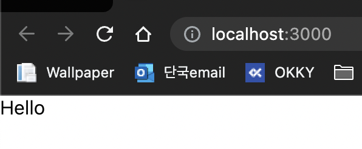

# React

React는 User Interface(UI)를 만들기 위한 자바스크립트 라이브러리로 페이스북(현 메타)에서 개발하고 관리한다. React를 사용하는 가장 큰 이유 중 하나는 UI를 자동으로 업데이트 해준다는 점이다. 이로 인해 개발자는 데이터 기반의 선언적 개발이 가능하고, 자동으로 업데이트 되는 과정에서 Virtual DOM을 통해 최적화된 업데이트를 할 수 있다. 또한 Component 기반의 개발을 통해 복잡한 UI를 효과적으로 구성할 수 있으며, JSX문법으로 Component를 편리하게 작성할 수 있다.

# React 특징

## 선언적

개발 방식에는 크게 절차적과 선언적이 있다. 절차적은 명령적이라고도 하며, 문제를 어떻게 해결할 것인가에 중점을 두는 방식이고, 선언적은 무엇을 해결할 것인가에 중점을 두는 방식이다.

프론트엔드 개발에서 바닐라 자바스크립트의 프로그래밍 방식은 절차적이고, 리액트의 프로그래밍 방식은 선언적이다. 우리가 원하는 결과, 화면에 그려지는 View애만 초점을 두고 우리가 원하는 모습을 선언해서 리액트에게 전달해주면 "어떻게" 하는지에 대한 중간 과정을 리액트가 알아서 처리해 준다. 이처럼 선언적인 방식으로 개발을 하게 되면 개발 과정에서도 결과물의 모습만 고려하면 되기 때문에 훨씬 편리하고 효율적으로 개발을 할 수 있다.

## Virtual DOM

위에 선언적인 방식으로 중간과정을 처리해준다 하였는데, 그 처리는 Virtual DOM에서 실제 DOM에 일어날 변화를 계산하여 처리한다.

우선 화면의 업데이트가 어떻게 되는것일까? DOM 요소에 변화가 생기면 웹 브라우저는 다시 렌더트리(DOM 트리 + CSSOM 트리)를 그리고, 레이아웃 위치를 계산하고, 화면에 그리는 작업을 한다. 그런데 현대의 복잡하고 규모가 큰 웹 애플리케이션은 상호작용이 많은 만큼 DOM을 조작할 때마다 위와 같은 작업을 수행하면 성능이 저하되고 전체적인 프로세스를 비효율적으로 만들게 되기 때문에 이러한 문제를 해결하기 위해 리액트는 이전 UI 상태를 메모리에 유지하는 Virtual DOM을 통해 변경될 UI의 최소 집합을 계산하여 DOM 처리 횟수를 최소화하고 효율적으로 진행한다.

## Component

컴포넌트(Component)란 재활용 가능한 UI 구성 단위를 의미한다. UI를 여러 조각으로 나누고 각 조각을 개별적으로 이용할 수 있다.

### Component의 특징

-   필요한 곳에서 재사용할 수 있다.
-   독립적으로 사용할 수 있기 때문에 유지보수에 좋다.
-   다른 컴포넌트를 포함할 수 있다.
-   페이지가 어떻게 구성되어 있는지 한눈에 파악하기 좋다

### Component의 종류

컴포넌트를 선언하는 방식에는 Class Component와 Function Component 두 가지가 있다.

1. 클래스 컴포넌트

```javascript
import React from "react";

class App extends React.Component {
    render() {
        return <h1>Hello World!</h1>;
    }
}

export default App;
```

클래스 컴포넌트는 위와 같이 반드시 render() 메서드가 있어야 하며, 그 안에서 화면에 보여줄 JSX(Javascript Syntax eXtension)를 반환한다. state 및 라이프사이클(lifecycle)API를 통해 관련 기능을 사용할 수 있다.

2. 함수 컴포넌트

```javascript
import React from "react";

const App = () => {
    return <h1>Hello World!</h1>;
};

export default App;
```

함수 컴포넌트는 render() 메서드 없이 JSX를 반환하는 방식으로, 클래스 컴포넌트에 비해서 훨씬 간단하고 단순하지만 State와 라이프사이클을 관리하지 못한다는 단점이 있다. 하지만 React16.8 버전에서 Hook 기능이 추가되면서 함수 컴포넌트에서도 state를 사용할 수 있게 되었고, 현재는 클래스 컴포넌트보다는 함수 컴포넌트가 더 많이 사용된다.

### 컴포넌트의 사용

리액트는 소문자로 시작하는 요소는 HTML 태그로 인식하기 때문에 컴포넌트 명은 항상 첫 글자를 대문자로 작성해야한다. 선언한 컴포넌트는 다른 곳에서 import하여 사용할 수 있다.

```javascript
// Hello.js

import React from "react";

const Hello = () => {
    return <div>HelloWorld</div>;
};

export default Hello;
```

```javascript
// App.js
import React from "react";
import Hello from "./Hello";

function App() {
    return (
        <div>
            <Hello />
        </div>
    );
}

export default App;
```



## JSX

JSX(Javascript Syntax eXtension)는 리액트에서 사용하는 자바스크립트 확장 문법이다. 기존 바닐라 자바스크립트를 통해 기능을 구현할 때 HTML에서 markup된 부분들을 확인하면서 직접 해당 DOM 에 접근하고 Event Listener를 부탁하는 등 HTML과 자바스크립트 로직은 서로 긴밀하게 연결되어 있다. JSX는 HTML과 자바스크립트 로직을 하나의 자바스크립트 파일 안에서 모두 처리하기 위해 확장한 문법이다.

JSX로 작성된 코드는 브라우저에서 동작하기 전에 Babel이라는 transcompiler를 통해 일반 자바크립트 코드 형태로 변환된다.

```javascript
// JSX로 작성한 코드

const element = <h1 className="greeting">Hello World!</h1>;
```

```javascript
// babel로 변환된 JSX코드

const element = React.createElement(
    "h1",
    { className: "greeting" },
    "Hello World!"
);
```

### JSX의 특징

JSX는 HTML 태그와 유사한 형태로 사용하기 때문에 보기 쉽고 익숙하다. 또한 하나의 자바스크립트 파일에서 HTML 마크업과 자바스크립트 로직을 동시에 작성할 수 있기 때문에 편리하다.

### JSX의 문법

JSX를 사용하는 방식은 정말 다양하다. `JSX element`, `Javascript 표현식`, `JSX attribute`, `Event`, `Inline Styling`, `Self-Closing Tag`, `NestedJSX`, `React.Fragment`

하나씩 살펴보면 다음과 같다.

1. JSX element
   JSX 문법을 통해 자바스크립트 파일 어디에서나 필요한 곳에 HTML 처럼 작성할 수 있다. 다음 예시처럼 변수에 저장할 수 있고 함수의 인자로도 넘길 수 있다.

    ```javascript
    const hi = <p>Hello</p>;
    ```

2. Javascript 표현식
   JSX 내부에서 자바스크립트 값을 출력하고 싶다면, `{...javascript...}`와 같이 `{}` 안에 유효한 자바스크립트 표현식을 작성할 수 있다.

    ```javascript
    import React from "react";

    const Greetings = () => {
        const name = "Woo";

        return <h1>{name}님, Hello!</h1>;
    };

    export default Greetings;
    ```

3. JSX attribute
   태그의 attribute name(속성명)은 camelCase로 작성해야 한다. attribute를 추가하고 싶을 때는 실제 HTML에서 쓰는 attribute name(속성명)과 다를 수 있다. 예로 class를 주고 싶을 때 원래 속성명은 class지만 JSX에서는 className을 사용해야 한다.

    ```javascript
    // HTML
    <h1 class='greetings'>Hello!</h1>

    // JSX
    <h1 className='greetings'>Hello!</h1>
    ```

4, Event 처리
기존에 바닐라 자바스크립트로 구현할 때 해당하는 DOM 요소에 직접 접근해 Event Listener를 부착하는 방식으로 Event처리를 했다.\
 JSX에서는 태그를 작성할 때 직접 이벤트와 이벤트 핸들러를 부여할 수 있다. - 이벤트는 앞에 on을 붙여 camelCase로 작성한다. - 문자열이 아닌 함수로 이벤트 핸들러를 전달한다.

    ```javascript
    //JS
    const title = document.getElementsByClassName("title")[0];
    title.addEventListener("click", handleClick);

    // JSX
    <h1 className="title" onClick={handleClick}>
        Hello!
    </h1>
    ```

5. Inline Styling
   style 속성은 HTML에서 문자열로 받는 것과 달리 camelCase를 요소로 가지는 자바스크립트 객체를 받는다. 그렇기에 중괄호를 두 번 겹쳐서 쓰는 형태로 사용한다. 바깥의 `{}`는 JSX문법을 의미하며 안쪽의 `{}`는 자바스크립트 객체를 의미한다.

    ```javascript
    //HTML
    <h1 style="color:red;background-image:yellow">Hello!</h1>

    // JSX
    <h1 style={{ color: "red", backgroundImage: "yellow" }}>
        Hello!
    </h1>
    ```

6. Self-Closing Tag
   어떤 태그라도 `Self-Closing Tag`로 사용할 수 있다. `img`같은 하나의 태그가 요소인 경우 기존 HTML에서는 `/`로 끝내지 않아도 되지만, JSX는 ``와 같이 항상 끝내줘야한다. 닫힘 태그가 따로 있는 경우인 `<div></div>`는 `<div />`로 작성할 수 있다.

7. Nested JSX
   반드시 최상위를 감싸고 있는 하나의 태그가 있어야 한다.

    ```javascript
    // Bad
    const Greetings = () => {
        return <h1>Hello</h1>;
    };

    // Good
    const Greetings = () => {
        return (
            <div>
                <h1>Hello</h1>
            </div>
        );
    };
    ```

    JSX를 하나의 태그로 감싸야 하는 이유는, 리액트의 `Virtual DOM`에서 컴포넌트 변화를 효율적으로 비교할 수 있도록 한 컴포넌트는 `하나의 DOM 트리 구조`로 이루어져야 한다는 규칙이 있기 때문이다.

8. React.Fragment
   앞에서 JSX에서는 반드시 최상위를 하나의 태그로 감싸야 한다고 했다. 그런데 최상위를 감싸고 있는 태그에 특별한 의미나 스타일이 없다면 불필요한 요소를 생성하게 된다. 이 때 `React.Fragment`를 사용한다. Fragment는 추가적인 DOM element를 생성하지 않고 하나의 컴포넌트 안에 여러 요소(자식)를 간단하게 그룹화할 수 있다.

    ```javascript
    // 기본
    const Greetings = () => {
        return (
            <React.Fragment>
                <h1>Hello!</h1>
            </React.Fragment>
        );
    };

    // 축약
    const Greetings = () => {
        return (
            <>
                <h1>Hello!</h1>
            </>
        );
    };
    ```
