# Spring initializr란?

Spring에서 제공하는 Spring initializr 웹 도구를 이용하여 프로젝트를 만드는 방법이다.

# 프로젝트 생성하기

[Spring 프로젝트 생성 사이트](https://start.spring.io/)에 접속하거나 IntelliJ에서 생성할 수 있다. 생성 항목은 똑같기 때문에 나는 IntelliJ에서 생성하겠다.

Java 버전은 8버전을 사용할 것이고 빌드 툴은 Gradle을 사용한다.

다음과 같이 설정한다.

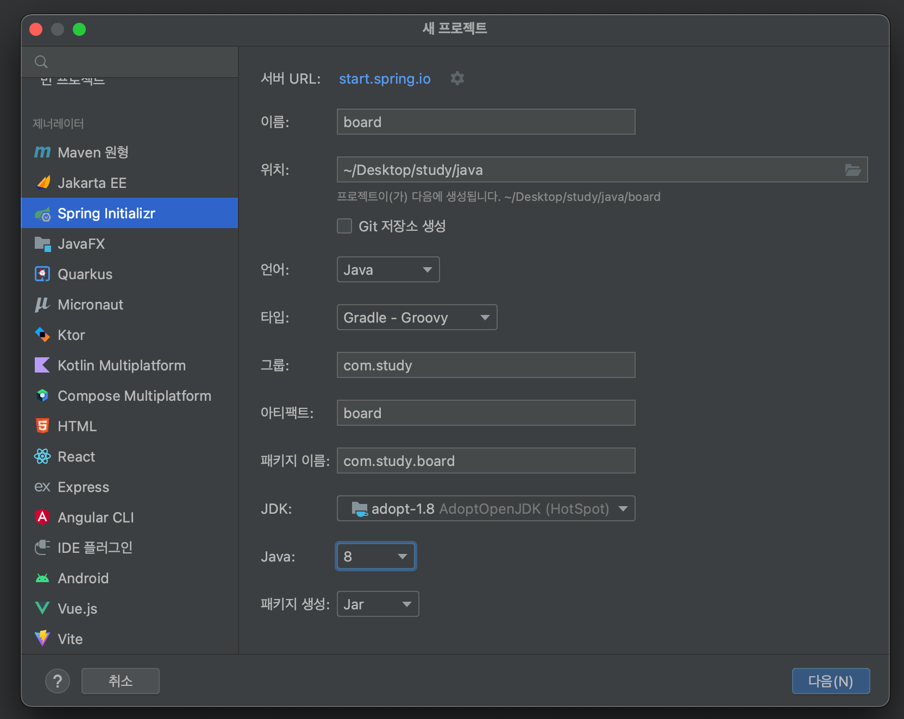

다음으로 의존성은 다음 항목을 추가한다.

`Spring Web`, `Spring Data JPA`, `MySQL Driver`, `Thymeleaf`, `Lombok`

그리고 Spring의 버전은 먼저 `snapshot`이 써있는건 아직 개발 중 이기 때문에 2버전을 선택해준다. 3.0.2가 최신이긴 하지만 Java8은 Spring3에서는 돌아가지 않기 때문에 2버전을 선택하고 생성해준다.

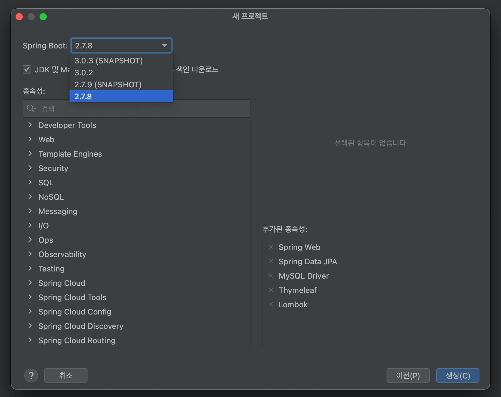

Spring3버전을 선택하게 되면 아래와 같은 에러를 마주하게 된다.

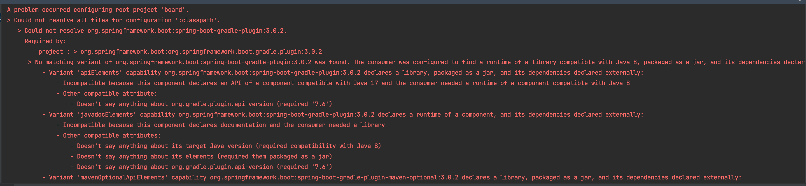

어느정도 시간이 지나 다음과 같이 빌드 성공 메세지가 뜨면 생성완료다.

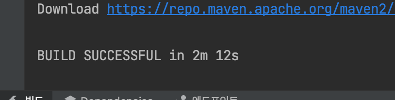

이제 잘 생성이 되었는지 확인을 해보자. `src-main-java`로 들어가서 `BoardApplication` 클래스를 실행해준다.

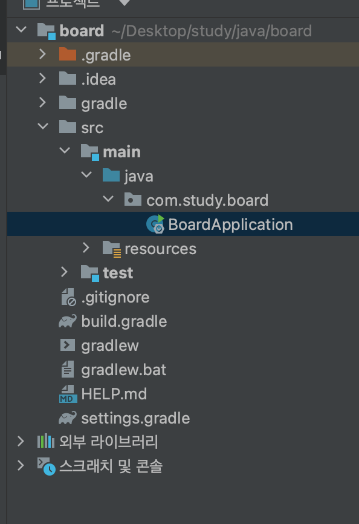

실행을 하면 다음과 같이 DB 설정을 해주지 않아서 에러가 뜨게된다. DB 설정을 해주자.

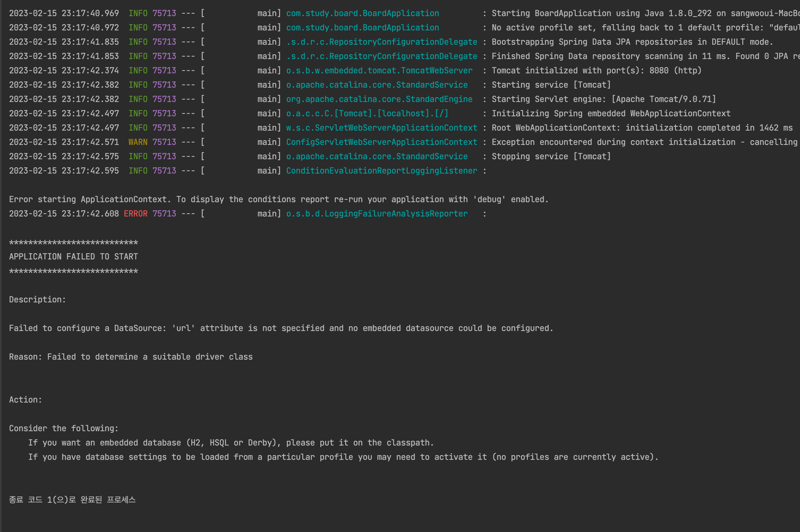

`src-main-resource`경로로 들어가서 `application.properties` 클래스 파일을 열어준다.

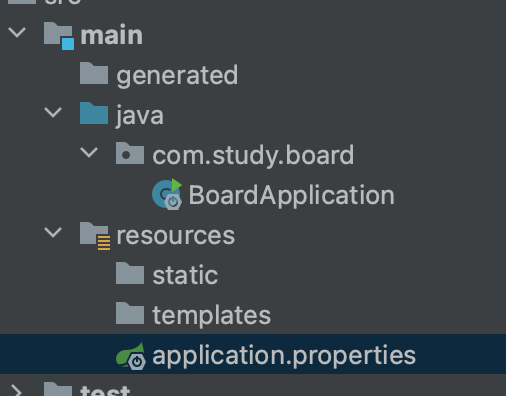

그리고 아래와 같이 작성을 해준다. 먼저 MySQL 관련 샘플은 다음과 같다.

```java
// MySQL 설정
spring.datasource.driver-class-name=com.mysql.cj.jdbc.Driver 

// DB Source URL
spring.datasource.url=jdbc:mysql://<IP>:<Port/<DB>?useSSL=false&useUnicode=true&serverTimezone=Asia/Seoul 

// DB username
spring.datasource.username=<username> 

// DB password
spring.datasource.password=<password> 

// true 설정시 JPA 쿼리문 확인 가능
spring.jpa.show-sql=true 

// DDL(create, alter, drop) 정의시 DB의 고유 기능을 사용할 수 있다.
spring.jpa.hibernate.ddl-auto=update 

// JPA의 구현체인 Hibernate가 동작하면서 발생한 SQL의 가독성을 높여준다.
spring.jpa.properties.hibernate.format_sql=true
```

나는 아래와 같이 작성을 해주었는데 먼저 mysql의 스키마를 만들어줘야한다. 스키마 이름은 `java-board`로 생성해주었다.

```
spring.datasource.driver-class-name=com.mysql.cj.jdbc.Driver
spring.datasource.username=root
spring.datasource.password=mysql패스워드를 적어준다.
spring.datasource.url=jdbc:mysql://localhost:3306/java-board?useSSL=false&useUnicode=true&serverTimezone=Asia/Seoul
```

DB까지 다 설정을 해주고 나서 다시 실행을 해서 아래와 같이 Start가 되면 성공이다.

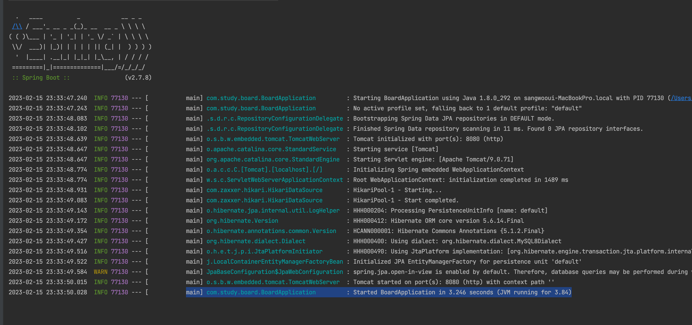

자바는 기본적으로 8080 포트로 실행하는데 만약에 8080이 아닌 다른 포트로 실행하고 싶다면 아까 DB 설정해준 파일에서 `server.port=원하는포트`를 적어주면 된다. 나는 기본 8080 포트로 실행을 했고 잘 작동하는지 웹사이트에 접속해보았다. 이렇게 아래와 같이 Error Page가 뜨면 성공이다.

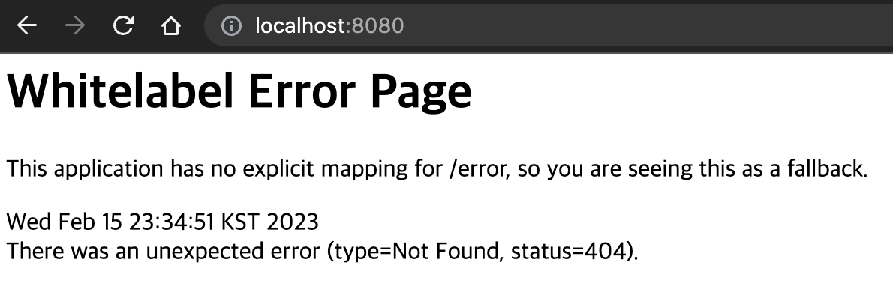

혹시나 Error Page가 떠서 의심하는 사람이 있을 수 있으니 해당 웹 페이지에 글자를 띄워보자.

아래와 같이 `controller` 패키지를 만들고 그 안에 `BoardController` 클래스를 생성해 준다.

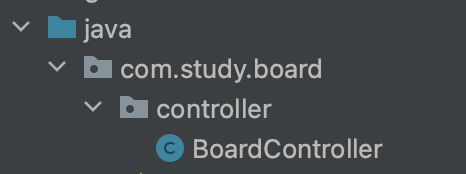

클래스에 다음과 같이 적어주자.

`@Controller`, `@GetMapping` 그리고 `@ResponseBody`는 어노테이션(annotation)으로 따로 정리해서 포스팅 하겠다.

```java
package com.study.board.controller;

import org.springframework.stereotype.Controller;
import org.springframework.web.bind.annotation.GetMapping;
import org.springframework.web.bind.annotation.ResponseBody;

@Controller
public class BoardController {

    @GetMapping("/")
    @ResponseBody
    public String main() {
        return "Java Spring Board";
    }
}
```

이제 다시 서버를 재실행 해주면 우리의 리턴 값이 잘 출력됨을 볼 수 있다.

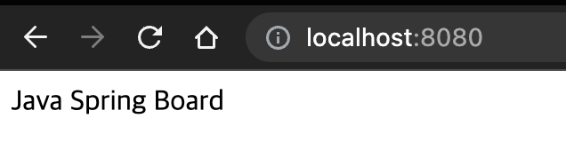

# 참고

[유튜브 한코딩 - [스트링 부트] 게시판 무작정 따라하기](https://youtu.be/6CJ6akFElPc)
[[Spring] DB(MySQL) 연결](https://velog.io/@sians0209/Spring-Spring-gradle-MySQL-JPA-%EC%97%B0%EB%8F%99)