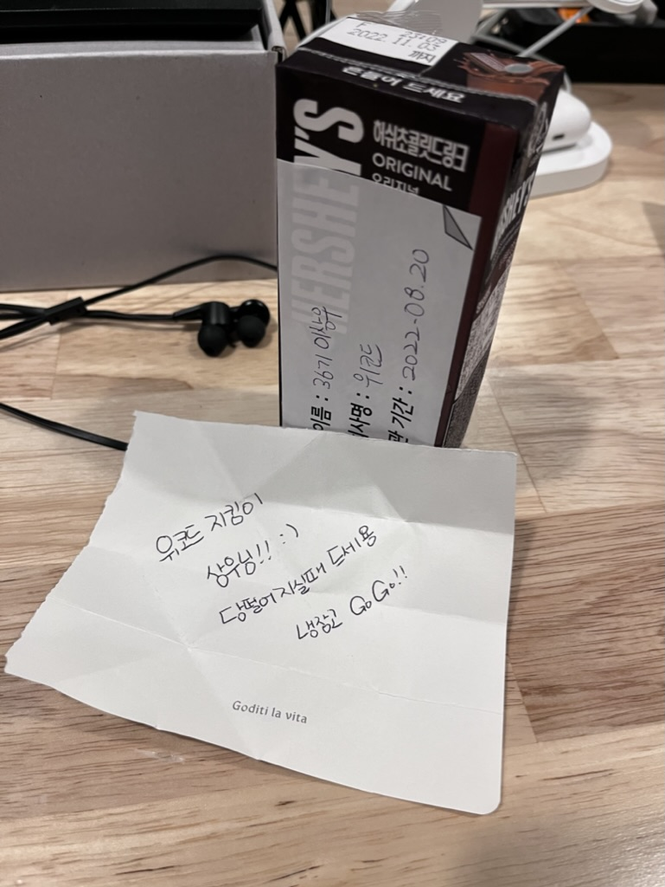
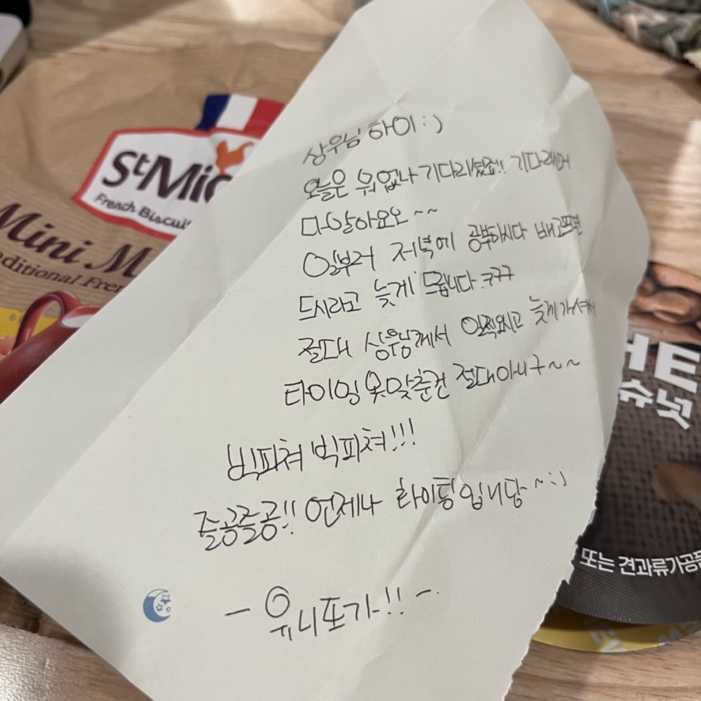

# 1차 프로젝트 3일차

3일차 프로젝트에서는 어제 피드백 받아서 수정한 모델링에 대한 리뷰를 받았다.

리뷰받고 수정할 부분을 수정 한 뒤 깃허브에 푸쉬하고 머지가 된 후 풀 받아서

데이터 입력 작업을 하였다.

### 중요 사항!

dbmate로 테이블 생성해서 마이그레이션을 하려면 참조관계를 잘 생각해서 테이블을 만들어야한다.

안그러면 dbmate up해서 마이그레이션 하는 끊임없이 나오는 에러를 마주할 것이다... 그래서 모델링이 정말 중요한 것 같다...

# 번외

지금 한 달 정도 비슷한 수면시간과 비슷한 패턴으로 지냈는데, 오늘따라 엄청 힘들다.

프로젝트 관련해서 신경 쓸 것도 많고 부담감이라는게 있는 모양이다.

당분간은 1시간 정도 잠을 늘려서 프로젝트 기간동안 몸과 정신이 잘 버텨질 수 있도록

나름의 관리가 필요할 거 같다.

그리고 화요일부터 위니또(위코드+마니또)를 진행했는데

내 위니또로부터 어제 오늘 귀중한 식량을 지원 받았다.

어떤 분이신지 너무너무 감사하고 정말 맛있다!

