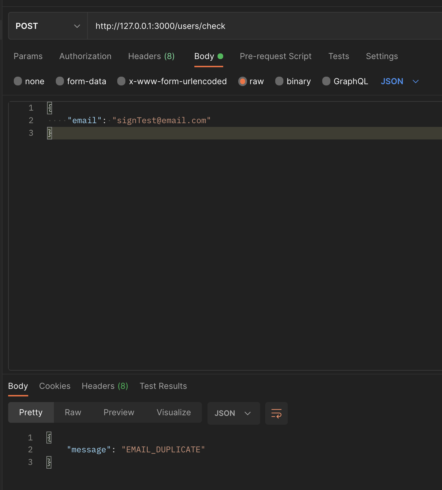
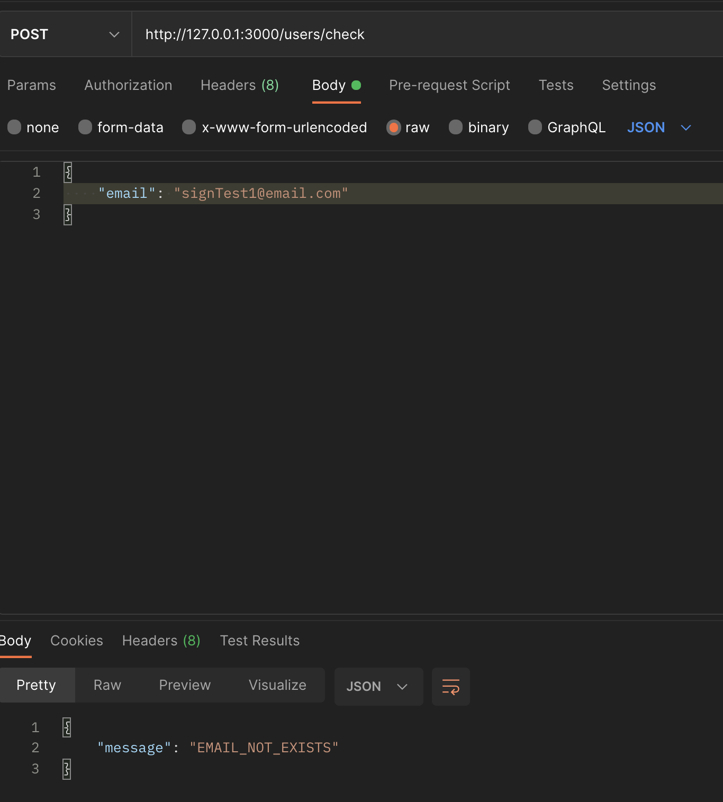
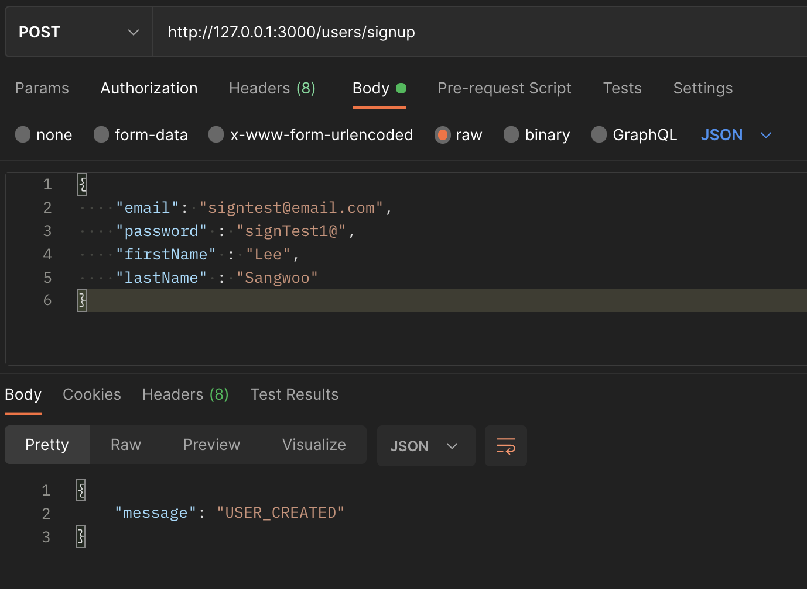
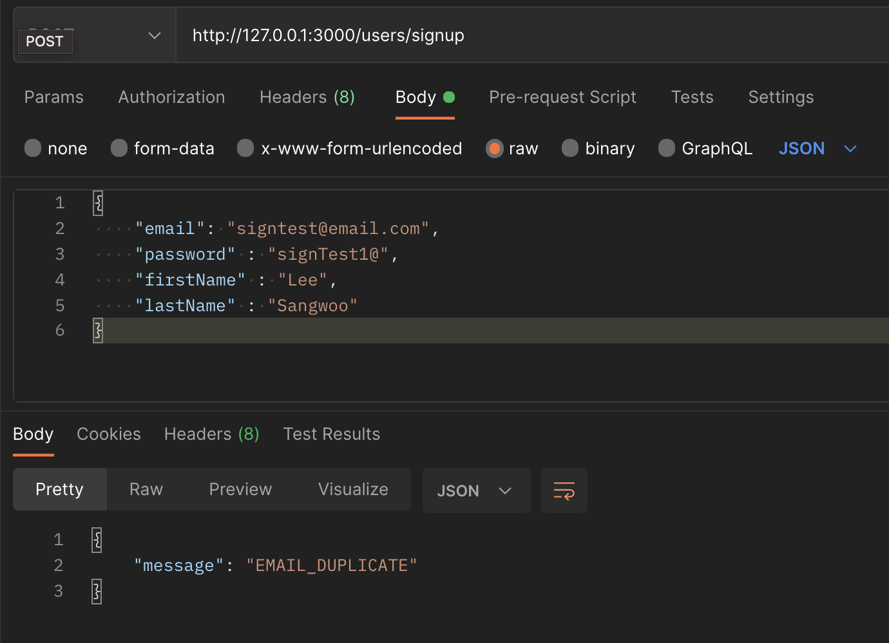
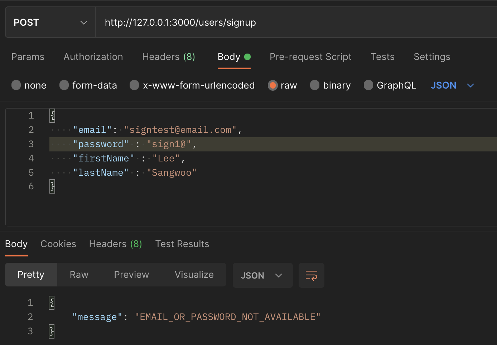
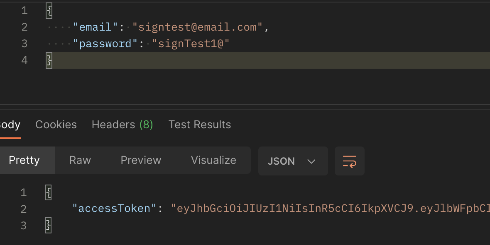
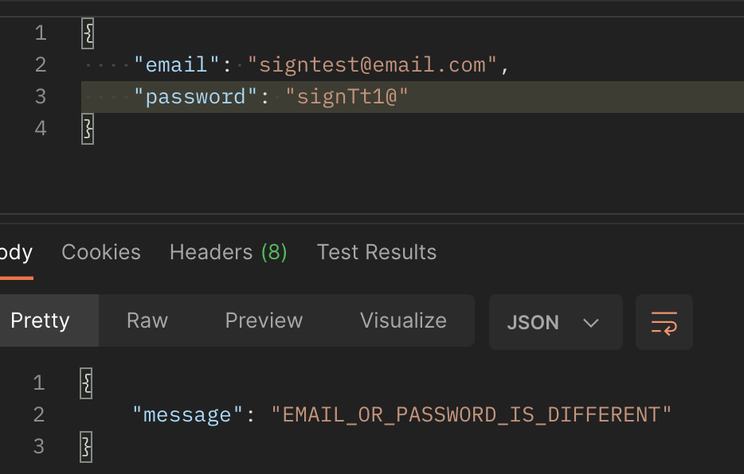

# Facts

이메일 중복체크와 로그인기능 및 회원가입기능 API를 구현했다.

그리고 포스트맨을 이용해서 작동확인을 했고 포스트맨을 이용한 API 문서를 작성했다.

****

#### 이메일 중복일 때

****

#### 이메일 중복이 아닐 때

****

#### 회원가입 성공일 때

****

#### 회원가입 이메일이 중복일 때

****

#### 회원가입 이메일 OR 패스워드의 양식이 맞지 않을 때

****

#### 로그인 성공일 때

****

#### 로그인 이메일 OR 패스워드가 틀릴 때

# Feelings

로그인과 회원가입은 이전에 과제에서 했어서 쉽게 할 수 있었다. 다만 이메일 중복체크에서 살짝 어려움을 느꼈다. 타 사이트와는 다르게 이메일을 먼저 체크하는 방식이다보니 이메일 중복을 체크 하고 그에 알맞은 응답을 보내서 로그인 OR 회원가입을 하는데 이메일 중복에는 실행이 잘 됐지만, 이메일 중복이 아닌 경우에 보낼 응답이 안나오다보니 정말 힘들었지만 몇 시간에 걸쳐 해결해서 딱 중복여부가 나타나는 순간 정말 행복했다. 이것 때문에 개발자를 하는가 보다.

# Findings

컴퓨팅 사고의 위대함?을 한번 더 느낀 하루였다..
정말 조금만 조금만 더 쪼개서 생각했으면 찾을 수 있던 로직이었는데 그걸 못해서 엄청난 시간을 투자했다... 그래도 결국 해냈으니 나의 컴퓨팅 사고가 한 층 더 성장 했을거라 생각한다.

# Self Affirmation

> 느려도 꾸준하게 하면 내일의 나는 오늘의 나보다 한 걸음 앞에 있을거야.