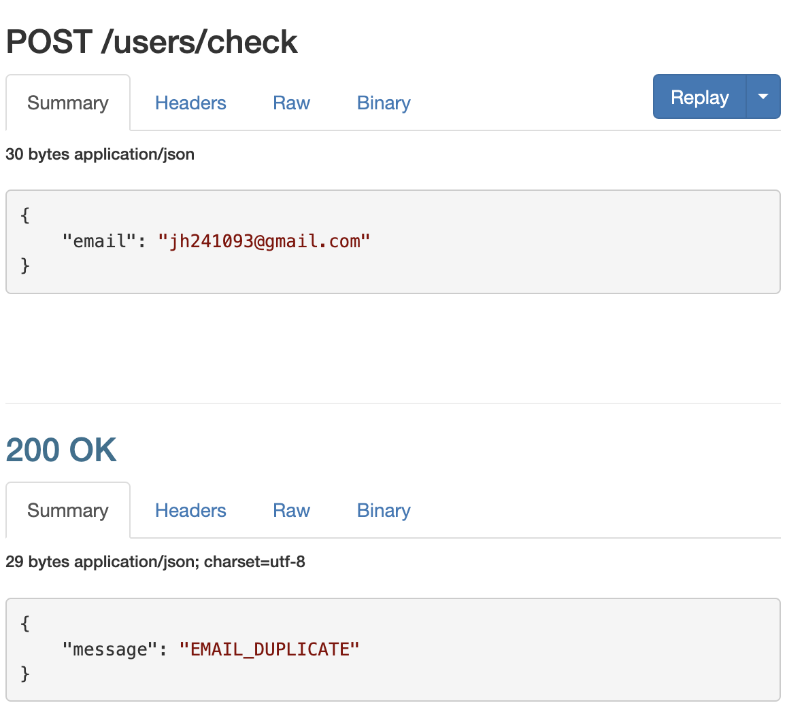
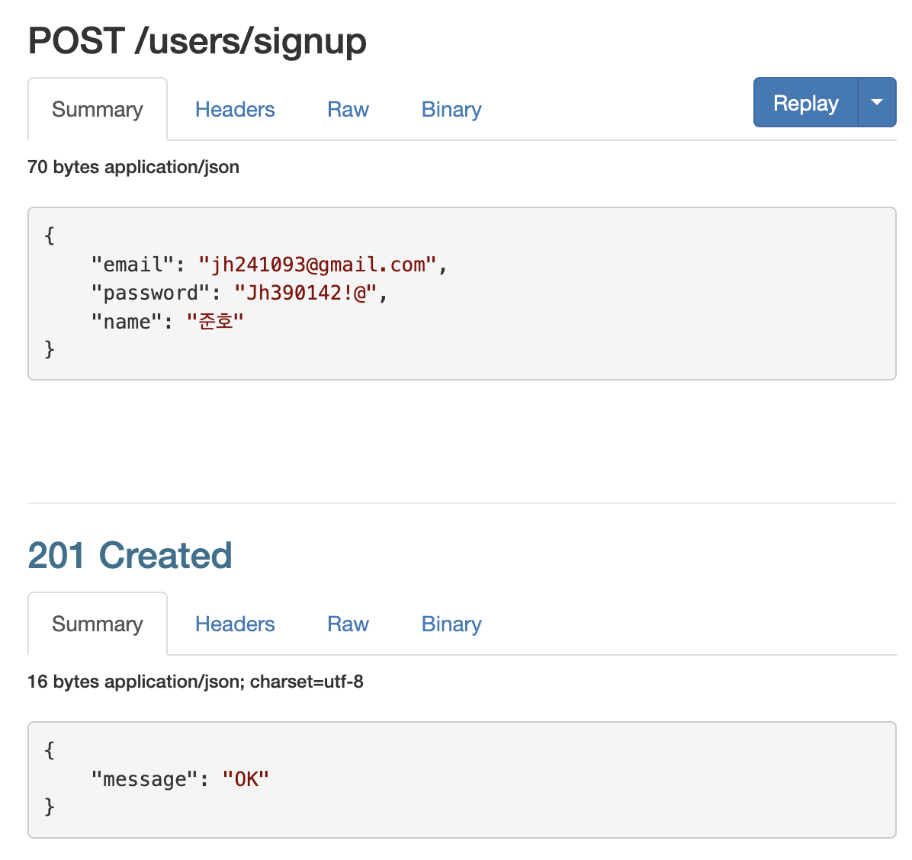
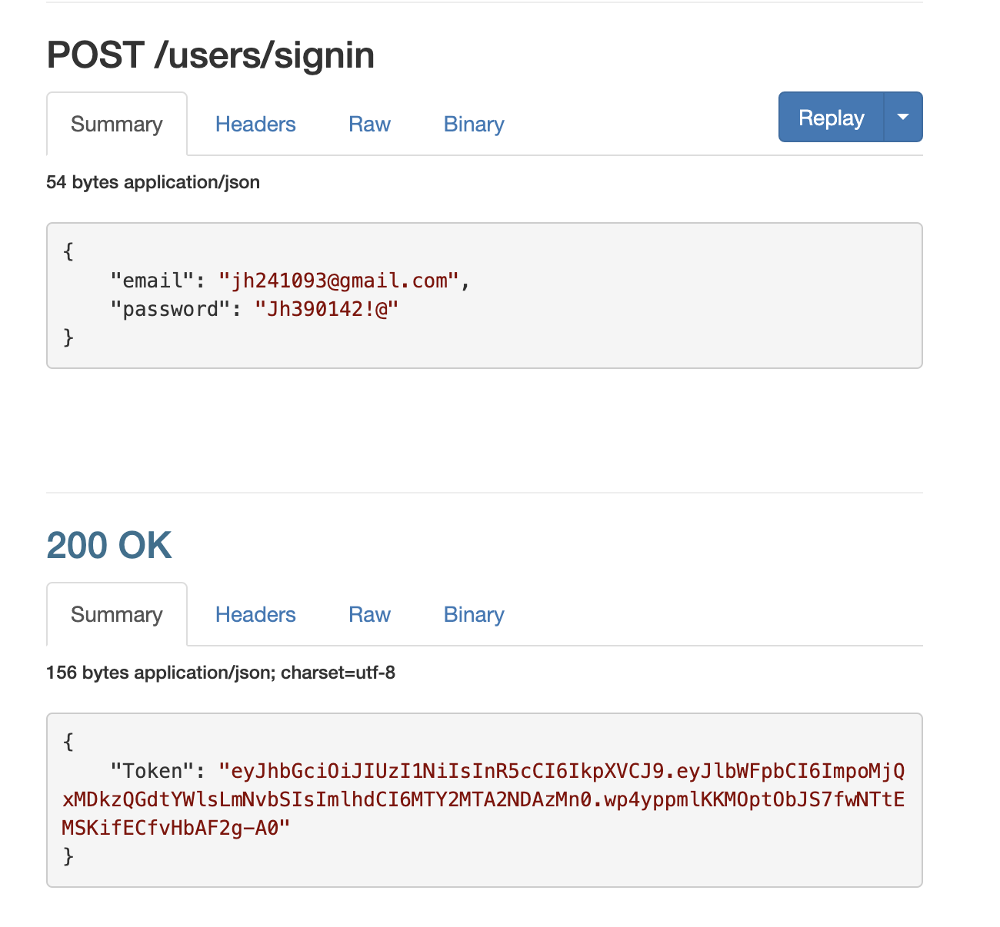

# Facts
프론트 동료와 이메일 중복체크, 회원가입, 로그인 통신을 주고 받았다.
동료가 코로나로 재택을 하는 상황이라 ngrok이라는 툴을 이용해서 통신했다.

****

#### 이메일 중복 통신

****

#### 회원가입 성공

****

#### 로그인 성공 후 토큰 발급

****

# Feelings

이전에 과제로 프론트와 회원가입 로그인 통신을 해보았지만 그 때는 멘토님께서 올려주신 코드를 받아서 했기 때문에 내가 작성한 코드로 통신에 성공한건 처음이라 짜릿했다.

통신을 하면서도 계속해서 소통을 하면서 바꿔야 할 코드가 많았지만 그래도 정말 재미있게 통신을 마무리 할 수 있었다.

# Findings

프론트와의 소통이 정말 중요하다는 걸 알게되었다. 그리고 이전 기수까지는 파이썬을 이용해서 백엔드를 하다가 내 기수부터 자바스크립트 그대로 사용해서 Node.js로 백을 배웠는데 사실 리엑트는 잘 모르지만 그래도 자바스크립트라서 서로 화면 공유를 하면서 잘못된 부분을 잡아주면서 코드를 맞춰나가니까 정말 즐겁게 시간을 보냈다. 만약 베이스 언어가 달랐으면 동료가 에러를 잡는 동안 나는 가만히 있거나 다른 일을 해야했을 텐데 베이스 언어가 같다보니 같이 코드를 보면서 에러를 잡아서 빠르게 할 수 있었다.

# Self Affirmation
> 포기하지 않으면 실패는 과정일 뿐이다.