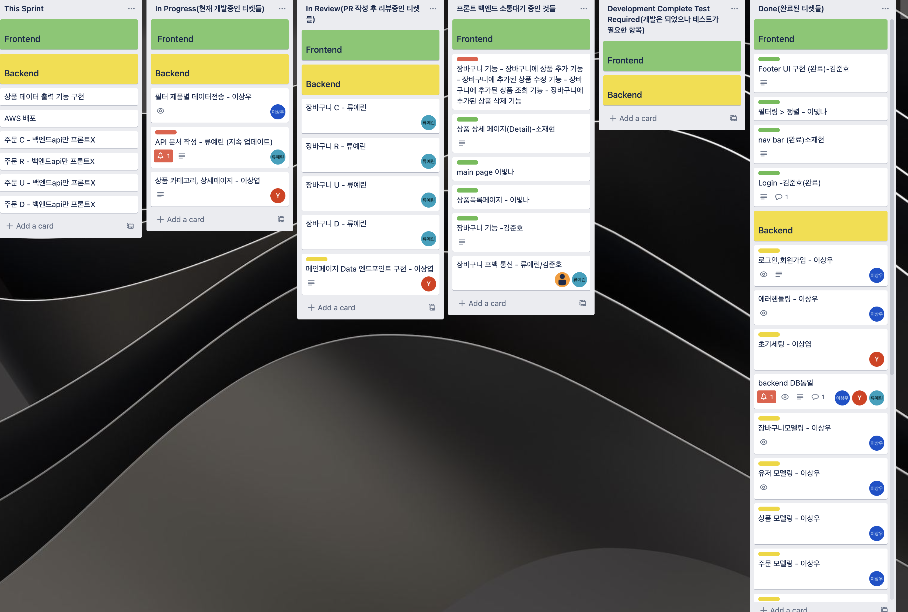
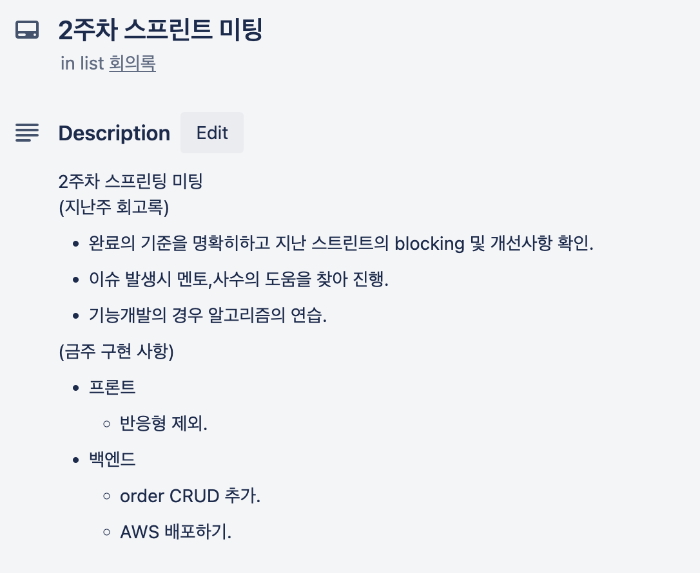

# Facts
wecode 1차 프로젝트 중간발표를 했다. 백엔드 부분은 내가 발표를 맡아서 1주차 진행 상황과 우리 팀의 특수한 상황(코로나로 팀 인원의 33%가 재택)을 이겨내기 위해 게더타운을 사용하여 24시간 소통하고 ngrok을 이용하여 통신을 주고받은 경험에 대해서 발표를 하였다.
2차 스프린트 미팅 시간에는 1주차에 대한 회고와 2주차에 구현할 기능에 대해 티켓분배를 했고 혹시나 시간이 될 경우 추가 구현사항에 대해서도 티켓을 만들었다.

****

#### 트렐로에 기입한 사항 (블로그 작성 시점에는 이미 넘어간 티켓이 있어서 미팅시 선정한 티켓과는 조금 다르다.)

****

#### 회의록

# Feelings

매일 스탠드업 미팅을 하면서 1주차에 진행하기로 했던 사항들에 대해 어느정도 작업이 다 되었다고 생각했는데 멘토님들과 함께 2차 스프린트 미팅을 진행해보니 확실하게 끝난 작업물이 1주차에 하기로 했던 분량의 3~40%정도밖에 안된다는 걸 알고 어떤 점이 부족했는지 생각해보니 모델링에서 시간을 좀 잡아먹기도 했고 데이터가 별로 없다는 생각에 기능구현을 좀 많이 잡아놔서 이런 상황을 만들었다.

# Findings

회고의 중요성

# Self Affirmation

> 회고를 하며 그 날의 그 주에 배운 것, 알게된 것에 대해 다시 한번 생각해보자.