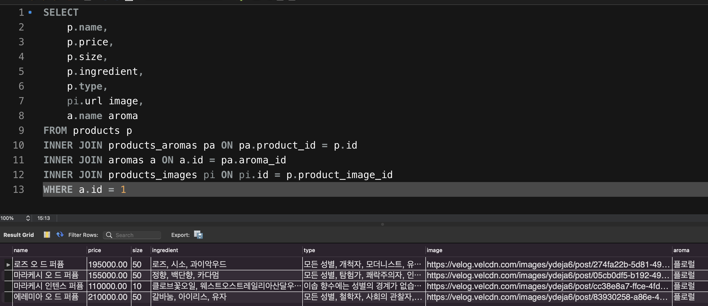
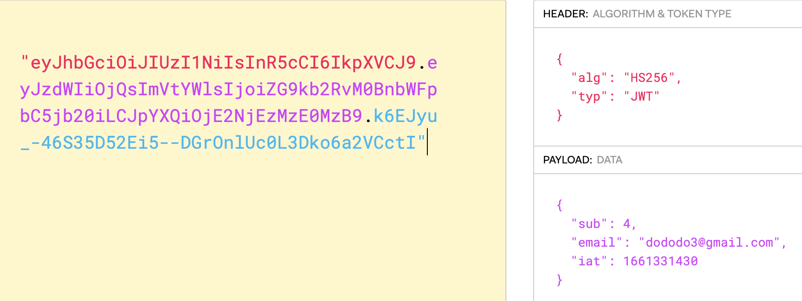

# Facts

- 향수 제품에 함유되어있는 아로마 타입에 따라 제품이 출력되도록 MySQL 쿼리문을 작성

- 페이로드에 유저정보 담기
  

# Feelings

인증인가 파트 때 과제를 너무 소홀하게 진행해서 페이로드에 우리가 사용 할 유저의 정보를 담는 것을 잊고있어서 추가하였다...

배운것을 최대한 활용해도 모자란데 이렇게 잊어버리다니 ㅜㅜ 그래도 이렇게 다시 사용하게 되어서 2차 프로젝트에서는 절대 잊이말고 사용할것이다!!

# Findings

# Self Affirmation
> 그 날 배운것은 그 날 바로 기록하기! 문서 형식이 아닌 예제 형식으로..!