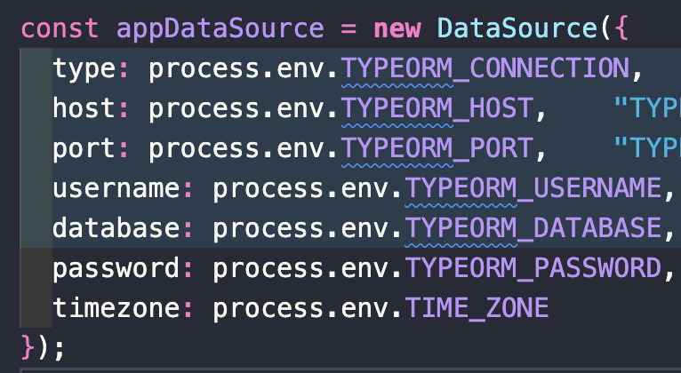

# Facts
숙소 에약기능을 구현하고있다. 게스트가 숙소 예약을 할 시 고려해야할 사항이 정말 많다.
단순하게 보면
- 숙박일정
- 가격
- 인원수\
이지만 내부에서 처리해야될 사항이 정말 많다.\
먼저, 호스트가 설정한 숙박 가능한 일정과 게스트의 일정을 비교해야한다. 호스트가 22년 8월 1일부터 22년 8월 31일까지만 숙박 가능하다고 설정하면 그 안에서만 숙박일정을 받도록 해야하며, 이미 예약이 되어있으면 숙박을 받지 못하도록 해야한다. 그리고 한번 숙박시 최대 일 수가 설정되어있다면 이것도 고려해야한다. 그리고 가격은 1박당으로 등록되어있기에 최대 숙박가능 일 수 범위 안에서 게스트가 묵고자 하는 일 수 만큼 가격 책정을 해야하며, 숙박 가능 인원도 디비에 저장되어있는 최대 인원 수와 비교를 해 주어야 한다.
현재 모든 기능은 구현 했지만 이미 예약이 되어있어서 숙박을 받지 못하도록 하는 부분이 잘 안풀리고있다. 구현은 했지만 중복되는 코드가 많고 service와 dao를 계속 왔다갔다 해야해서 처리 시간도 오래걸리다 보니 원하던 과정이 아니어서 계속해서 생각하고 수정하고 하고있는데 생각대로 풀리고있진 않다.

# Feelings
처음 예약기능 티켓을 가져가면서 생각했던 구현시간보다 1일이 더 걸렸지만 아직 끝내지 못하고 있다. 결과적으로는 기능은 잘 작동 되지만 코드가 마음에 들지 않다보니 리팩토링 하는 과정에 있는데 잘 풀리지 않으니 답답하다. 그래도 기능 하나를 정말 제대로 끝내야 마음이 편할 거 같고 많은 고민과 다양한 시도로 최적의 효율을 내는 코드가 완성된다면 얻게될 희열과 기쁨을 생각하며 더 도전을 해봐야겠다.

# Findings
숙소의 예약 가능 일정을 `2022-08-22 00:00:00`이런 식으로 설정했는데 쿼리를 이용해 출력해서 콘솔 찍어보면 22일이 아닌 21일이 나왔다. 검색을 해보니 mysql의 `timezone`과 관련된 내용으로 `UTC`로 설정되어 있어서 그런것을 확인하고 mysql의 timezone을 확인 했는데 `KST(한국 표준시)`로 잘 설정이 되어있어서.. 살짝 당황 했다. 그래서 `mysql timezone`, `javascript mysql timezone`, `mysql kst javascript utc`, `node.js mysql time` 등 여러 검색어를 이용하여 검색하다가 해결책을 찾게 되었다. .env에 환경변수로 `TIME_ZONE = Asia/Seoul`을 설정해주면 된다는 사실을 알고 바로 추가해서 `database`에 환경변수를 추가해주니 날짜가 한국 표준시로 잘 나오게 되었다.
#### 환경변수 설정 전

#### 환경변수 설정

#### 환경변수 설정 후

# Self Affirmation
> 과정 속에서 얻어가는 것이 많으면 그것이 쌓이고 쌓여서 훗 날 나를 지지해 줄 거대한 산이 될 것이다.