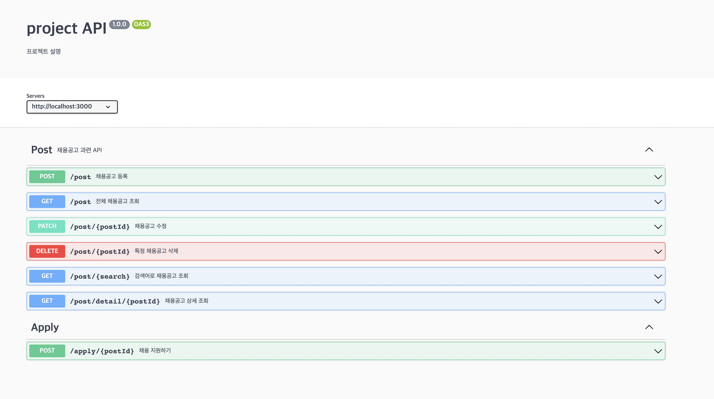

# Facts

swagger를 이용하여 원티드 프리온보딩 백엔드 코스 사전과제에 API 문서를 만들었다.

# Feeling

주석으로 코딩하는것도 신기했고 정말 깔끔하고 예쁘게 만들어지는 것을 보니 앞으로 잘 써보고 싶다.
그동안 postman이나 notion을 이용하여 API문서를 만들었는데 swagger를 이용하니 깔끔하고 정갈하게 나와서 프론트도 한눈에 파악하기 쉬워보이고 소통에도 큰 기여를 할 거 같다.

참 신기하고 놀라운 코딩의 세계이다.

# Findings

세상 사람들의 편리함을 위해 개발을 하는 개발자들을 위해 개발된 툴들도 정말 다양하고 많은거 같다. 나에게 필요한 툴을 적제적소에 잘 사용할 수 있도록 다양한 툴들도 경험해보고 새로운 것에도 빠르게 적응할 수 있도록 더욱 더 노력해야겠다.

# 결과물

### 이게 정말정말 신기하다

