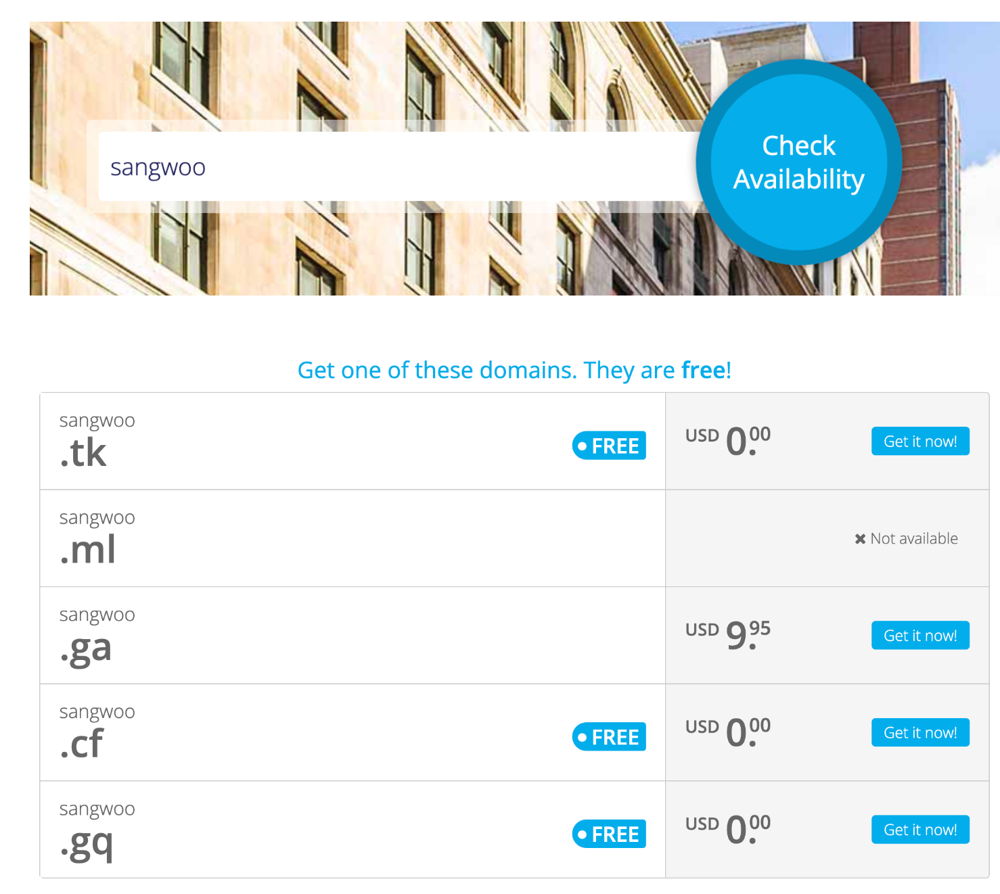
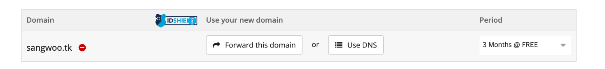
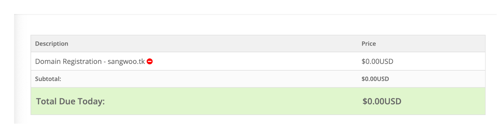
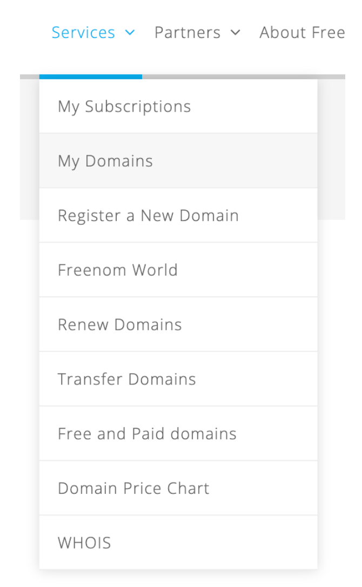
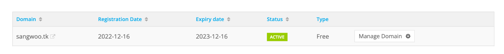
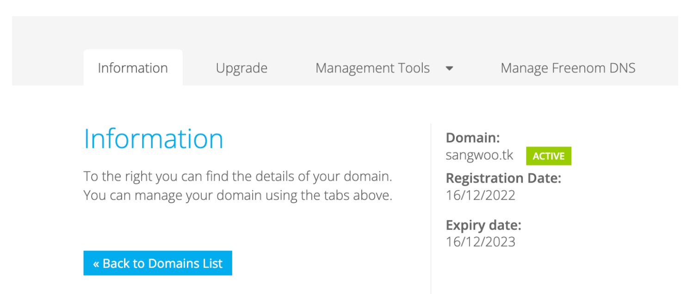
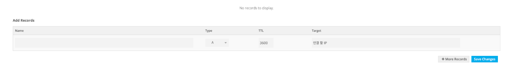
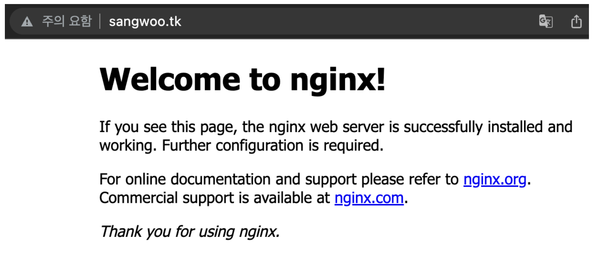

# Freenom으로 무료 도메인 발급하기

실제 웹 사이트 배포를 하기 위해서라면 도메인을 구입해야 하지만 테스트 목적이라면 무료로 간단하게 발급할 수 있는 Freenom의 도메인을 추천한다.

#### **Freenom의 단점**

도메인을 발급 받기 전에 몇 가지 단점이 있으니 알고 넘어가자.

1. TLD(Top Level Domain)이 제한적이다.
TLD는 우리가 사이트 도메인에서 주로 볼 수 있는 **com** **net** 등을 의미한다. Freenom은 무료로 **tk ml ga gq cf**를 제공해준다. 무료이고 테스트 목적이니 상관은 없다고 생각한다.

2. 유료화
도메인을 발급 받을 때 무료로 최대 1년까지 설정할 수 있고 연장을 해서 계속해서 사용할 수 있다. 연장을 하는데 비용은 들지 않지만 연장 시기를 놓치게 되면 만료가 되기 때문에 이를 새로 발급받아야 하는데 **special domain**으로 분류가 되어 비용을 지불해야한다. 가격은 대략 9달러 정도 된다.

3. 하이재킹
이 3번이 freenom의 도메인을 실제 웹 사이트에 적용하면 안 되는 결정적인 이유이다. Freenom의 무료 도메인을 적용했는데, 트래픽이 많아지게 되면 special domain으로 분류가 되어 강제로 유료화된다. 

4. 제한적인 DNS
DNS 서버가 범용적이지 못하다. Freenom에서 발급받은 도메인에 접속하려면 클라이언트의 네트워크 DNS 서버가 Freenom의 정보를 알고 있어야 하는데 Freenom은 그 범용성이 너무 떨어진다. 

#### **이제 몇 가지 단점을 알았으니 도메인을 발급 해보자**

[www.freenom.com](https://www.freenom.com/en/index.html?lang=en)

먼저 사이트에 회원가입을 하고 사용할 도메인을 아래 창에 검색한다.

이전에 sangwoo.ga를 발급받은 적이 있고 현재는 사용을 하지 않지만 가지고 있는데 거진 10달러로 측정이 되어있다....

sangwoo.tk를 선택해서 들어가 보면 제일 오른쪽에 기간을 정할 수 있는 드롭다운 창이 있다.

12개월로 선택하고 다음으로 넘어가서 무료인 것을 확인한 뒤 주문을 완료해준다.

주문을 완료하고 상단의 Services의 My Domains으로 들어가 준다

방금 발급받은 도메인이 있는 것을 확인한 뒤 Manage Domain 버튼을 클릭해준다.

그다음 Manage Freenom DNS로 들어가 준다.

다음과 같은 창이 보일 것이고 Target에 연결할 IP를 넣어준다.

Nginx가 설치된 EC2와 연결을 했고 해당 도메인으로 접속을 해보면 아래와 같이 적용이 잘 된 것을 볼 수 있다.

