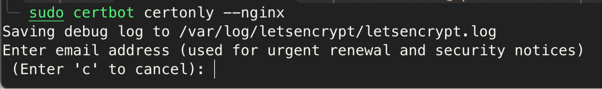
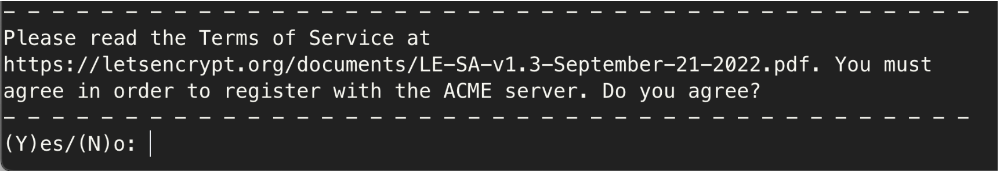
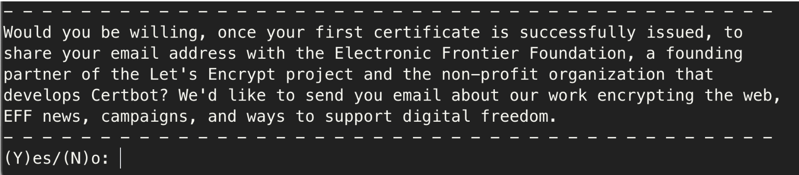
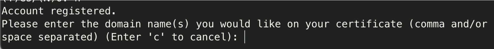
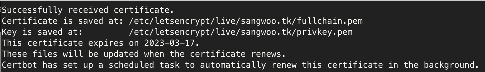

### **Let's Encrypt에서 무료 SSL 인증서 발급**

SSL 인증서를 발급받기 위해서는 먼저 도메인이 필요하다. 도메인이 없으면 아래 글을 참고하여 발급 받아준다.

[무료 도메인 발급](https://www.sangwoo.dev/web/freenom)

#### **Let's Encrypt의 단점**

SSL 인증서를 발급받기 전에 먼저 몇 가지 단점을 알아보자.

1. 유효기간
무료 인증서의 유효기간은 90일 이다. 하지만 자동 갱신을 지원해 주기 때문에 이건 단점이라 볼 수 없으며, tomcat을 사용한다면 수동으로 갱신을 해줘야 한다.

2. 서브 도메인
서브 도메인(멀티 도메인)을 지원하지 않는다. 지금 내가 적용하려는 sangwoo.tk를 예시로 들면 해당 도메인에 인증서를 발급 받았는데 sub.sangwoo.tk를 쓰고싶다면 해당 도메인에 대해서 다시 인증서를 받아야한다.

#### **SSL 인증서 발급받기**

도메인을 발급해서 EC2에 연결을 해주었기에 EC2에서 SSL 인증서 발급을 진행하도록 한다.

먼저 다음 명령어를 통해 apt를 업데이트하고 snapd를 설치한 뒤 EC2 재부팅을 해준다.

```
sudo apt update
sudo apt install snapd

// EC2 재부팅
sudo reboot
```

EC2에 다시 접속을 하고 아래 명령어를 입력한다

```
sudo snap install core
sudo snap install --classic certbot
sudo ln -s /snap/bin/cerbot /usr/bin/certbot


// 자신의 웹 서버의 설정을 업데이트 한다.

// Apache
sudo certbot --apache

// Nginx
sudo certbot --nginx
```

명령어를 순서대로 입력하면 이제 아래와 같이 입력을 요구한다.

공지를 받을 이메일을 작성해준다.



다음은 약관에 동의하냐는 질문이다. 동의를 해준다.



EFF의 소식을 받을지 말지 결정한다.



이제 마지막으로 도메인 주소를 입력해준다. 



SSL 인증서 발급이 성공적으로 마치게 되었다.



#### **NGINX에 HTTPS  적용하기**

[Nginx에 HTTPS  적용](https://www.sangwoo.dev/nginx/https)