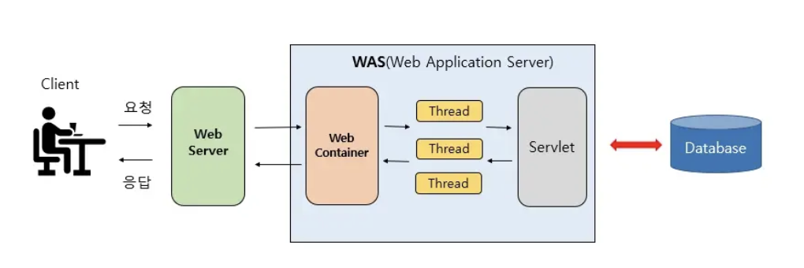

# Web Server

웹 서버란 HTTP 프로토콜을 기반으로 클라이언트가 웹 브라우저에서 요청을 하면 그 요청을 받아 `정적 컨텐츠`를 제공하는 서버이다.

여기서 정적 컨텐츠는 `HTML`, `CSS`, `이미지` 등 즉시 응답 가능한 컨텐츠이다.

동적 컨텐츠 요청을 받으면 WAS로 해당 요청을 넘겨서 WAS에서 처리한 결과를 클라이언트에게 전달하는 역할도 한다.

Web Server에는 Apache, Nginx 등이 있다.

# WAS (Web Application Server)

WAS는 DB를 조회하거나 다양한 비즈니스 로직 처리를 요구하는 동적 컨텐츠에 대한 요청을 해결하기 위해 만들어진 Application 서버이다. 

HTTP 프로토콜을 기반으로하여 서용자 컴퓨터나 장치에 애플리케이션을 수행하는 미들웨어로, 주로 데이터베이스 서버와 같이 수행된다.

WAS는 JSP, Servlet 구동환경을 제공하기에 서블릿 컨테이너 OR 웹 컨테이너라고도 불린다.

WAS에는 Tomcat, JBoss, WebSphere 등이 있다.

# Web Server와 WAS

WAS는 Web Server와 Web Container 역할을 모두 할 수 있다.

그럼에도 Web Server와 WAS를 분리하는 이유는 다음과 같다.

1. 서버 부하 방지
    WAS는 동적 컨텐츠를 처리하고 Web Server는 정적 컨텐츠를 처리하여 서버의 부하를 방지한다. 

2. 보안 강화
    SSL에 대한 암호화, 복호화 처리에 Web Server를 사용 가능하며, Web Server를 한번 더 거치기 때문에 보안적으로 더 좋다.

3. 여러 WAS 연결 가능
    로드 밸런싱을 위해 Web Server를 이용할 수 있다. 여러 개의 서버를 사용하는 경우에는 Web Server와 WAS를 분리하여 무중단 운영을 하며 장애에 대응할 수 있다.

4. 여러 웹 어플리케이션 서비스 가능
    하나의 서버에서 PHP, JAVA 애플리케이션을 함께 사용할 수 있다.

# Web Service Architecture

# 참고

[코드사냥꾼의 전리품 - [Web]웹 서버와 WAS의 차이를 쉽게 알아보자](https://codechasseur.tistory.com/25)

[[Web] Web Server와 WAS의 차이와 웹 서비스 구조](https://gmlwjd9405.github.io/2018/10/27/webserver-vs-was.html)