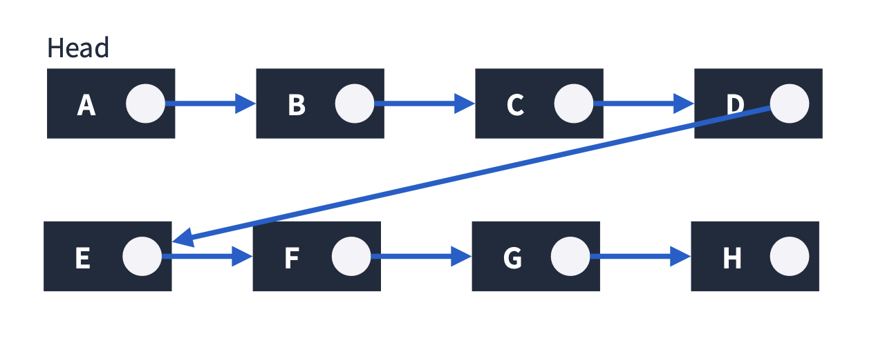

# 연결 리스트(Linked List)

연결리스트는 각 요소를 포인터로 연결하여 관리하는 선형 자료구조이다. 각 요소는 노드라고 부르는데 데이터 영역과 포인터 영역으로 구성되어진다.

## 연결리스트의 특징

- 메모리가 허용하는 한 요소를 제한 없이 추가할 수 있다.
- 요소를 추가하거나 삭제할 때는 O(1)이 소요된다. 요소를 탐색할 경우에는 O(n)이 소요된다.
- Singly, Doubly, Circular Linked List로 나뉜다.

## 배열과 연결리스트의 차이점

||장점|단점|
|---|---|---|
|배열|랜덤 엑세스 빠름   빠르게 접근 가능 |메모리 사용 비효율적   배열 내에서 데이터 이동 및 재구성 어려움|
|연결리스트|동적으로 메모리 사용가능   메모리 효율적 사용   데이터 재구성 용이   대용량 데이터 처리 적합|특정 위치 데이터 검색이 느림   메모리를 추가적으로 사용해야함|

  출처:
  <a href="https://sycho-lego.tistory.com/17"> 글쓰는 공돌이 </a>

 

