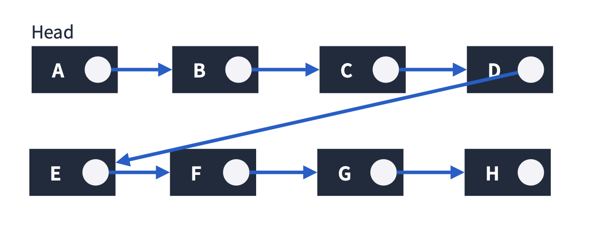
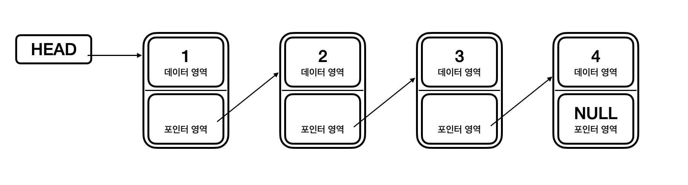
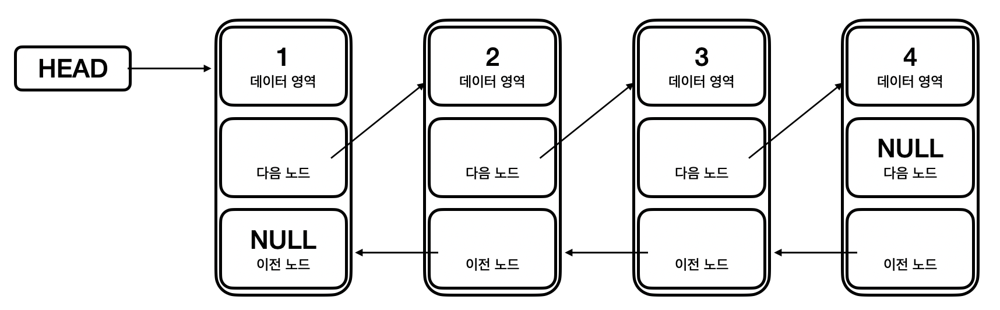
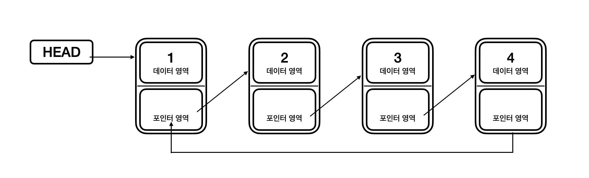

# 연결 리스트(Linked List)



연결리스트는 각 요소를 포인터로 연결하여 관리하는 선형 자료구조이다. 각 요소는 노드라고 부르는데 데이터 영역과 포인터 영역으로 구성되어진다.

## 연결리스트의 특징

- 메모리가 허용하는 한 요소를 제한 없이 추가할 수 있다.
- 요소를 추가하거나 삭제할 때는 O(1)이 소요된다. 요소를 탐색할 경우에는 O(n)이 소요된다.
- Singly, Doubly, Circular Linked List로 나뉜다.

## 배열과 연결리스트의 차이점

||장점|단점|
|---|---|---|
|배열|랜덤 엑세스 빠름 <br> 빠르게 접근 가능 |메모리 사용 비효율적 <br> 배열 내에서 데이터 이동 및 재구성 어려움|
|연결리스트|동적으로 메모리 사용가능 <br> 메모리 효율적 사용 <br> 데이터 재구성 용이 <br> 대용량 데이터 처리 적합|특정 위치 데이터 검색이 느림 <br> 메모리를 추가적으로 사용해야함|


<p align="center">
  출처:
  <a href="https://sycho-lego.tistory.com/17"> 글쓰는 공돌이 </a>
</p> 


## Singly Linked List

Head에서 Tail까지 단방향으로 이어지는 연결 리스트로 가장 단순한 형태인 연결 리스트이다.




## Doubly Linked List

양방향으로 이어지는 연결 리스트로 Singly보다 자료구조의 크기가 더 크다.



## Circular Linked List

Singly 혹은 Doubly에서 Tail이 Head로 연결되는 연결 리스트로 메모리를 아껴쓸 수 있다. 원형 큐 등을 만들 때 사용된다.




## Javascript 예제 코드 

```javascript

class Node {
  constructor(value) {
    this.value = value;
    this.next = null;
  }
}

class SinglyLinkedList {
  constructor() {
    this.head = null;
    this.tail = null;
  }

  find(value) {
    let currNode = this.head;
    while (currNode.value !== value) {
      currNode = currNode.next;
    }
    return currNode;
  }

  append(newValue) {
    const newNode = new Node(newValue);
    if (this.head === null) {
      this.head = newNode;
      this.tail = newNode;
    } else {
      this.tail.next = nextNode;
      this.tail = newNode;
    }
  }

  insert(node, newValue) {
    const newNode = new Node(newValue);
    newNode.next = node.next;
    node.next = newNode;
  }

  remove(value) {
    let prevNode = this.head;
    while (prevNode.next.value !== value) {
      prevNode = prevNode.next;
    }

    if (prevNode.next !== null) {
      prevNode.next = prevNode.next.next;
    }
  }

  display() {
    let currNode = this.head;
    let displayString = "[";
    while (currNode !== null) {
      displayString += `$(currNode.value), `;
      currNode = currNode.next;
    }
    displayString = displayString.substr(0, displayString.length - 2);
    displayString += "]";
    console.log(displayString);
  }
}

// ex
const linkedList = new SinglyLinkedList();
linkedList.append(1);
linkedList.append(2);
linkedList.append(3);
linkedList.append(5);
linkedList.display(); // [1, 2, 3, 5]
console.log(linkedList.find(3)) // Node { value: 3, next: Node { value: 5, next: null } }
linkedList.remove(3);
linkedList.display(); // [1, 2, 5]
linkedList.insert(linkedList.find(2), 10);
linkedList.display(); // [1, 2, 10, 5]
```

# 참고

[프로그래머스 JAVASCRIPT 코딩테스트 광탈 방지 강의](https://school.programmers.co.kr/learn/courses/13213/13213-%EC%BD%94%EB%94%A9%ED%85%8C%EC%8A%A4%ED%8A%B8-%EA%B4%91%ED%83%88-%EB%B0%A9%EC%A7%80-a-to-z-javascript)