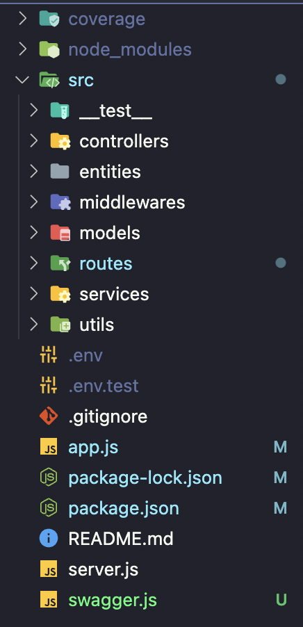
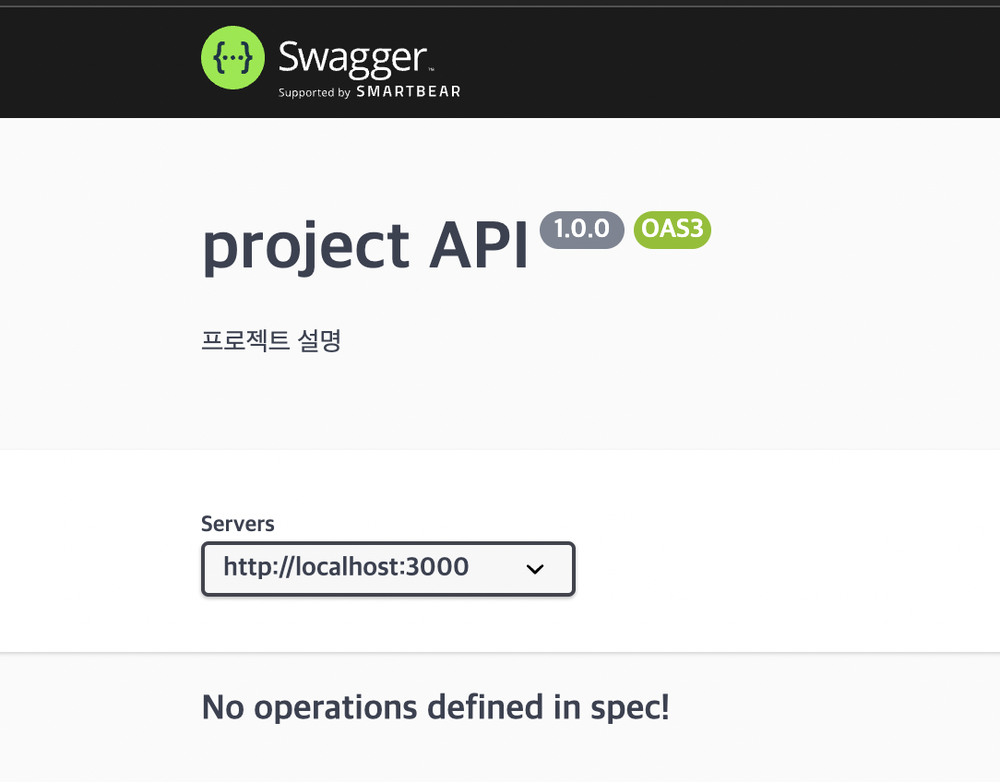
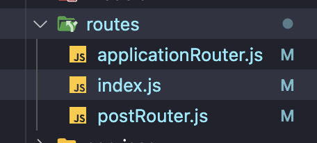
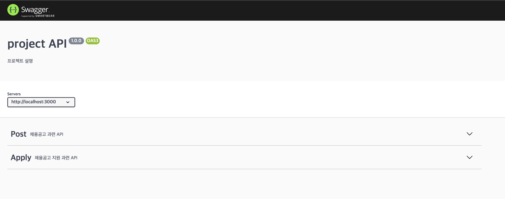
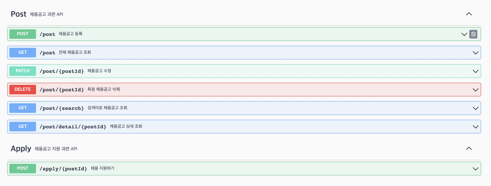
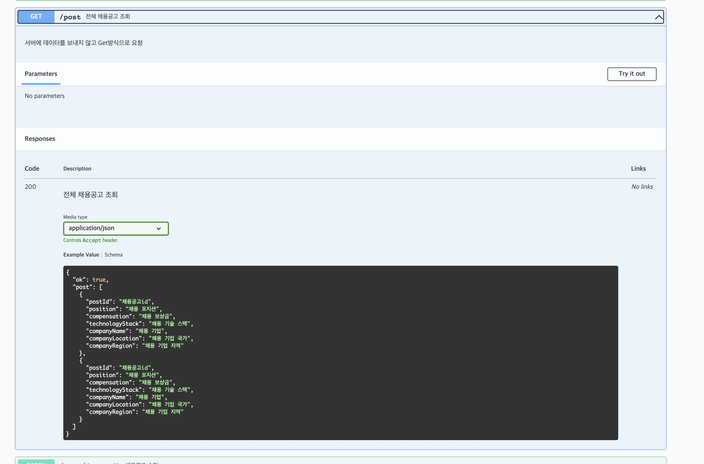
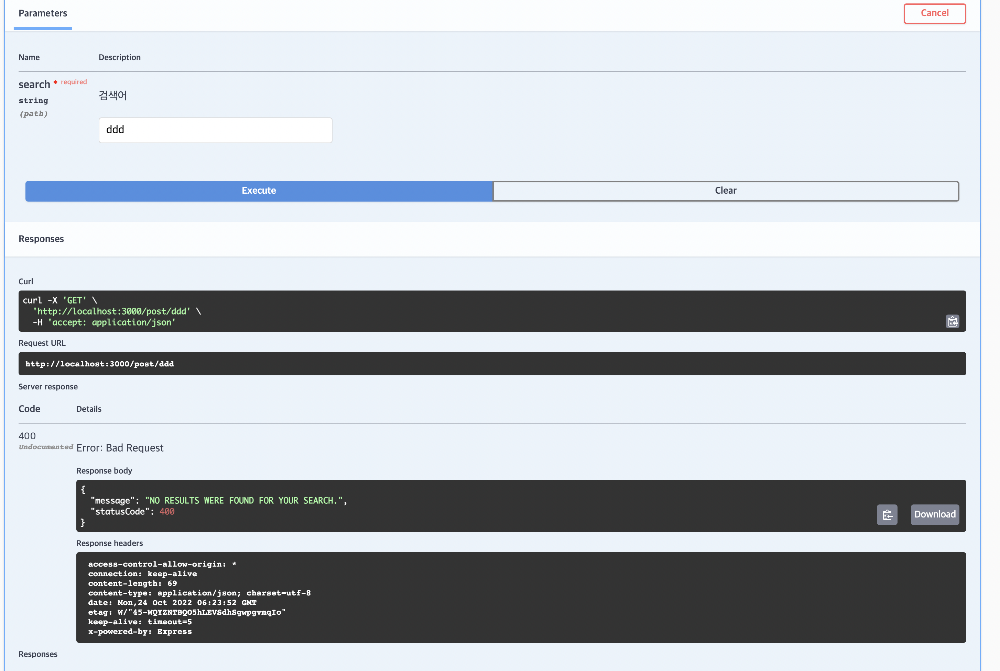

# swagger

express에서 swagger를 이용하여 API 문서화를 하기 위해서는 다음 두 패키지가 필요하다.

## 패키지 설치

```javascript
// swagger-jsdoc: jsdoc주석으로 Swagger API 문서화하기 위해 사용
// swagger-ui-express: swagger ui와 express 연결을 위해 사용

npm install swagger-jsdoc swagger-ui-express --save-dev
```

## 파일 구조

swagger를 이용해 API문서를 작성할 프로젝트의 구조는 다음과 같다.



## swagger 환경 설정

프로젝트의 최상단 디렉토리에 swagger.js 파일을 만들어준 뒤 다음 내용을 입력해준다.

```javascript
// 설치한 npm을 불러온다.
const swaggerUi = require("swagger-ui-express");
const swaggerJsdoc = require("swagger-jsdoc");

const options = {
    swaggerDefinition: {
        openapi: "3.0.0",
        info: {
            version: "1.0.0",
            title: "project API",
            description: "프로젝트 설명"
        },
        servers: [
            {
                url: "http://localhost:3000" // URL
            }
        ]
    },
    apis: ["./src/routes/*.js"] //Swagger 파일 연동
};
const specs = swaggerJsdoc(options);

module.exports = {
    swaggerUi,
    specs
};
```

다음으로 app.js 파일에 다음 내용을 추가해준다.

```javascript
const { swaggerUi, specs } = require("./swagger");

app.use("/api-docs", swaggerUi.serve, swaggerUi.setup(specs));
```

내 파일의 app.js에는 다음과 같이 추가했다.

```javascript
const express = require("express");
const cors = require("cors");
const morgan = require("morgan");
require("express-async-errors");

const routes = require("./src/routes");
const errorHandler = require("./src/middlewares/errorHandler");
const { swaggerUi, specs } = require("./swagger");

const createApp = () => {
    const app = express();

    app.use(express.json());
    app.use(cors());
    app.use(morgan("dev"));
    app.use(routes);
    app.use(errorHandler);
    app.use("/api-docs", swaggerUi.serve, swaggerUi.setup(specs));

    return app;
};

module.exports = { createApp };
```

## swagger 작성 하기전에!

작성 전에 먼저 http://localhost:3000/api-docs 주소로 들어가보자.

만약 위의 설정이 제대로 되었다면 다음과 같은 화면이 떠야한다.



## 이제 진짜 swagger 작성

우선적으로 routes 폴더에 index.js에 작성해줄 것이 있다.
내 routes 폴더의 구조는 다음과 같다.



index.js를 열어서

```javascript
/**
 * @swagger
 * tags:
 *   name: Post
 *   description: 채용공고 과련 API
 */
router.use("/post", postRouter.router);
/**
 * @swagger
 * tags:
 *   name: Apply
 *   description: 채용공고 지원 과련 API
 */
router.use("/apply", applicationRouter.router);
```

이렇게 `@swagger` 태그를 주석 안에 작성해주면 해당 주석에는 swagger의 정보를 작성할 수 있게된다.

작성하고서 다시 http://localhost:3000/api-docs 주소로 들어가보면



위에서 작성한 정보대로 Post와 Apply가 생겨났다!!

## 이제 진짜 본격적으로 API문서를 작성해보자

작성은 router를 연결하는 부분에 작성합니다.

#### get

작성이 끝났으면 다시 주소로 들어가준다.

## 정말 멋지게 작성되었다!!!





## 더 놀라운건 여기서 직접 테스트?도 가능하다!!


## 그리고 내가 설정한 에러도 잘 뜬다!!


