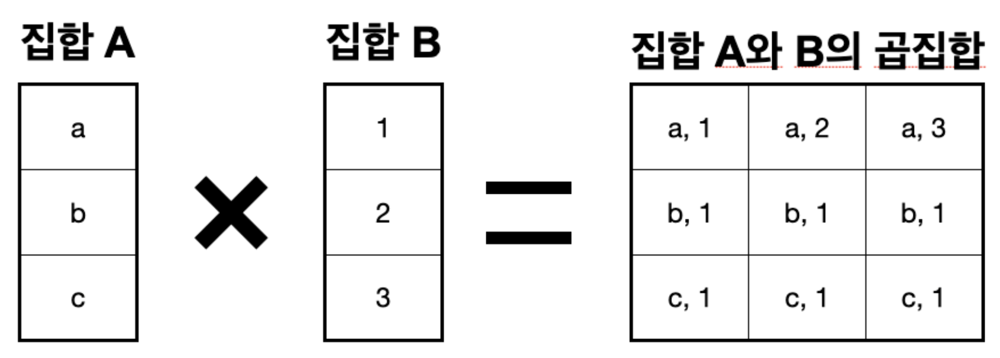
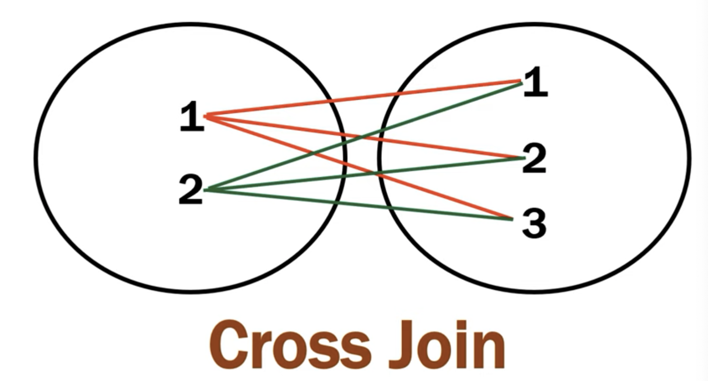
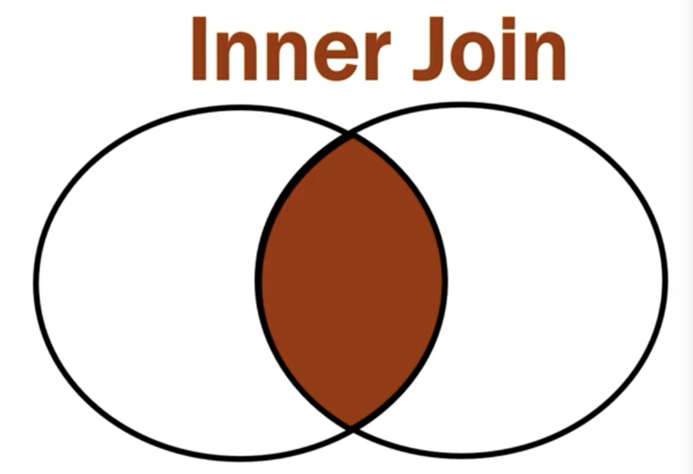
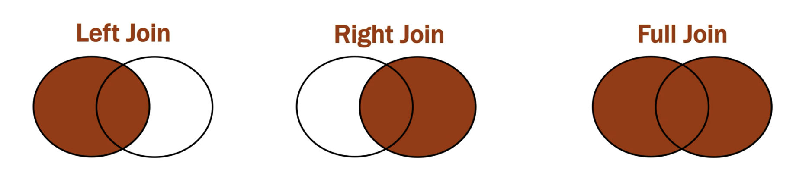

# DB (DataBase)

여러 사람들이 공유하고 사용할 목적으로 통합 관리되는 데이터들의 집합, 모음을 뜻하며, 단순한 모음이 아닌 일반적으로 잘 정리되어 표준화된 모음을 의미한다.

***

# DBMS (DataBase Management System)

사용자들이 데이터베이스에 있는 데이터들을 접근하고 사용하기 위해 쓰이는 시스템이다. DB 자체만을 가지고 데이터를 이용하려면 무척이나 불편하고 힘들 것이다. DBMS에 내장된 질의어들을 통해 사용자들은 DB에 접근할 수 있다.

***

# DB Application

데이터베이스가 사용되고 적용되는 것을 의미한다.
생산분야에서는 재고, 주문, 생산 부분에서 DB가 이용될 것이고, 대학교에서는 대학 등록, 학생 관리, 성적들에 DB가 사용된다. 이처럼 데이터베이스가 적용되는 시스템을 의미한다.

***

# DBS (DataBase System)

데이터베이스를 생성, 사용, 저장 관리하는 시스템 전체를 의미하며 DB + DBMS + DB Application을 포괄하는 개념으로 가장 광범위한 개념이다.

***

# 트랜잭션이란?

데이터베이스의 상태를 변환시키는 하나의 논리적 기능을 수행하기 위한 작업의 단위 또는 한꺼번에 모두 수행되어야 할 일련의 연산을 의미한다.

## 트랜잭션의 특징

1. 트랜잭션은 데이터베이스 시스템에서 병행 제어 및 회복 작업 시 처리되는 작업의 논리적 단위
2. 사용자가 시스템에 대한 서비스 요구 시 시스템이 응답하기 위한 상태 변화 과정의 작업 단위
3. 하나의 트랜잭션은 커밋 되거나 롤백된다.

## 트랜잭션의 성질

Atomicity(원자성)
데이터베이스에 모두 반영되든지 아니면 전혀 반영되지 않아야 한다. 트랜잭션 내의 모든 명령은 반드시 완벽히 수행되어야 하며, 모두가 완벽히 수행되지 않고 어느 하나라도 오류가 발생하면 전부 취소되어야한다.

Consistency(일관성)
트랜잭션이 그 실행을 성공적으로 완료하면 언제나 일관성 있는 데이터베이스 상태로 변환한다. 시스템이 가지고 있는 고정요소는 트랜잭션 수행 전과 트랜잭션 수행 완료 후의 상태가 같아야 한다.

Isolation(독립성, 격리성)
둘 이상의 트랜잭션이 동시에 병행 실행되는 경우 어느 하나의 트랜잭션 실행중에 다른 트랜잭션의 연산이 끼어들 수 없다. 수행중인 트랜잭션은 완전히 완료될 때까지 다른 트랜잭션에서 수행 결과를 참조할 수 없다.

Durability(지속성)
성공적으로 완료된 트랜잭션의 결과는 시스템이 고장나도 영구적으로 반영되어야 한다.

## 트랜잭션 연산 및 상태

Commit 연산
한개의 논리적 단위에 대한 작업이 성공적으로 끝났고 데이터베이스가 다시 일관된 상태에 있을 때, 이 트랜잭션이 행한 갱신 연산이 완료된 것을 트랜잭션 관리자에게 알려주는 연산이다.

Rollback 연산
하나의 트랜잭션 처리가 비정상적으로 종료되어 데이터베이스의 일관성을 깨뜨렸을 때, 이 트랜잭션의 일부가 정상적으로 처리되었더라도 트랜잭션의 원자성을 구현하기 위해 이 트랜잭션이 행한 모든 연산을 취소하는 연산이다. Rollback시 해당 트랜잭션을 재시작하거나 폐기한다.

***

# 인덱스란?

추가적인 쓰기 작업과 저장 공간을 활용하여 데이터베이스 테이블의 검색 속도를 향상시키기 위한 자료구조이다.

## 장점

    - 테이블을 조회하는 속도와 그에 따른 성능을 향상시킬 수 있다.
    - 전반적인 시스템의 부하를 줄일 수 있다.

## 단점

    - 인덱스를 관리하기 위해 DB의 약 10%에 해당하는 저장공간이 필요하다.
    - 인덱스 관리를 위한 추가 작업이 필요하다.
    - 잘못 사용할 경우 오히려 성능이 저하되는 역효과가 발생할 수 있다.

[인덱스 사용하면 좋은 경우] - 규모가 작지 않은 테이블 - INSERT, UPDATE, DELETE가 자주 발생하지 않는 컬럼 - JOIN이나 WHERE 또는 ORDER BY에 자주 사용되는 컬럼 - 데이터의 중복도가 낮은 컬럼

## 인덱스의 자료구조

해시테이블(Hash Table)
key, value로 데이터를 저장하는 자료구조 중 하나로 빠른 데이터 검색이 필요할 때 유용하다. key값을 이용해 고유한 인덱스를 생성하여 그 인덱스에 저장된 값을 꺼내오는 구조이다.

하지만 DB인덱스에서 해시 테이블이 사용되는 경우는 제한적인데, 그러한 이유는 해시가 `=`연산에만 특화되었기 때문이다. 해시 함수는 값이 1이라도 달라지면 완전히 다른 해시 값을 생성하는데, 이러한 특성에 의해 부등호 연산이 자주 사용되는 데이터베이스 검색을 위해서는 해시 테이블이 적합하지 않다.

B+Tree
DB의 인덱스를 위해 자식 노드가 2개 이상인 B-Tree를 개선시킨 자료구조이다. 모든 노드에 데이터(value)를 저장했던 BTree와 다른 특성을 가지고 있다. - 리트노드(데이터노드)만 인덱스와 함께 데이터를 가지고 있고, 나머지 노드(인덱스노드)들은 데이터를 위한 인덱스(key)만을 갖는다. - 리프노드들은 LinkedList로 연결되어 있다. - 데이터 노드 크기는 인덱스 노드의 크기와 같지 않아도 된다.

데이터베이스의 인덱스 컬럼은 부등호를 이용한 연산이 자주 발생될 수 있다. 이러한 이유로 BTree의 리프노드들을 LinkedList로 연결하여 순차검색을 용이하게 하는 등 BTree를 인덱스에 맞게 최적화되어 있다.

***

# DB 설계
소프트웨어 개발 공정에서 DB설계는 DB의 상세한 자료구조 모형을 만드는 과정이다. 사용자의 요구사항과 데이터 분석을 통해 데이터의 요소, 구성, 관계를 식별하고 표 등으로 개념화하여 가시화 한다.

DB설계는 데이터를 분석하고 컴퓨터에 저장할 수 있는 구조로 변형하여 DBMS(데이터관리시스템)에 구현하고 다수의 사용자가 사용할 수 있도록 하는 목적을 가지고 있다. 

일반적으로 사용자의 요구사항을 분석하고 개념적, 논리적, 물리적 설계등의 단계를 거치게 되고 성능개선을 위하여 각 단계를 여러 차례 반복하여 수행한다. DB설계를 통해 데이터의 논리적이고 물리적인 상세한 구조가 완성되면 DBMS는 이에 따라 데이터를 저장 관리 한다.

## 설계 단계
### 1단계 요구사항 분석 => 요구사항 명세서 작성

구성원들이 DB를 사용해 실제 어떤 업무를 처리하려는 용도로 사용하는지, 사용자에게 필요한 데이터의 종류와 처리 방법을 파악하는 단계이다. 요구사항을 분석한 결과를 토대로 하여 `요구사항 명세서`로 작성하는 것이 주요작업이다. 작성된 명세서는 중요하게 사용이 되고, DB의 품질을 결정짓는 중요한 역할을 한다.

### 2단계 개념적 설계 => 개념 스키마,ERD

1단계에서 작성한 명세서를 가지고 시작한다. 1단계에서 파악한 요구사항을 개념적 데이터 모델을 이용해서 표현하는데 실제 개발에 사용할 DBMS의 종류에 독립적이면서 데이터 요소와 요소 간의 관계를 표현할 때 데이터 요소들의 관계를 `ERD(Entity Relationship Diagram)`로 표현한다. 이 단계를 마치면 요구사항 명세서가 개념적 데이터 모델로 변환되어 결과로 산출되는데 이를 `개념적 모델링`이라고 하고 해당 결과물을 `개념적 구조` 또는 `개념적 스키마`라고 한다.

### 3단계 논리적 설계

개발에 사용될 DBMS에 적합한 논리적 데이터 모델을 이용해 2단계에서 생성한 스키마를 기반으로 논리적 구조를 설계한다. 주로 관계 데이터 모델을 사용하는데 2단계에서 생성한 다이어그램을 릴레이션 스키마로 변환하여 DBMS에서 처리할 수 있도록 하는 것이 주요 작업이다. 이 과정을 논리적 모델링 또는 데이터 모델링이라 하고 산출된 결과물을 `논리적 구조` 또는 `논리적 스키마`라고 한다.

### 4단계 물리적 설계

3단계에서 생성된 스키마를 기반으로 물리적 구조를 설계한다. 물리적 구조란 DB를 저장 장치에 실제로 저장하기 위한 내부 저장 구조와 접근 경로 등을 말한다. 그러므로 물리적 설계 단계에서는 저장 장치에 적합한 저장 레코드와 인덱스의 구조 등을 설계하고 저장된 데이터와 인덱스에 빠르게 접근할 수 있는 탐색 기법 등을 정의한다.

### 5단계 구현
이전 설계 단계에서 도출된 데이터베이스 스키마를 실제 파일로 생성한다. 앞선 결과물을 바탕으로 데이터베이스 관리 시스템에서 SQL로 작성한 명령문을 실행하여 데이터베이스를 실제로 생성한다. 그리고 데이터를 입력하며 응용 프로그램에서 사용하기 위한 `트랜잭션을 생성`한다.

***

# RDBMS와 NoSQL

## RDBMS

데이터베이스 관리 시스템인 DBMS에 관계를 뜻하는 R(Relational)이 붙어 관계형 데이터베이스 관리 시스템을 의미한다. 

RDBMS는 테이블, 행, 열의 정보를 구조화하는 방식이다. 엑셀의 형식과 유사한 2차원 테이블 형식으로 구성되며 속성(Attribute)과 값(Value)을 이용하여 데이터를 정의하고 관리한다.

모든 테이블에는 행에서 고유하게 식별 가능한 `기본 키`라는 속성이 있으며, `외래 키(다른 테이블의 기본 키를 참조`를 사용하여 각 행에서 서로 다른 테이블 간의 관계를 만드는 데 사용한다.

이러한 데이터들을 활용하기 위해서는 SQL이라는 언어를 활용한다.

## RDBMS의 장점과 단점 및 예시

### 장점

- Data를 Column과 Row 형태로 저장
- 데이터의 분류, 정렬 탐색 속도가 비교적 빠름
- SQL 이라는 구조화 된 질의를 통해 데이터를 다룰 수 있음
- 작업의 안정성을 보장함
- 데이터의 UPDATE가 빠름

### 단점
- 반드시 스키마 규격에 맞춰서 데이터를 다뤄야함
- 데이터 처리에 대한 부하 발생시 처리가 어려움
- 성능 향상을 위해서는 장비가 좋아야하는 Scale up의 특징으로 비용이 기하급수적으로 발생됨

### 예시
대표적으로 `MySQL, Oracle, PostgreSQL, MariaDB, MS-SQL` 등이 있다.  

## NoSQL
관계형 데이터베이스가 아닌 다른 형태의 데이터 저장 기술을 의마한다. `NoSQL`에서는 테이블 간 관계를 정의하지 않는다. 데이터 테이블은 하나의 테이블이며 테이블 간의 관계를 정의하지 않아 일반적으로 테이블 간 조인도 불가능하다.

NoSQL은 빅데이터의 등장으로 데이터와 트래픽이 기하급수적으로 증가함에 따라 관계형 데이터베이스는 성능 향상을 위해서는 장비가 좋아야하는 Scale Up의 특징이 비용을 증가시킨다는 단점 때문에 데이터의 일관성은 포기하되 비용을 고려하여 여러 대의 데이터에 분산하여 저장하는 Scale Out을 목표로 등장하였다.

## NoSQL의 종류

### Key - Value Database

- 기본적인 패턴으로 Key-Value 하나의 묶음으로 저장되는 구조로 단순한 구조이기에 속도가 빠르며 분산 저장 시 용이하다.
- Key안에 Column, Value 형태로 된 여러 필드를 갖는다.
- 주로 Server config, Session Clustering 등에 사용되며 엑세스 속도는 빠르지만, Scan에는 용이하지 않다.

### Wide-Column Database

- 행마다 키와 해당 값을 저장할 때마다 각각 다른 값의 다른 수의 스키마를 가질 수 있다.
- 대량의 데이터를 압축, 분산 처리, 집계 쿼리 및 쿼리 동작 속도 그리고 확장성이 뛰어나다.

### Document Database

- 테이블의 스키마가 유동적이다.
- XML, JSON과 같은 Document를 이용해 레코드를 저장한다.
- 트리형 구조로 레코드를 저장하거나 검색하는데 효과적이다.

### Graph Database
- 데이터를 노드로 표현하며 노드 사이의 관계를 간선(Edge)으로 표현한다.
- 일반적으로 RDBMS보다 성능이 좋고 유연하며 유지보수에 용이하다.

## NoSQL의 장점과 단점 및 예시

### 장점

- 데이터간의 관계를 정의하지 않는다.(테이블간의 조인 불필요)
- 관계형 데이터베이스보다 복잡도가 떨어져 훨씬 방대한 데이터를 저장 관리할 수 있다.
- 테이블에 스키마가 정해져있지 않아 데이터 저장이 비교적 자유롭다.
- 많은 양의 데이터를 저장 처리 할 수 있다.

### 단점

- Key값에 대한 입출력만 지원한다.
- 스키마가 정해져 있지 않아 데이터에 대한 규격화가 되어있지 않다.
- 데이터 중복이 발생할 수 있으며 중복된 데이터가 변경 될 경우 수정을 모든 컬렉션에서 수행해야 한다.
- 데이터를 Update하는데 비교적 느리다.

### 예시
대표적으로 `MongoDB, Azure Cosmos DB, Redis` 등이 있다.

## Scale Up & Out

### Scale Up

기존의 서버를 보다 높은 사양으로 업그레이드 하는것을 말한다. 하드웨어를 예시로 성능이나 용량 증강을 목적으로 하나의 서버에 디스크를 추가하거나 CPU, 메모리 등을 업그레이드 시키는 것을 말한다. 소프트웨어의 예시로는 AWS의 EC2 인스턴스 사양을 micro에서 small or medium 등으로 높이는 것이라 생각할 수 있다.

하나의 서버의 능력을 증강하기 때문에 수직스케일링(vertical scaling)이라고도 한다.

### Scale Out

장비를 추가해서 확장하는 방식을 말한다. 기존의 서버만으로 용량이나 성능의 한계에 도달했을 때 비슷한 사양의 서버를 추가로 연결해 처리할 수 있는 데이터 용량이 증가할 뿐만 아니라 기존 서버의 부하를 분담해 성능 향상의 효과를 기대할 수 있다.

서버를 추가로 확장하기 때문에 수평 스케일링(horizontal scaling)이라고도 한다.

## Scale Up 과 Scale Out의 장점과 단점

### Scale Up의 장점

- 추가적인 네트워크 연결 없이 용량을 증강할 수 있다.
- 관리 비용이나 운영 이슈가 적다.
- 사양만 올리면 돼서 비교적 쉽다.

### Scale Up의 단점

- 성능 향상에 한계가 있으며 성능 향상에 따른 비용부담이 크다.
- 서버 한 대가 부담하는 양이 많아서 자연재해 등의 다양한 이유로 서버에 문제가 생기면 큰 타격을 입게 된다.
- 기존의 서버를 교체함으로써 성능을 올릴 때는 서비스를 이용할 수 없는 다운타임이 불가피하다.
- 구축한 상황에서는 향후 확장 가능성에 대비해 서버를 현재 필요한 만큼보다 더 많은 용량이나 성능을 확보해 놓는 경우가 많은데 이런 경우 예상했던 정도와 요구되는 정도가 다르거나 필요성이 없어졌을 경우 추가로 확보한 만큼 손해가 발생한다.

### Scale Out의 장점

- 가장 큰 장점으로 확장의 유연성에 있다.
- 서버를 필요한 만큼만 도입해서 장기적인 용량 증가 추이를 예착할 필요 없이 그때그때 필요한 만큼 서버를 추가해 용량과 성능을 확장할 수 있다.

### Scale Out의 단점

- 여러 노드를 연결해 병렬 컴퓨팅 환경을 구성하고 유지를 위해서는 아키텍처에 대한 높은 이해도가 요구된다.
- 서버의 수가 늘어날수록 관리가 힘들어지고 아키텍처의 설계 단계에서부터 고려되어야 할 필요가 있다.
- 여러 노드에 부하를 균등하게 분산시키기 위해 로드 밸런싱(load balancing)이 필요하고, 노드를 확장할 수록 문제 발생의 잠재 원인 또한 늘어나게 된다.

***

# 정규화
정규화의 기본 목표는 테이블 간에 중복된 데이터를 허용하지 않는다는 것이다. 이로인해 무결성(Integrity)을 유지할 수 있으며, DB저장 용량 역시 줄일 수 있다. 테이블이 어떻게 분리되는지에 따라 정규화 단계가 달라진다.

해당 내용에 대해서는 다음 블로그에 상세히 있어서 이것을 보는걸로 대체한다.

[DanStory님의 정규화](https://mr-dan.tistory.com/10)

# SQL Join에 대해

## Join이란

두 개 이상의 테이블을 서로 연결하여 데이터를 검색할 때 사용하는 방법이다. 두 개의 테이블을 마치 하나의 테이블인 것처럼 보여준다.

Join에 대해 제대로 이해를 하기 위해서는 곱집합이라는 개념에 대해서 잘 알아야한다. 곱집합은 우리가 흔히 알고있는 합집합(UNION)이나 교집합(INTERSECT)처럼 집합의 연산 방법 중 하나이다. 곱집합은 두 개의 집합을 곱하는 연산 방법이다. 다음 예시를 보면 이해가 갈것이다.



## Join의 종류

### 교차 결합(Cross Join)

데이터베이스에서 테이블과 테이블의 곱집합을 계산하는 방법으로 교차 결합이 있다. FROM절에 복수의 테이블을 `,`로 구분지어 지정한다.

다만, 교차 결합의 경우 필요한 경우가 거의 없고 비용이 매우 많이 드는 연산이기 때문에 잘 사용되지 않는다.



### 내부 결합(Inner Join)

교차 결합으로 얻은 결과를 기준으로 사용한다. 내부 결합은 기준이 되는 테이블(left table)과 join이 걸리는 테이블(right table) 양쪽 모두에 결합 조건이 맞는 row만 검색하는 방법이다.



### 외부 결합(Outer Join)
외부 결합에는 대표적으로 `LEFT(Outer) JOIN`, `RIGHT(OUTER) JOIN`, `FULL(OUTER) JOIN`이 있다. 외부 결합은 내부 결합과 함께 자주 사용되는 결합으로 결합하는 여러 테이블에서 한 쪽에는 데이터가 있고, 한 쪽에는 데이터가 없는 경우, 데이터가 있는 쪽 테이블을 기준으로 모두 출력하는 결합 방법이다.



#### LEFT JOIN
기준이 되는 테이블의 모든 row와 join이 걸리는 테이블 중에서 left table과 매칭되는 row만 검색한다. 기준이 되는 테이블 쪽에만 존재하는 row는 전부 그대로 가져오면서, join이 걸리는 테이블에서는 매칭되는 결과가 없는 경우 빈 값(NULL)으로 표시한다.

#### RIGHT JOIN
join이 걸리는 테이블의 모든 row와 기준이 되는 테이블에서 매칭이 되는 row만 검색하고 매칭되는 데이터가 없는 경우 빈 값(NULL)으로 표시한다.

#### FULL JOIN
LEFT JOIN과 RIGHT JOIN을 합친 결합 방법으로 기준이 되는 테이블과 join이 걸리는 테이블 양쪽 모두의 row를 검색한다. MySQL에서는 직접적인 키워드가 없기 때문에 다음과 같이 LEFT JOIN과 RIGHT JOIN을 UNION 하는 방식으로 FULL JOIN을 구현한다.

```mysql
SELECT
    [테이블 컬럼]
FROM [기준 테이블 명]
LEFT JOIN [join이 걸리는 테이블명] ON [결합 조건]
UNION
SELECT
    [테이블 컬럼]
FROM [기준 테이블 명] RIGHT [join이 걸리는 테이블 명] ON [결합 조건]
```

단, UNION을 이용할 시 위와 아래는 같아야한다.