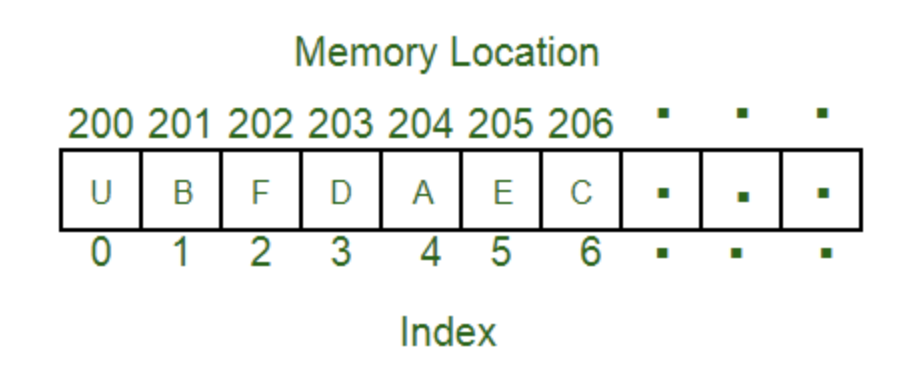

# Array/List
- 가장 기초적이고 단순하면서도 가장 자주 사용되는 자료구조이다.
- 일반적으로 Python에서는 Array보다 일반 List가 더 많이 사용되고 대부분의 경우 큰 차이가 없다.
- 기능적으로는 거의 동일 하지만 메모리 효율면에서는 Array가 유리하다.
- Python에서 사용하기에는 List가 편하다. (Array는 모듈을 import해서 사용해야 한다.)

# Array 특징
## 순차적으로 데이터를 저장하는 자료구조
- 가장 큰 특징으로 순차적(ordered)으로 데이터를 저장한다.
- 자료구조에 저장하는 데이터는 일반적으로 요소(element)라고 한다.
- Array는 주로 서로 연결된 데이터들을 순차적으로 저장할 때 사용한다.
- 순서가 상관 없더라도 서로 연결된 데이터들을 저장할 때 일반적으로 사용한다.
- 삽입 순서대로 저장된다.(즉, 새로 삽입되는 요소는 array의 새로운 꼬리가 된다.)
- 이미 생성된 리스트도 수정 가능하다.
- 동일한 값도 여러번 삽입 가능하다.
- Multi-dimensional Array(다중 차원 배열)
    - Array의 요소가 array로 구성된 array를 다중차원(multi-dimensional) array라고 한다. 일반적으로 2차원(2D) array가 많이 사용된다
    - ex. A = [[1,2,3], [4,5,6], [7,8,9]]

# Array 내부 구조

