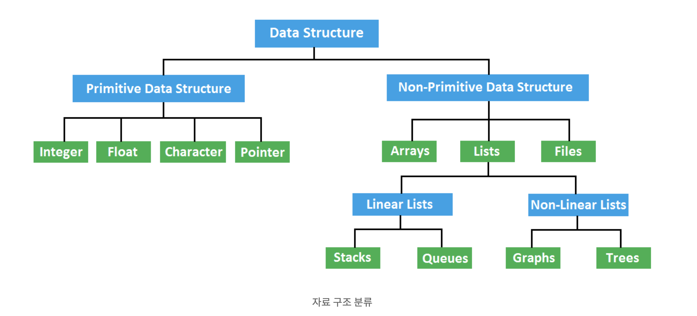

# 자료구조란
- 데이터에 편리하게 접근하고 조작하기 위한 데이터를 저장하거나 조직하는 방법
- 모든 목적에 부합하는 자료구조는 없기 떄문에 상황에 맞게 올바른 자료구조를 선택하고 사용해야 한다.
- 언어별로 지원하는 양상이 다르다.
- 각 자료구조의 본질과 컨셉을 이해하고 상황에 맞는 적절한 자료구조를 선택하는 것이 중요하다.

# 자료구조 분류
- Primitive Data Structure(단순 구조)
    - 프로그래밍에서 사용되는 기본 데이터 타입
- None-Primitive Data Structure(비단순 구조)
    - 여러 데이터를 목적에 맞게 효과적으로 저장하는 자료구조
    - Linear Data Structure(선형 구조)
        - 저장되는 자료의 전후 관계가 1:1 (ex. List, Stacks, Queues)
    - Non-Linear Data Structure(비선형 구조)
        - 데이터 항목 사이의 관계가 1:n 또는 n:m(ex. Graphs, Trees)

# 7가지 자료구조

## Array(배열)
- 가장 기본적인 데이터 구조이다.
- 생성되는 순간 셀에 인덱스가 부여되고 해당 셀의 개수는 고정된다.
- 부여된 인덱스를 통해 원하는 데이터에 접근할 수 있다.
- 바로 만들어서 활용하기가 쉽고 원하는 데이터를 효율적으로 검색하여 가져오는게 가능하다.
- 배열을 기반으로 더 복잡한 자료구조를 만들 수 있으며, 정렬이 용이하다는 장점이 있다.
- 생성될 때 셀의 개수가 고정되므로 데이터를 저장할 수 있는 메모리의 크기가 고정되어 있고 데이터를 삽입, 삭제하는 과정이 비효율적이다.
- 데이터가 삭제되고 나면 남는 셀은 빈 공간이 되어 메모리를 낭비하게 된다.

## Contiguous List(연속 리스트)
- 배열처럼 연속적인 기억 장소에 데이터가 저장되는 자료구조이다.
- 연속적으로 데이터가 저장되어 검색에 용이하다.
- 데이터 삽입이나 삭제시 자료의 이동이 필요하다는 번거로움이 있다.

## Linked List(연결 리스트)
- 데이터를 임의의 기억공간에 기억시키되, 데이터 항목의 순서에 따라 노드의 포인터를 이용하여 서로 연결시킨 자료구조이다.
- 새로운 데이터를 삽입하고 삭제하는 것이 용이하고 효율적이다.
- 배열처럼 메모리에 연속적으로 위치하지 않고 구조의 재구성이 필요 없다.
- 메모리를 더 효율적으로 사용할 수 있어서 대용량의 데이터의 처리에 적합하다.
- 연결이 끊어지면 다음 노드를 찾기가 어렵고 속도가 느리다.

## Stack(스택)
- 순서가 유지되는 선형 구조이다.
- 한쪽에서만 데이터의 삽입과 삭제가 일어나므로 가장 마지막 요소부터 가장 처음 요소를 처리하는 LIFO(Last In First Out) 메커니즘을 갖고 있다.
- 기억공간이 부족한 경우 데이터를 삽입하는 경우 오버플로(Overflow)가 발생하고 삭제할 데이터가 없을 때 데이터를 삭제하고자 하면 언더플로(Underflow)가 발생한다.
- 데이터를 받는 순서대로 정렬되고 메모리의 크기가 동적이지만 한 번에 하나의 데이터만 처리할 수 있는 불편함이 있다.

## Queue(큐)
- 스택과 비슷하지만 먼저 입력된 요소를 먼저 처리하는 FIFO(First In First Out)메커니즘을 가진다.
- 리스트의 한쪽에서는 삽입이 일어나고 다른 쪽에서는 삭제가 일어난다.
- 데이터의 시작 부분을 프런트(Front)라 하고 끝 부분은 리어(Rear)라고 한다.
- 동적인 메모리 크기와 빠른 런타임을 자랑한다.
- 가장 오래된 요소만을 가져오고 한 번에 하나의 데이터만 처리하는 단점이 있다.

## Graph(그래프)
- 정점(Vertex)과 간선(Edge)으로 이루어진 데이터 구조이며 사이클이 없는 그래프를 트리라고 한다.
- 방향 그래프와 무방향 그래프가 있다.
- 새로운 요소들의 추가나 삭제가 용이하고 구조를 응용하기에 적합하다.
- 데이터 간에 충돌이 일어날 수 있다.

## Tree(트리)
- 노드로 구성된 계층적인 자료구조이다.
- 최상위 노드(Root)를 만들고 그 아래에 자식을 추가하는 방식으로 트리구조는 다양하게 구현할 수 있다. - 노드와 노드를 잇는 선을 간선(Edge)이라 한다.
- 같은 부모(Parent) 노드를 가지며 같은 레벨에 있는 노드를 형제(Siblings) 노드라 하고 자식이 없는 노드를 단말(Terminal) 노드라고 한다.

